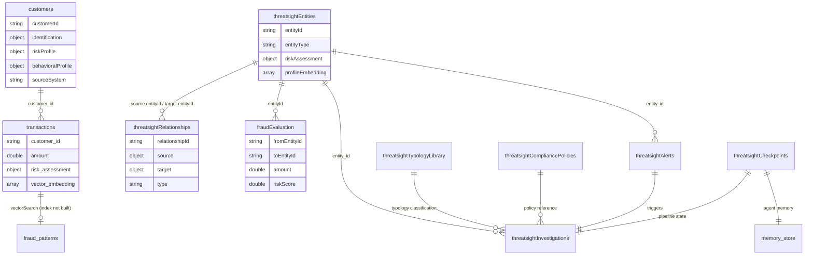

# EDD — Entity Document Diagram

MongoDB data model for ThreatSight 360, a dual-backend fraud detection and
AML/KYC compliance demo.

This file is the compact, agent-facing summary. For exhaustive per-collection
field tables, index definitions, and field naming conventions, see
[docs/DATA_MODEL.md](docs/DATA_MODEL.md) — this file exists so an agent has a
fast, accurate map of collection names and known traps before touching either
backend, without reading all 468 lines of that file first.

Two backends, one shared database (`DB_NAME`), disjoint collections.

---

## Entity overview

| Collection | Backend | Docs | Written by | Vector index |
| --- | --- | --- | --- | --- |
| `customers` | Fraud (`:8000`) | ~50 | `scripts/migrate_customers.py` | — |
| `transactions` | Fraud | ~25,556 | Seed notebook + `POST /transactions/evaluate` | `transaction_vector_index` |
| `fraud_patterns` | Fraud | ~5 | Seed notebook | none (deliberately — see below) |
| `threatsightEntities` | AML (`:8001`) | ~508 | Seed notebook, via `scripts/fix_collection_names.py` | `entity_vector_search_index` |
| `threatsightRelationships` | AML | ~530 | same | — |
| `fraudEvaluation` | AML | ~12,772 | same | — |
| `threatsightTypologyLibrary` | AML (agents) | 12 | `services/agents/seed.py` | none |
| `threatsightCompliancePolicies` | AML (agents) | 6 | same | none |
| `threatsightInvestigations` | AML (agents) | Variable | `finalize_node` | — |
| `threatsightAlerts` | AML (agents) | Variable | `POST /agents/investigate` | — |
| `threatsightCheckpoints` / `threatsightCheckpointWrites` | AML (agents) | Variable | `MongoDBSaver` (LangGraph) | — |
| `memory_store` | AML (agents) | Variable | `MongoDBStore` (LangGraph) | — |

`memory_store` is the one collection genuinely named without the `threatsight`
prefix — not a bug, just how it was written.

---

## Why two names for the same three collections

The seed notebooks in `docs/` write `entities`, `relationships`, and
`transactionsv2`. The application queries `threatsightEntities`,
`threatsightRelationships`, and `fraudEvaluation` — confirmed across
`repositories/factory/repository_factory.py`, every file in
`services/agents/tools/`, and `routes/transactions.py`. Same schema on both
sides; only the collection name differs.

A comment in [aml-backend/dependencies.py](aml-backend/dependencies.py)
documents why: a real, dated "leafy_bank_bian migration" (2026-07-29) renamed
several collections (also `risk_models` → `threatsightRiskModels`,
`model_performance` → `threatsightModelPerformance`) to align with a shared
production database. The seed notebooks were never updated to match, so a
fresh seed silently produces data no route can find.

`scripts/fix_collection_names.py` (aml-backend) copies the three collections
to their correct names, rebuilds indexes there, and drops the originals — no
new embeddings, no Bedrock calls. Run it once after seeding.

## `customers`: two schemas, one migration

The seed notebook writes flat, snake_case documents (`personal_info`,
`behavioral_profile`). [models/customer.py](backend/models/customer.py) and
[services/fraud_detection.py](backend/services/fraud_detection.py) expect a
different, camelCase, more deeply nested shape (`customerId`,
`identification`, `identifiers`, `riskProfile`, `behavioralProfile`), with
reads scoped to `{"sourceSystem": "threatsight360"}`
([db/scope.py](backend/db/scope.py)). A code comment describes this as the
output of a "SD-1 transform" — no such script exists in the repository.

`scripts/migrate_customers.py` (backend) performs this transform. It is
additive (keeps the original fields) and idempotent (skips documents that
already have `customerId`).

## `entities`.`profileEmbedding`, not `embedding`

`models/database/collections.py`'s `vector_search_config["legacy"]` claims the
entity embedding field is named `embedding`. The code that actually queries it
— `hybrid_search_service.py`, `vector_search_repository.py`'s default mode,
every tool in `services/agents/tools/chat_tools.py` — hardcodes
`profileEmbedding`, confirmed by an in-repo comment ("Correct field name from
working vector search"). The seed notebook only ever writes
`profileEmbedding`. Treat `collections.py`'s "legacy" config as stale
documentation, not a second live path.

The same file's `identifier` and `behavioral` embedding configs
(`identifierEmbedding`, `behavioralEmbedding`) are real code paths in
`vector_search_repository.py`, but nothing populates those fields — the seed
notebook writes only `profileEmbedding`. Those two vector indexes are not
created; there is no data for them to serve.

## The fraud-pattern vector index that was never built

`fraud_patterns` documents have real embeddings, but no vector index exists on
the collection. `services/fraud_detection.py` documents why in a comment: the
pattern-similarity search path is "deliberately not created — building one
would enable a code path that has never run." `routes/fraud_pattern.py`
separately checks for *any* existing vector index and then queries a
hardcoded index name (`"vector_index"`) that would not match one named
`fraud_pattern_vector_index` even if created — a second, independent bug in
that fallback path, also currently unreachable.

---

## Relationships

All relationships are logical, not enforced — no foreign keys, no cross-collection
validators. `$graphLookup` traversal on `threatsightRelationships` and
application-level lookups by `entityId` are the only ties.

## Known inconsistencies

1. **Notebook vs. application collection names** (entities, relationships,
   transactionsv2) — see above. Fixed for already-seeded data by
   `scripts/fix_collection_names.py`; fixed for future seeds by a patch to
   the entity resolution notebook.
2. **`customers` schema mismatch** — see above. Fixed by
   `scripts/migrate_customers.py`.
3. **`profileEmbedding` vs. documented `embedding`** — `collections.py` is
   stale; the code and the seed data agree with each other, not with that
   file.
4. **Fraud-pattern vector index never created** — deliberate, per a code
   comment. `routes/fraud_pattern.py` also has a second, independent bug: it
   checks for any vector index but queries a hardcoded name that won't match
   one actually created for this collection.
5. **`get_voyage_embeddings()` has no callers.** Present in
   `aml-backend/services/agents/embeddings.py`, wired into nothing. Typology
   and policy lookup use `$regex`/`$or` text queries, not vector search.

Update this section if any of these are fixed — otherwise it becomes actively
misleading.
