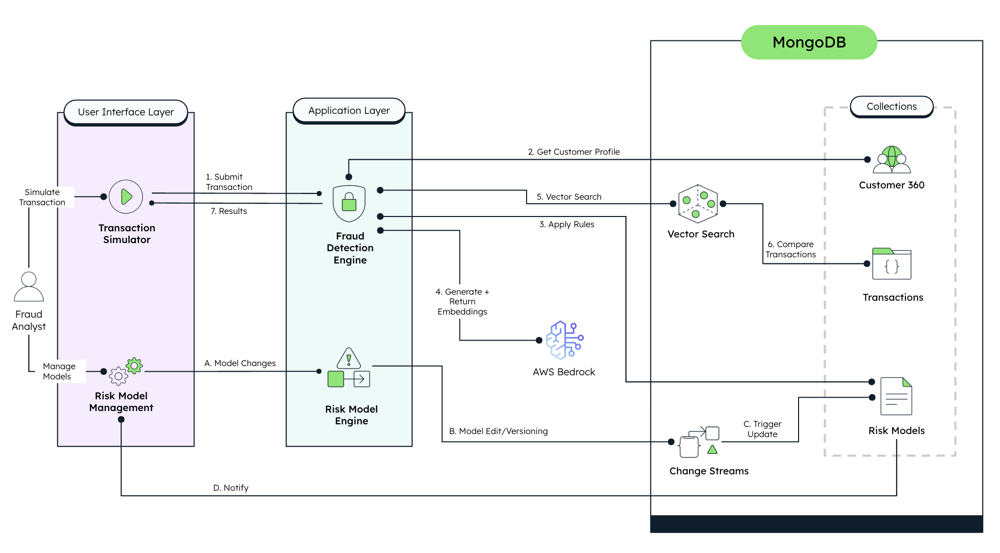

# ThreatSight 360 - Financial Fraud Detection System


**Comprehensive Financial Services Platform with Dual-Backend Microservices Architecture**

In today's rapidly evolving financial landscape, detecting fraudulent transactions quickly and accurately while maintaining robust AML/KYC compliance is crucial. Financial institutions of all sizes struggle with balancing customer experience with comprehensive fraud protection and regulatory compliance. 

ThreatSight 360 addresses these challenges with a **dual-backend microservices architecture** that provides real-time risk assessment, AI-powered pattern recognition, intelligent entity resolution, and comprehensive compliance operations.

By the end of this guide, you'll have a comprehensive fraud detection and AML/KYC compliance system up and running capable of:

- **Real-time Fraud Detection**: Multi-factor risk assessment with AI-powered pattern recognition
- **Intelligent Entity Resolution**: AI-powered fuzzy matching and duplicate detection for AML/KYC compliance
- **Network Analysis**: Relationship mapping and graph analytics for compliance investigations
- **Vector-based Pattern Recognition**: Advanced similarity matching using MongoDB Atlas Vector Search
- **Dynamic Risk Model Management**: Configurable risk models with real-time updates
- **Interactive Transaction Simulation**: Comprehensive testing and demonstration capabilities

We will walk you through the process of configuring and using [MongoDB Atlas](https://www.mongodb.com/atlas) as your backend with [AWS Bedrock](https://aws.amazon.com/bedrock/) for AI-powered risk assessment and entity resolution in your [Next.js](https://nextjs.org/) and [FastAPI](https://fastapi.tiangolo.com/) application.

## Architecture Overview

ThreatSight 360 uses a **dual-backend microservices architecture** optimized for financial services:

### **Main Backend** (`/backend`, port 8000)
- **Fraud Detection**: Real-time transaction analysis and risk scoring
- **Transaction Processing**: High-throughput transaction validation and processing
- **Risk Assessment**: Multi-factor risk evaluation with configurable models
- **Pattern Recognition**: Vector-based fraud pattern detection using MongoDB Atlas Vector Search

### **AML Backend** (`/aml-backend`, port 8001)  
- **Entity Management**: Comprehensive customer and organization entity management
- **Intelligent Entity Resolution**: AI-powered fuzzy matching and duplicate detection
- **Network Analysis**: Relationship mapping and graph analytics for compliance
- **Atlas Search Integration**: Advanced search capabilities with faceted filtering and autocomplete
- **Compliance Operations**: AML/KYC workflows and regulatory compliance features

### **Frontend** (`/frontend`, port 3000)
- **Next.js 15+** with App Router and MongoDB LeafyGreen UI components
- **Transaction Simulator**: Interactive fraud scenario testing
- **Entity Management Dashboard**: Advanced entity search and relationship visualization
- **Risk Model Management**: Dynamic risk model configuration interface
- **Real-time Updates**: MongoDB Change Streams for live data synchronization



If you want to learn more about Financial Fraud Detection, AML/KYC Compliance, and AI-powered Risk Assessment, visit the following pages:

- [MongoDB for Financial Services](https://www.mongodb.com/industries/financial-services)
- [AWS Bedrock Foundation Models](https://aws.amazon.com/bedrock/foundation-models/)
- [Vector Search for Fraud Detection](https://www.mongodb.com/use-cases/fraud-detection)
- [Building Real-time Fraud Detection Systems](https://www.mongodb.com/developer/products/atlas/vector-search-fraud-detection/)
- [MongoDB Atlas Search Documentation](https://www.mongodb.com/docs/atlas/atlas-search/)

Let's get started!

## Prerequisites

Before you begin working with this project, ensure that you have the following prerequisites set up in your development environment:

- **Python 3.10+**: Both backend services are built with Python. You can download it from the [official website](https://www.python.org/downloads/).

- **Node.js 18+**: The frontend requires Node.js 18 or higher, which includes npm for package management. You can download it from the [official Node.js website](https://nodejs.org/).

- **Poetry**: Both backend services use Poetry for dependency management. Install it by following the instructions on the [Poetry website](https://python-poetry.org/docs/#installation).

- **MongoDB Atlas Account**: This project uses MongoDB Atlas for data storage, Atlas Search, and vector search capabilities. If you don't have an account, you can sign up for free at [MongoDB Atlas](https://www.mongodb.com/cloud/atlas/register). Once you have an account, follow these steps to set up a minimum free tier cluster:

  - Log in to your MongoDB Atlas account.
  - Create a new project or use an existing one, and then click "create a new database".
  - Choose the free tier option (M0).
  - Configure the cluster settings according to your preferences and then click "finish and close" on the bottom right.
  - Finally, add your IP to the network access list so you can access your cluster remotely.

- **AWS Account with Bedrock Access**: You'll need an AWS account with access to the Bedrock service for AI foundation models used in both fraud detection and entity resolution. Visit the [AWS Console](https://aws.amazon.com/console/) to set up an account and request access to Bedrock.

- **Docker (Optional)**: For containerized deployment, Docker is required. Install it from the [Docker website](https://www.docker.com/get-started).

## Quick Start

The fastest way to get ThreatSight 360 up and running:

```bash
# Clone the repository
git clone https://github.com/yourusername/threatsight360.git
cd threatsight360

# Install Poetry (if not already installed)
make install_poetry

# Setup all components
make setup_all

# Start all services in development mode
make dev_all
```

This will start:
- **Fraud Detection Backend** at [http://localhost:8000](http://localhost:8000)
- **AML/KYC Backend** at [http://localhost:8001](http://localhost:8001)  
- **Frontend Application** at [http://localhost:3000](http://localhost:3000)

For detailed configuration, continue with the sections below.

## Initial Configuration

### Obtain your MongoDB Connection String

Once the MongoDB Atlas Cluster is set up, locate your newly created cluster, click the "Connect" button and select the "Connect your application" section. Copy the provided connection string. It should resemble something like this:

```
mongodb+srv://<username>:<password>@cluster-name.xxxxx.mongodb.net/
```

> [!Note]
> You will need the connection string to set up your environment variables later (`MONGODB_URI`).

### Set up AWS Bedrock Access

1. Log in to your AWS Management Console.

2. Navigate to the Bedrock service or search for "Bedrock" in the AWS search bar.

3. Follow the prompts to request access to the Bedrock service if you haven't already.

4. Once access is granted, create an IAM user with programmatic access and appropriate permissions for Bedrock.

5. Save the AWS Access Key ID and Secret Access Key for later use in your environment variables.

> [!Important]
> Keep your AWS credentials secure and never commit them to version control.

### Cloning the Github Repository

Now it's time to clone the ThreatSight 360 source code from GitHub to your local machine:

1. Open your terminal or command prompt.

2. Navigate to your preferred directory where you want to store the project using the `cd` command. For example:

   ```bash
   cd /path/to/your/desired/directory
   ```

3. Once you're in the desired directory, use the `git clone` command to clone the repository:

   ```bash
   git clone https://github.com/yourusername/threatsight360.git
   ```

4. After running the `git clone` command, a new directory with the repository's name will be created in your chosen directory. To navigate into the cloned repository, use the `cd` command:

   ```bash
   cd threatsight360
   ```

## MongoDB Atlas Configuration

### Set up Vector Search

ThreatSight 360 leverages MongoDB Atlas Vector Search for advanced fraud pattern recognition and entity similarity matching. Follow these steps to enable it:

#### 1. Fraud Pattern Vector Index

1. Navigate to your MongoDB Atlas dashboard and select your cluster.

2. Click on the "Search" tab located in the top navigation menu.

3. Click "Create Search Index".

4. Choose the JSON editor and click "Next".

5. Name your index "transaction_vector_index".

6. Select your database and the "transactions" collection.

7. For the index definition, paste the following JSON:

   ```json
   {
     "mappings": {
       "dynamic": true,
       "fields": {
         "vector_embedding": {
           "type": "knnVector",
           "dimensions": 1536,
           "similarity": "cosine"
         }
       }
     }
   }
   ```

#### 2. Entity Resolution Search Index

1. Create another Atlas Search index named "entity_resolution_search".

2. Select the "entities" collection.

3. Use the following comprehensive index definition for entity resolution:

   ```json
   {
     "mappings": {
       "dynamic": false,
       "fields": {
         "name": {
           "type": "document",
           "fields": {
             "full": [
               {
                 "type": "string",
                 "analyzer": "lucene.standard"
               },
               {
                 "type": "autocomplete",
                 "tokenization": "edgeGram",
                 "minGrams": 2,
                 "maxGrams": 15,
                 "foldDiacritics": true
               }
             ],
             "aliases": {
               "type": "string",
               "analyzer": "lucene.standard"
             }
           }
         },
         "entityType": {
           "type": "stringFacet"
         },
         "nationality": {
           "type": "stringFacet"
         },
         "residency": {
           "type": "stringFacet"
         },
         "jurisdictionOfIncorporation": {
           "type": "stringFacet"
         },
         "riskAssessment": {
           "type": "document",
           "fields": {
             "overall": {
               "type": "document",
               "fields": {
                 "level": {
                   "type": "stringFacet"
                 },
                 "score": {
                   "type": "numberFacet",
                   "boundaries": [0.0, 15.0, 25.0, 50.0, 100.0]
                 }
               }
             }
           }
         },
         "customerInfo": {
           "type": "document",
           "fields": {
             "businessType": {
               "type": "stringFacet"
             }
           }
         },
         "addresses": {
           "type": "document",
           "fields": {
             "structured": {
               "type": "document",
               "fields": {
                 "country": {
                   "type": "string",
                   "analyzer": "lucene.keyword"
                 },
                 "city": {
                   "type": "string",
                   "analyzer": "lucene.keyword"
                 }
               }
             },
             "full": {
               "type": "string",
               "analyzer": "lucene.standard"
             }
           }
         },
         "identifiers": {
           "type": "document",
           "fields": {
             "type": {
               "type": "string",
               "analyzer": "lucene.keyword"
             },
             "value": {
               "type": "string",
               "analyzer": "lucene.standard"
             }
           }
         },
         "scenarioKey": {
           "type": "string",
           "analyzer": "lucene.keyword"
         }
       }
     }
   }
   ```

#### 3. Entity Text Search Index

For enhanced entity text matching, create an Atlas Search index named "entity_text_search_index":

```json
{
  "mappings": {
    "dynamic": false,
    "fields": {
      "name": {
        "type": "document",
        "fields": {
          "full": { "type": "string" },
          "aliases": { "type": "string" }
        }
      },
      "addresses": {
        "type": "document",
        "fields": {
          "full": { "type": "string" }
        }
      },
      "entityType": { "type": "string" },
      "identifiers": {
        "type": "document",
        "fields": {
          "value": { "type": "string" }
        }
      }
    }
  }
}
```

#### 4. Entity Vector Search Index (Optional)

For semantic entity matching, create a vector search index named "entity_vector_search_index":

```json
{
  "type": "vectorSearch",
  "fields": [
    {
      "type": "vector",
      "path": "embedding",
      "numDimensions": 1536,
      "similarity": "cosine"
    }
  ]
}
```

> [!Note]
> The index names must match exactly for the application to work properly.

### Set up Change Streams

For real-time updates in your application, you'll need to enable change streams in MongoDB Atlas:

1. Navigate to your MongoDB Atlas dashboard and select your cluster.

2. Go to "Database Access" in the left sidebar.

3. Ensure that your database user has the "readWrite" and "dbAdmin" roles for the database you'll be using.

4. For production environments, consider creating a dedicated user with specific privileges for change streams.

> [!Important]
> Change streams require a replica set, which is automatically provided by MongoDB Atlas, even in the free tier.

## Backend Configuration

### Main Backend (Fraud Detection) Setup

Navigate to the `backend` directory and create environment configuration:

```bash
cd backend
```

Create a `.env` file with the following configuration settings:

```bash
# MongoDB Connection
MONGODB_URI=mongodb+srv://<username>:<password>@cluster-name.xxxxx.mongodb.net/
DB_NAME=fsi-threatsight360

# AWS Bedrock Credentials
AWS_ACCESS_KEY_ID=your_aws_access_key_here
AWS_SECRET_ACCESS_KEY=your_aws_secret_key_here
AWS_REGION=us-east-1

# Server Configuration
HOST=0.0.0.0
PORT=8000

# Frontend URL for CORS
FRONTEND_URL=http://localhost:3000

# Risk Assessment Thresholds
AMOUNT_THRESHOLD_MULTIPLIER=2.5
MAX_LOCATION_DISTANCE_KM=100
VELOCITY_TIME_WINDOW_MINUTES=10
VELOCITY_THRESHOLD=5
SIMILARITY_THRESHOLD=0.8

# Risk Weights
WEIGHT_AMOUNT=0.25
WEIGHT_LOCATION=0.25
WEIGHT_DEVICE=0.20
WEIGHT_VELOCITY=0.15
WEIGHT_PATTERN=0.15
```

Install dependencies and start the server:

```bash
# Install dependencies
make setup_fraud

# Start development server
make dev_fraud
```

### AML Backend (Entity Resolution & Compliance) Setup

Navigate to the `aml-backend` directory and create environment configuration:

```bash
cd aml-backend
```

Create a `.env` file with the following configuration settings:

```bash
# MongoDB Connection
MONGODB_URI=mongodb+srv://<username>:<password>@cluster-name.xxxxx.mongodb.net/
DB_NAME=fsi-threatsight360

# AWS Bedrock Credentials (for AI features)
AWS_ACCESS_KEY_ID=your_aws_access_key_here
AWS_SECRET_ACCESS_KEY=your_aws_secret_key_here
AWS_REGION=us-east-1

# Server Configuration
HOST=0.0.0.0
PORT=8001

# Frontend URL for CORS
FRONTEND_URL=http://localhost:3000

# Atlas Search Configuration
ATLAS_SEARCH_INDEX=entity_resolution_search
ATLAS_TEXT_SEARCH_INDEX=entity_text_search_index
ENTITY_VECTOR_INDEX=entity_vector_search_index

# Performance Tuning
ATLAS_SEARCH_TIMEOUT=30000
MAX_SEARCH_RESULTS=1000
VECTOR_SEARCH_LIMIT=100
CONNECTION_POOL_SIZE=50
```

Install dependencies and start the server:

```bash
# Install dependencies  
make setup_aml

# Start development server
make dev_aml
```

> [!Note]
> Never commit your `.env` files to version control. Make sure they're included in your `.gitignore` file.

## Frontend Configuration

### Set up Environment Variables

Navigate to the `frontend` directory of your project:

```bash
cd frontend
```

Create a `.env.local` file with the following content:

```bash
# API URLs for dual-backend architecture
NEXT_PUBLIC_FRAUD_API_URL=http://localhost:8000
NEXT_PUBLIC_AML_API_URL=http://localhost:8001

# Legacy compatibility (points to fraud backend)
NEXT_PUBLIC_API_URL=http://localhost:8000
```

> [!Note]
> The `.env.local` file will be ignored by Git automatically.

### Install Dependencies and Start

Install the frontend dependencies and start the development server:

```bash
# Install dependencies
make setup_frontend

# Start development server
make dev_frontend
```

Your frontend application should now be running at [http://localhost:3000](http://localhost:3000).

## Data Seeding

To populate your database with initial data for testing, run the seeding script:

```bash
# Seed fraud detection data
make db_seed

# For comprehensive entity data, use the AML backend test scripts
make test_mongodb
```

This will create:

- Customer profiles with varied transaction histories
- Sample fraud patterns for testing
- Risk models with different configurations
- Entity data for AML/KYC testing
- Sample relationships for network analysis

## Using the Application

### Transaction Simulator

The Transaction Simulator allows you to test and visualize how the fraud detection system responds to different scenarios:

1. Navigate to [http://localhost:3000/transaction-simulator](http://localhost:3000/transaction-simulator).

2. Select a customer from the dropdown menu.

3. Choose a predefined fraud scenario or configure your own:

   - Normal Transaction
   - Unusual Amount
   - Unusual Location
   - New Device
   - Multiple Red Flags

4. Customize transaction details if needed:

   - Transaction type (purchase, withdrawal, transfer, deposit)
   - Payment method
   - Amount
   - Merchant category
   - Location information
   - Device information

5. Click "Evaluate Transaction" to analyze the risk profile.

6. Review the comprehensive risk assessment, including:
   - **Traditional Risk Assessment**: Rules-based evaluation with fraud pattern detection
   - **Advanced Vector Search**: AI-powered similarity matching against historical transactions
   - **Vector Search Calculation Transparency**: Detailed mathematical breakdown showing:
     - Step-by-step weight calculations for each similar transaction
     - Weighted average computation methodology
     - Multiple high-risk match boost calculations
     - Algorithm effectiveness explanations
   - **Context-aware Filtering**: Smart prioritization of relevant similar transactions
   - **Multi-factor Risk Scoring**: Comprehensive risk evaluation with detailed explanations

> [!Note]
> The simulator is a powerful tool for understanding how the system works and for demonstrating the capabilities to stakeholders.

### Entity Management Dashboard

The Entity Management interface provides comprehensive AML/KYC capabilities:

1. Navigate to [http://localhost:3000/entities](http://localhost:3000/entities).

2. Key capabilities include:

   - **Advanced Search**: Multi-strategy search with Atlas Search, autocomplete, and faceted filtering
   - **Entity Resolution**: AI-powered fuzzy matching and duplicate detection during onboarding
   - **Network Visualization**: Interactive relationship graphs using Cytoscape.js
   - **Risk Assessment**: Comprehensive entity risk scoring and watchlist matching
   - **Compliance Workflows**: AML/KYC onboarding and resolution processes

3. Search and filter entities using:
   - Name-based fuzzy search with autocomplete
   - Entity type filters (Individual, Organization)
   - Risk level filters (Low, Medium, High, Critical)
   - Geographic filters (Country, City, Nationality, Residency)
   - Business type and jurisdiction filters

4. Click on any entity to view:
   - Detailed entity information and identifiers
   - Risk assessment details and watchlist matches
   - Relationship network visualization
   - Similar entities and potential duplicates

### Entity Resolution Workflow

The Entity Resolution feature helps identify potential duplicates during customer onboarding:

1. Navigate to [http://localhost:3000/entity-resolution/enhanced](http://localhost:3000/entity-resolution/enhanced).

2. Enter new customer information using the simplified onboarding form:
   - Entity Type (Individual or Organization)
   - Full Name
   - Address

3. The system performs comprehensive AI-powered search using three methods:
   - **Atlas Search**: Text-based fuzzy matching on names and addresses
   - **Vector Search**: Semantic similarity analysis using AI embeddings
   - **Hybrid Search**: MongoDB $rankFusion combining both approaches with contribution analysis

4. Review search results across three tabs with expandable query details:
   - View actual MongoDB queries executed for each search method
   - See contribution percentages for hybrid search results
   - Click entity names to open detailed modal views
   - Analyze match confidence scores and reasoning

5. Enhanced features include:
   - **Query Transparency**: Expandable cards showing exact MongoDB aggregation pipelines
   - **Contribution Analysis**: Percentage breakdown of Atlas vs Vector search contributions
   - **Network Visualization**: Interactive relationship graphs for matched entities
   - **Real-time Search**: Instant results with optimized MongoDB operations

### Risk Model Management

The Risk Model Management interface allows administrators to configure and deploy different risk assessment models:

1. Navigate to [http://localhost:3000/risk-models](http://localhost:3000/risk-models).

2. View and select from available risk models in the system.

3. Key capabilities include:

   - **Dynamic Risk Factor Management**: Add or modify risk factors without system changes
   - **Real-Time Updates**: See changes instantly using MongoDB Change Streams
   - **Version Control**: Create and manage multiple versions of risk models
   - **Model Activation**: Easily switch between different models
   - **Performance Metrics**: Track effectiveness with false positive/negative rates
   - **Custom Thresholds**: Configure flag and block thresholds for each model
   - **Model Reset Functionality**: Reset models to clean state by removing version 2 models and setting default configurations

4. To create a new risk model:
   - Click "Create New Model"
   - Configure basic information (name, description)
   - Add risk factors with appropriate weights and thresholds
   - Set overall model thresholds
   - Save and optionally activate the model

5. To reset models to default state:
   - Click "Reset Models" (located on the far right of the action buttons)
   - This will delete all version 2 models, set `default-risk-model` to active, and set `behavioral-risk-model` to inactive
   - Useful for returning to a clean baseline during testing or demos

> [!Important]
> All changes are reflected in real-time across all connected sessions thanks to MongoDB Change Streams.

## Development Commands

ThreatSight 360 includes a comprehensive Makefile for easy development:

### Setup Commands

```bash
make setup_all          # Setup all components (backends + frontend)
make setup_fraud        # Setup fraud detection backend only
make setup_aml          # Setup AML/KYC backend only
make setup_frontend     # Setup frontend only
```

### Development Commands

```bash
make dev_all           # Start all services in development mode
make dev_fraud         # Start fraud detection backend (port 8000)
make dev_aml           # Start AML/KYC backend (port 8001)
make dev_frontend      # Start frontend (port 3000)
make dev_both          # Start both backends concurrently
```

### Testing Commands

```bash
make test_all              # Run complete test suite
make test_mongodb          # Test MongoDB connectivity and entities
make test_aml_api          # Test AML API endpoints
make test_entity_resolution # Test entity resolution and Atlas Search
make test_models           # Test Pydantic models and validation
make test_repositories     # Test repository pattern implementation
make test_network          # Test network analysis functionality
```

### Health Check Commands

```bash
make health_all        # Check all services health
make health_fraud      # Check fraud detection backend health
make health_aml        # Check AML/KYC backend health
make health_frontend   # Check frontend health
```

### Docker Commands

```bash
make build            # Build and start all containers
make build_fraud      # Build fraud detection backend container
make build_aml        # Build AML/KYC backend container
make build_frontend   # Build frontend container
make start            # Start existing containers
make stop             # Stop running containers
make clean            # Remove all containers, images, and volumes
```

For a complete list of available commands, run:

```bash
make help
```

## Docker Deployment

For containerized deployment in production environments, you can use Docker Compose:

1. Ensure Docker and Docker Compose are installed on your system.

2. Configure environment variables for production in your `.env` files.

3. From the root directory of the project, run:

   ```bash
   make build
   ```

4. This will build and run containers for:
   - Frontend (port 3000)
   - Fraud Detection Backend (port 8000)
   - AML/KYC Backend (port 8001)

5. Access the application at [http://localhost:3000](http://localhost:3000).

> [!Note]
> The Docker configuration uses production settings by default. Check the `docker-compose.yml` file and individual Dockerfiles for details.

## Demo Scenarios

The system includes pre-configured scenarios for comprehensive testing:

### Fraud Detection Scenarios

1. **Normal Transaction**: A transaction matching the customer's typical behavior pattern

2. **Unusual Amount**: A transaction with an amount significantly above the customer's average

3. **Unusual Location**: A transaction originating from a location outside the customer's normal geographic patterns

4. **New Device**: A transaction from a device not previously associated with the customer

5. **Multiple Red Flags**: A high-risk transaction combining multiple suspicious indicators

### Entity Resolution Scenarios

1. **Exact Match**: Identical customer attempting to create duplicate account

2. **Fuzzy Name Match**: Similar names with minor variations (typos, nicknames)

3. **Address Similarity**: Same customer with different address formats

4. **Identifier Cross-Reference**: Matching identifiers with different personal information

5. **Complex Resolution**: Multiple potential matches requiring manual review

Running through these scenarios will give you a good understanding of how both systems evaluate different risk factors and compliance requirements.

## API Documentation

Both backend services provide comprehensive API documentation:

- **Fraud Detection API**: [http://localhost:8000/docs](http://localhost:8000/docs)
- **AML/KYC API**: [http://localhost:8001/docs](http://localhost:8001/docs)

### Key API Endpoints

#### Fraud Detection Backend (Port 8000)

- `POST /transactions/evaluate` - Evaluate transaction for fraud risk with vector search calculation details
- `GET /customers/{customer_id}` - Get customer profile and transaction history
- `GET /risk-models` - List available risk models
- `POST /risk-models` - Create new risk model
- `POST /risk-models/reset` - Reset models to default state (remove v2, activate default, deactivate behavioral)

#### AML/KYC Backend (Port 8001)

- `GET /entities/` - List entities with advanced filtering
- `GET /entities/{entity_id}` - Get detailed entity information
- `POST /entities/onboarding/find_matches` - Find potential duplicate entities
- `GET /entities/search/unified` - Advanced entity search with faceting
- `GET /entities/search/autocomplete` - Real-time autocomplete suggestions
- `GET /network/{entity_id}` - Entity relationship network analysis
- `GET /relationships/` - Relationship management operations

## Troubleshooting

Here are some common issues and their solutions:

### Database Connection Issues

- **MongoDB Connection Failed**:
  - Verify your MongoDB connection string and network access settings
  - Ensure your IP address is whitelisted in MongoDB Atlas
  - Check that the database name is correctly configured

### Atlas Search Issues

- **Search Not Working**:
  - Verify that Atlas Search indexes are created and built
  - Check that index names match the configuration exactly
  - Ensure documents are properly indexed and searchable

### AWS Bedrock Errors

- **AWS Bedrock Access Denied**:
  - Ensure your AWS credentials are valid and have appropriate permissions
  - Check that you have access to the Bedrock service in your AWS account
  - Verify that the region is correctly configured

### Frontend API Errors

- **Backend Connection Issues**:
  - Check that both backend servers are running and accessible
  - Verify the API URLs in your frontend environment variables
  - Ensure CORS is properly configured on both backends

### Docker Deployment Issues

- **Container Startup Problems**:
  - Verify port mappings and network settings in docker-compose.yml
  - Check Docker logs with `make logs`
  - Ensure environment variables are properly configured

### Performance Issues

- **Slow Search Performance**:
  - Verify MongoDB indexes are created and optimized
  - Check Atlas Search index build status
  - Consider adjusting search result limits and timeouts

For additional troubleshooting, check the logs of individual services:

```bash
# Backend logs
make logs_fraud    # Fraud detection backend logs
make logs_aml      # AML/KYC backend logs
make logs_frontend # Frontend logs

# Or view all logs
make logs
```

## Additional Resources

Check additional and accompanying resources below:

### MongoDB Resources
- [MongoDB for Financial Services](https://www.mongodb.com/industries/financial-services)
- [MongoDB Atlas Search Documentation](https://www.mongodb.com/docs/atlas/atlas-search/)
- [Vector Search Documentation](https://www.mongodb.com/docs/atlas/atlas-search/vector-search/)
- [MongoDB LeafyGreen UI](https://www.mongodb.design/)

### AWS Resources
- [AWS Bedrock AI Foundation Models](https://aws.amazon.com/bedrock/foundation-models/)
- [AWS Bedrock Documentation](https://docs.aws.amazon.com/bedrock/)

### Framework Documentation
- [FastAPI Documentation](https://fastapi.tiangolo.com/)
- [Next.js Documentation](https://nextjs.org/docs)
- [Poetry Documentation](https://python-poetry.org/docs/)
- [Pydantic Documentation](https://docs.pydantic.dev/)

### Financial Services & Compliance
- [Anti-Money Laundering (AML) Compliance](https://www.mongodb.com/use-cases/financial-services)
- [Know Your Customer (KYC) Best Practices](https://www.mongodb.com/industries/financial-services)
- [Building Real-time Fraud Detection Systems](https://www.mongodb.com/developer/products/atlas/vector-search-fraud-detection/)

## Architecture Details

For detailed information about the system architecture and implementation:

- **Main README**: This file - overall system overview
- **AML Backend README**: [aml-backend/README.md](aml-backend/README.md) - detailed AML/KYC backend documentation
- **Architecture Analysis**: [aml-backend/ARCHITECTURE_ANALYSIS.md](aml-backend/ARCHITECTURE_ANALYSIS.md) - technical architecture decisions
- **Implementation Guides**: Various implementation documentation in [aml-backend/reference/](aml-backend/reference/)

## Contributing

1. Follow the established clean architecture patterns for both backends
2. Add comprehensive tests for new features
3. Update documentation for API changes
4. Use type hints and docstrings for all Python functions
5. Follow the repository pattern for data access in the AML backend
6. Add integration tests for new endpoints
7. Ensure frontend components follow LeafyGreen UI patterns

## License

This project is licensed under the MIT License - see the [LICENSE](LICENSE) file for details.