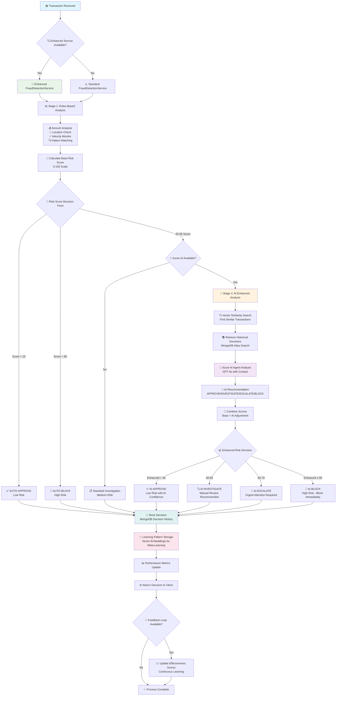
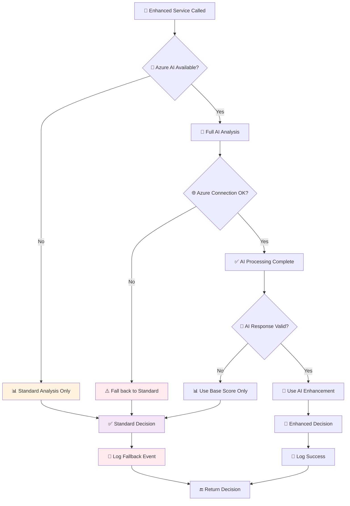

# Azure AI Foundry Fraud Detection Agent - Logical Flow Diagram

**Generated:** August 26, 2025  
**Architecture:** Enhanced FraudDetectionService with Azure AI Foundry Integration

---

## 🔄 **Complete Agent Decision Flow**



---

## 🎯 **Detailed Decision Logic**

### **🔍 Stage 1: Rules-Based Analysis**
```
┌─────────────────────────────────────────────────────────────┐
│                    STAGE 1 ANALYSIS                        │
├─────────────────────────────────────────────────────────────┤
│ 💰 AMOUNT ANALYSIS                                         │
│    • Calculate std deviations from customer average        │
│    • Apply amount threshold multiplier (3.0x)              │
│    • Score: 0-100 based on deviation                       │
│                                                             │
│ 📍 LOCATION ANALYSIS                                        │
│    • Calculate distance from usual locations               │
│    • Haversine distance calculation                        │
│    • Flag if > 500km from normal                           │
│                                                             │
│ ⚡ VELOCITY MONITORING                                      │
│    • Count transactions in 60-minute window                │
│    • Flag if > 5 transactions in window                    │
│    • Weight by transaction amounts                         │
│                                                             │
│ 🔍 PATTERN MATCHING                                        │
│    • Vector similarity search (existing)                   │
│    • Compare against known fraud patterns                  │
│    • MongoDB Atlas vector search                           │
│                                                             │
│ 🧮 COMBINED SCORING                                        │
│    • Weighted combination: 25% amount, 25% location,       │
│      20% device, 15% velocity, 15% patterns               │
│    • Final Score: 0-100                                    │
└─────────────────────────────────────────────────────────────┘
```

### **🤖 Stage 2: AI Enhanced Analysis** 
```
┌─────────────────────────────────────────────────────────────┐
│                    STAGE 2 AI ANALYSIS                     │
├─────────────────────────────────────────────────────────────┤
│ 🔍 CONTEXT BUILDING                                        │
│    • Stage 1 results + flags                               │
│    • Similar transactions (vector search)                  │
│    • Historical decisions (MongoDB Atlas)                  │
│    • Customer behavioral patterns                          │
│                                                             │
│ 🧠 AZURE AI AGENT PROCESSING                               │
│    • Create isolated thread                                │
│    • Send structured analysis request                      │
│    • GPT-4o processes with fraud detection tools          │
│    • Native conversation with create_and_process()         │
│                                                             │
│ 🎯 AI RECOMMENDATION PARSING                               │
│    • Extract: APPROVE/INVESTIGATE/ESCALATE/BLOCK           │
│    • Confidence level: 0.0-1.0                            │
│    • Reasoning and risk factors                            │
│                                                             │
│ 🤝 SCORE ENHANCEMENT                                       │
│    • Base Score + (AI Adjustment × Confidence)             │
│    • AI Adjustments: APPROVE(-15), INVESTIGATE(0),         │
│      ESCALATE(+20), BLOCK(+30)                            │
│    • Final Enhanced Score: 0-100 (capped)                 │
└─────────────────────────────────────────────────────────────┘
```

---

## 📊 **Decision Thresholds & Actions**

### **🎯 Risk Score Mapping**
| **Score Range** | **Risk Level** | **Decision** | **Action Required** |
|-----------------|----------------|--------------|-------------------|
| **0-24** | 🟢 **LOW** | ✅ **AUTO-APPROVE** | Process immediately |
| **25-39** | 🟡 **LOW-MEDIUM** | ✅ **APPROVE** | Log for monitoring |
| **40-59** | 🟡 **MEDIUM** | 🔍 **INVESTIGATE** | Manual review queue |
| **60-79** | 🟠 **HIGH** | 🚨 **ESCALATE** | Priority attention |
| **80-100** | 🔴 **CRITICAL** | 🚫 **BLOCK** | Immediate block |

### **🤖 AI Enhancement Impact**
```
Enhanced Score = Base Score + (AI Adjustment × AI Confidence)

Examples:
• Base: 60, AI: APPROVE (0.9 confidence) → 60 + (-15 × 0.9) = 46.5
• Base: 45, AI: ESCALATE (0.8 confidence) → 45 + (20 × 0.8) = 61.0  
• Base: 70, AI: BLOCK (0.95 confidence) → 70 + (30 × 0.95) = 98.5
```

---

## 🔄 **Data Flow & Storage**

### **📝 Decision Storage Flow**
```
┌─────────────────┐    ┌──────────────────────┐    ┌─────────────────────┐
│   Transaction   │───▶│    Agent Decision    │───▶│   Vector Embedding  │
│      Data       │    │     Analysis         │    │    (1536 dims)      │
└─────────────────┘    └──────────────────────┘    └─────────────────────┘
         │                        │                           │
         ▼                        ▼                           ▼
┌─────────────────────────────────────────────────────────────────────────┐
│                    MONGODB DECISION RECORD                             │
├─────────────────────────────────────────────────────────────────────────┤
│ • decision_id: "dec_20250826_143052_1234"                              │
│ • timestamp: 2025-08-26T14:30:52Z                                      │
│ • agent_decision: {decision, confidence, risk_score, reasoning}        │
│ • transaction_data: {id, amount, merchant, customer}                   │
│ • decision_embedding: [vector for similarity search]                   │
│ • metadata: {has_ai_analysis, thread_id, risk_level}                  │
└─────────────────────────────────────────────────────────────────────────┘
```

### **🧠 Learning Pattern Flow**
```
┌─────────────────┐    ┌──────────────────────┐    ┌─────────────────────┐
│  Pattern Type   │───▶│   Effectiveness      │───▶│   Pattern Storage   │
│ "electronics"   │    │    Score: 0.82       │    │   with Embedding    │
└─────────────────┘    └──────────────────────┘    └─────────────────────┘
         │                        │                           │
         ▼                        ▼                           ▼
┌─────────────────────────────────────────────────────────────────────────┐
│                    LEARNING PATTERN RECORD                             │
├─────────────────────────────────────────────────────────────────────────┤
│ • pattern_id: "pattern_electronics_1724681452"                         │
│ • pattern_type: "high_amount_electronics"                              │
│ • pattern_data: {category, amount_range, typical_outcome}              │
│ • effectiveness_score: 0.82                                            │
│ • pattern_embedding: [vector for pattern similarity]                   │
└─────────────────────────────────────────────────────────────────────────┘
```

---

## 🛡️ **Error Handling & Fallback Logic**

### **🔄 Graceful Degradation Flow**


---

## 📈 **Performance & Monitoring Points**

### **⏱️ Performance Checkpoints**
1. **Stage 1 Processing**: Target < 200ms
2. **Vector Similarity Search**: Target < 500ms  
3. **Azure AI Agent Call**: Target < 2000ms
4. **Decision Storage**: Target < 100ms
5. **Total Processing**: Target < 3000ms

### **📊 Success Metrics**
- **Stage 1 Efficiency**: % of decisions made without AI (target: 70-80%)
- **AI Enhancement Value**: Improvement in decision accuracy
- **Vector Search Quality**: Similarity scores > 0.7
- **Fallback Rate**: % of requests falling back to standard analysis

### **🚨 Alert Conditions**
- Azure AI Foundry service unavailable > 5 minutes
- Vector search returning < 50% expected results
- Processing time > 5 seconds consistently  
- Fallback rate > 30%

---

## 🎯 **Integration Points Summary**

### **🔌 External Dependencies**
1. **Azure AI Foundry**: Agent operations, GPT-4o processing
2. **Azure OpenAI**: Embeddings generation (1536-dim vectors)
3. **MongoDB Atlas**: Vector search, decision storage
4. **Existing FraudDetectionService**: Rules-based analysis, patterns

### **📡 API Integration Points**
1. **Transaction Input**: `/transactions/` endpoint  
2. **Enhanced Analysis**: `analyze_with_azure_agent()`
3. **Decision Storage**: `store_agent_decision()`
4. **Learning Retrieval**: `retrieve_similar_agent_decisions()`
5. **Pattern Storage**: `store_learning_pattern()`

---

**🏆 This flow diagram represents a production-ready, fault-tolerant fraud detection system that seamlessly combines existing proven infrastructure with cutting-edge Azure AI capabilities.**