# Azure AI Foundry - High-Level Architecture Overview

**Focus:** General understanding of Azure AI Foundry concepts, patterns, and integration approaches  
**Audience:** Technical leaders, solution architects, and developers new to Azure AI Foundry

---

## 🎯 **Core Concept Overview**

Azure AI Foundry enables building intelligent agents that can reason, use tools, and maintain conversational context. This architecture shows the fundamental patterns for enterprise integration.

```mermaid
graph TB
    subgraph "🌐 External World"
        USER[👤 Users<br/>Business Applications]
        APIS[🔌 External APIs<br/>Business Systems]
    end
    
    subgraph "🚪 Integration Layer"
        GATEWAY[🚀 API Gateway<br/>Request Orchestration]
        AUTH[🔐 Authentication<br/>Security & Access Control]
    end
    
    subgraph "🧠 Azure AI Foundry Core"
        AGENT[🤖 Intelligent Agent<br/>GPT-4o Reasoning Engine]
        TOOLS[🛠️ Custom Function Tools<br/>Business Logic Integration]
        THREADS[🧵 Thread Management<br/>Conversation Context]
    end
    
    subgraph "💾 Knowledge & Memory"
        MONGODB[🍃 MongoDB Atlas<br/>Operational Data Store]
        VECTORS[🧠 Vector Store<br/>Semantic Knowledge Base]
        CACHE[⚡ Memory Cache<br/>Session & Performance]
    end
    
    subgraph "⚙️ Business Logic"
        SERVICES[🏗️ Business Services<br/>Domain Logic]
        EXTERNAL[🌐 External Systems<br/>APIs & Databases]
    end
    
    %% Flow connections
    USER --> GATEWAY
    APIS --> GATEWAY
    GATEWAY --> AUTH
    AUTH --> AGENT
    
    AGENT <--> TOOLS
    AGENT <--> THREADS
    TOOLS <--> SERVICES
    
    AGENT <--> MONGODB
    THREADS --> CACHE
    SERVICES <--> VECTORS
    
    SERVICES <--> EXTERNAL
    
    %% Styling
    classDef external fill:#e1f5fe,stroke:#0277bd,stroke-width:2px
    classDef integration fill:#e8f5e8,stroke:#388e3c,stroke-width:2px
    classDef foundry fill:#fff3e0,stroke:#f57c00,stroke-width:3px
    classDef data fill:#f3e5f5,stroke:#7b1fa2,stroke-width:2px
    classDef business fill:#e0f2f1,stroke:#00695c,stroke-width:2px
    
    class USER,APIS external
    class GATEWAY,AUTH integration
    class AGENT,TOOLS,THREADS foundry
    class MONGODB,VECTORS,CACHE data
    class SERVICES,EXTERNAL business
```



---

## 🧠 **Azure AI Foundry Core Concepts**

### **🤖 Intelligent Agent**
The central reasoning engine powered by GPT-4o that:
- **Processes natural language** requests from users
- **Makes decisions** using contextual understanding
- **Orchestrates tool usage** to accomplish complex tasks
- **Maintains conversation flow** across multiple interactions

### **🛠️ Custom Function Tools**
Business-specific capabilities that agents can invoke:
- **API Integration**: Connect to existing business systems
- **Data Operations**: Query databases, perform calculations
- **External Services**: Call third-party APIs, services
- **Business Logic**: Execute domain-specific workflows

### **🧵 Thread Management**
Conversational context and state management:
- **Session Persistence**: Maintain conversation across requests
- **Context Awareness**: Remember previous interactions
- **State Management**: Track conversation flow and decisions
- **Multi-turn Dialogues**: Support complex back-and-forth exchanges

---

## 🔄 **Foundational Integration Patterns**

### **Pattern 1: Agent-to-API Integration**

```mermaid
sequenceDiagram
    participant User as 👤 User Application
    participant Gateway as 🚀 API Gateway
    participant Agent as 🤖 Azure AI Agent
    participant Tools as 🛠️ Custom Tools
    participant API as 🔌 Business API
    
    User->>Gateway: Business Request
    Gateway->>Agent: Process Request
    Agent->>Agent: Analyze & Plan
    Agent->>Tools: Execute Business Function
    Tools->>API: Call Business API
    API-->>Tools: Business Data
    Tools-->>Agent: Processed Result
    Agent->>Agent: Reason & Decide
    Agent-->>Gateway: Intelligent Response
    Gateway-->>User: Final Result
```



### **Pattern 2: Knowledge Integration with MongoDB**

```mermaid
graph LR
    subgraph "🧠 Agent Reasoning"
        AGENT[🤖 GPT-4o Agent]
        CONTEXT[💭 Context Building]
        DECISION[🎯 Decision Making]
    end
    
    subgraph "💾 MongoDB Knowledge Store"
        OPERATIONAL[📊 Operational Data<br/>Real-time Business Data]
        HISTORICAL[📚 Historical Knowledge<br/>Past Decisions & Outcomes]
        VECTORS[🧠 Vector Embeddings<br/>Semantic Similarity Search]
    end
    
    AGENT --> CONTEXT
    CONTEXT <--> OPERATIONAL
    CONTEXT <--> HISTORICAL
    CONTEXT <--> VECTORS
    CONTEXT --> DECISION
    DECISION --> OPERATIONAL
```



---

## 🛠️ **Custom Function Tool Architecture**

### **Tool Definition Pattern**

```python
# Conceptual Tool Structure
class CustomBusinessTool:
    def __init__(self, api_gateway_client):
        self.api_client = api_gateway_client
    
    def business_function(self, parameters):
        """
        Azure AI Foundry will automatically call this function
        when the agent determines it's needed
        """
        # 1. Validate input
        # 2. Call business API through gateway
        # 3. Process response
        # 4. Return structured result
        pass
    
    def get_function_schema(self):
        """
        Returns OpenAPI-style schema that tells the agent
        how and when to use this tool
        """
        return {
            "name": "business_function",
            "description": "What this tool does for the business",
            "parameters": {
                "type": "object",
                "properties": {
                    "param1": {"type": "string", "description": "Business parameter"}
                }
            }
        }
```

### **Tool Integration Flow**

```mermaid
graph TD
    subgraph "🤖 Agent Processing"
        A1[📥 User Request]
        A2[🧠 Analyze Intent]
        A3[🛠️ Select Tools]
        A4[⚙️ Execute Tools]
        A5[💭 Synthesize Results]
        A6[📤 Provide Response]
    end
    
    subgraph "🛠️ Custom Tool Layer"
        T1[🔍 Tool Registry<br/>Available Functions]
        T2[⚙️ Tool Executor<br/>Function Calls]
        T3[🔄 Result Processor<br/>Response Formatting]
    end
    
    subgraph "🚀 API Gateway Integration"
        G1[🔐 Authentication<br/>Security Layer]
        G2[🔄 Request Router<br/>Service Discovery]
        G3[📊 Response Handler<br/>Data Transformation]
    end
    
    A1 --> A2
    A2 --> A3
    A3 --> T1
    T1 --> A4
    A4 --> T2
    T2 --> G1
    G1 --> G2
    G2 --> G3
    G3 --> T3
    T3 --> A5
    A5 --> A6
```



---

## 💾 **MongoDB as Knowledge & Memory Store**

### **Data Architecture Patterns**

```mermaid
graph TB
    subgraph "🧠 Agent Memory Patterns"
        WORKING[⚡ Working Memory<br/>Current Session Context]
        SHORT[📅 Short-term Memory<br/>Recent Conversations]
        LONG[🏛️ Long-term Memory<br/>Historical Knowledge]
    end
    
    subgraph "💾 MongoDB Collections"
        SESSIONS[🧵 agent_sessions<br/>Thread State & Context]
        DECISIONS[🎯 agent_decisions<br/>Historical Choices & Outcomes]
        KNOWLEDGE[📚 knowledge_base<br/>Business Facts & Rules]
        VECTORS[🧠 vector_embeddings<br/>Semantic Search Index]
    end
    
    subgraph "🔍 Query Patterns"
        TEXT[📝 Text Search<br/>Atlas Search]
        VECTOR[🧮 Vector Search<br/>Semantic Similarity]
        GRAPH[🌐 Graph Queries<br/>Relationship Analysis]
    end
    
    WORKING --> SESSIONS
    SHORT --> DECISIONS
    LONG --> KNOWLEDGE
    
    SESSIONS --> TEXT
    DECISIONS --> VECTOR
    KNOWLEDGE --> GRAPH
    VECTORS --> VECTOR
```



### **Knowledge Integration Patterns**

| **Memory Type** | **MongoDB Pattern** | **Use Case** | **Retrieval Method** |
|----------------|---------------------|--------------|---------------------|
| **🧵 Session State** | Thread Documents | Conversation context | Direct ID lookup |
| **🎯 Decision History** | Timestamped Records | Learning from past choices | Vector similarity |
| **📚 Business Knowledge** | Structured Documents | Domain expertise | Atlas Search |
| **🧠 Semantic Memory** | Vector Embeddings | Conceptual understanding | Cosine similarity |

---

## 🔄 **End-to-End Flow Example**

### **Intelligent Business Decision Flow**

```mermaid
sequenceDiagram
    participant App as 📱 Business App
    participant Gateway as 🚀 API Gateway  
    participant Agent as 🤖 Azure AI Agent
    participant Thread as 🧵 Thread Manager
    participant Tools as 🛠️ Business Tools
    participant MongoDB as 💾 MongoDB Atlas
    participant External as 🌐 External APIs
    
    App->>Gateway: "Analyze customer risk for transaction X"
    Gateway->>Agent: Process business request
    
    Agent->>Thread: Get conversation context
    Thread->>MongoDB: Retrieve session history
    MongoDB-->>Thread: Previous context
    Thread-->>Agent: Session state
    
    Agent->>Agent: Analyze request & plan approach
    Agent->>Tools: Execute risk analysis function
    
    Tools->>MongoDB: Get customer history
    MongoDB-->>Tools: Customer data
    
    Tools->>External: Call risk scoring API
    External-->>Tools: Risk scores
    
    Tools->>MongoDB: Store analysis results
    Tools-->>Agent: Comprehensive risk assessment
    
    Agent->>Agent: Reason about results
    Agent->>Thread: Update conversation state
    Thread->>MongoDB: Persist session updates
    
    Agent-->>Gateway: Intelligent risk decision
    Gateway-->>App: Business recommendation
```



---

## 🎯 **Key Architectural Benefits**

### **🧠 Intelligence Layer**
- **Natural Language Understanding**: Agents comprehend business requests
- **Contextual Reasoning**: Decisions based on full business context
- **Dynamic Tool Selection**: Automatically choose appropriate business functions
- **Learning Capability**: Improve over time from experience

### **🔌 Integration Flexibility**
- **API Gateway Pattern**: Clean separation between AI and business systems
- **Custom Tool Framework**: Extend agent capabilities with business logic
- **Thread Management**: Maintain context across complex workflows
- **Universal Connectivity**: Connect to any API or service

### **💾 Persistent Intelligence**
- **MongoDB Flexibility**: Store any business data structure
- **Vector Intelligence**: Semantic search and similarity matching
- **Conversation Persistence**: Remember context across sessions
- **Historical Learning**: Learn from past decisions and outcomes

### **⚡ Enterprise Scalability**
- **Stateless Agent Design**: Scale horizontally
- **MongoDB Sharding**: Handle large datasets
- **API Gateway**: Manage traffic and security
- **Async Processing**: Handle complex workflows

---

## 🚀 **Implementation Quick Start**

### **1. Core Components Setup**
```
Azure AI Foundry Agent → Custom Function Tools → API Gateway → Business Systems
                     ↓
MongoDB Atlas (Sessions + Knowledge + Vectors)
```

### **2. Key Integration Points**
- **Agent Configuration**: Define agent personality and capabilities
- **Tool Registration**: Connect business functions to agent
- **Thread Setup**: Configure conversation management
- **MongoDB Schema**: Design knowledge and memory structure

### **3. Business Value Delivered**
- **Intelligent Automation**: AI-powered business decision making
- **Contextual Responses**: Decisions based on complete business context
- **Scalable Intelligence**: Enterprise-grade AI that grows with business
- **Integrated Experience**: Seamless connection to existing systems

---

**🎯 This architecture provides a foundation for building intelligent business applications that combine Azure AI Foundry's reasoning capabilities with your existing systems and data infrastructure.**