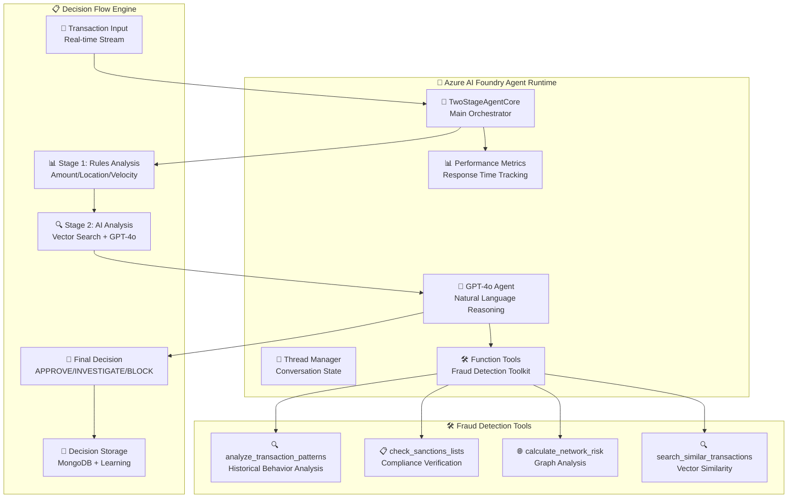
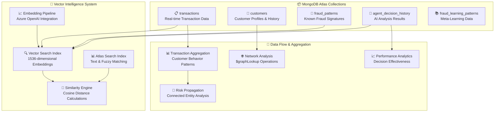
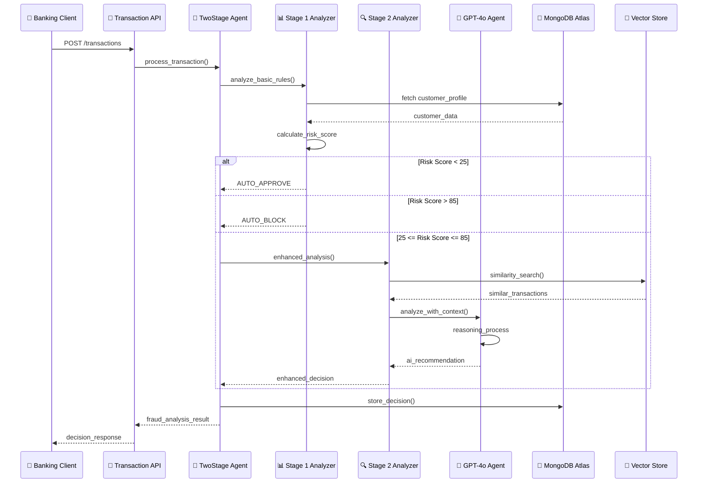
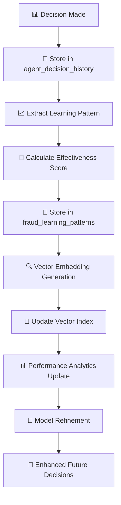
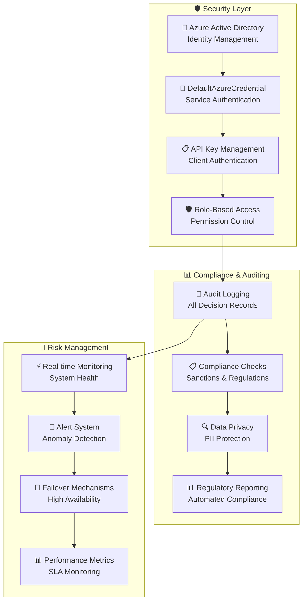
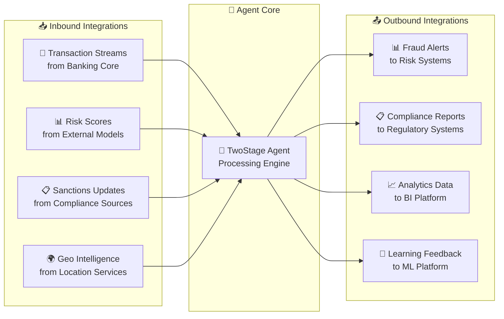

# Azure AI Foundry Fraud Detection - Solution Architecture

**Generated:** August 26, 2025  
**System:** ThreatSight 360 Enhanced Fraud Detection with Azure AI Foundry Integration

---

## 🏗️ **Complete Solution Architecture**

```mermaid
graph TB
    subgraph "🌐 External Integrations"
        EXT1[🏦 Banking APIs<br/>Transaction Streams]
        EXT2[📊 Databricks<br/>ML Models & Features]
        EXT3[🎯 Risk Model APIs<br/>External Scoring]
        EXT4[📋 Sanctions Lists<br/>Compliance Data]
        EXT5[🌍 Location Services<br/>Geo-Intelligence]
    end
    
    subgraph "🔌 API Gateway Layer"
        API1[🚀 Transaction API<br/>POST /transactions]
        API2[🔍 Fraud Detection API<br/>POST /analyze]
        API3[📊 Risk Assessment API<br/>GET /risk/{id}]
        API4[🧠 Agent Analysis API<br/>POST /agent/analyze]
        API5[📈 Learning API<br/>POST /learn/pattern]
    end
    
    subgraph "🤖 Agentic Intelligence Layer"
        subgraph "🧠 Azure AI Foundry Core"
            AGENT1[🤖 TwoStageAgentCore<br/>Orchestration Engine]
            AGENT2[💭 GPT-4o Agent<br/>Analysis & Reasoning]
            AGENT3[🧵 Thread Management<br/>Conversation State]
            AGENT4[🛠️ Function Tools<br/>Fraud Detection Kit]
        end
        
        subgraph "📋 Agent Decision Flow"
            STAGE1[📊 Stage 1 Analyzer<br/>Rules + Basic ML]
            STAGE2[🔍 Stage 2 Analyzer<br/>Vector + AI Analysis]
            DECISION[🎯 Decision Engine<br/>Risk Scoring Logic]
        end
    end
    
    subgraph "⚙️ Business Logic Layer"
        subgraph "🛡️ Fraud Detection Services"
            FDS1[🔍 FraudDetectionService<br/>Core Analysis Engine]
            FDS2[📊 Pattern Matching<br/>Vector Similarity]
            FDS3[📍 Geo Analysis<br/>Location Intelligence]
            FDS4[⚡ Velocity Monitoring<br/>Real-time Checks]
        end
        
        subgraph "🧠 ML & AI Services"
            ML1[🔮 Risk Model Service<br/>Dynamic Scoring]
            ML2[📚 Learning Service<br/>Pattern Recognition]
            ML3[🎯 Prediction Service<br/>Outcome Forecasting]
            ML4[📊 Feature Engineering<br/>Transaction Enrichment]
        end
    end
    
    subgraph "💾 Database & Memory Layer"
        subgraph "📦 MongoDB Atlas Cluster"
            DB1[📋 Transactions Collection<br/>Real-time Data]
            DB2[👥 Customers Collection<br/>Profile & History]
            DB3[🎯 Fraud Patterns<br/>Known Signatures]
            DB4[🤖 Agent Decisions<br/>AI Analysis History]
            DB5[📚 Learning Patterns<br/>Meta-Learning Data]
        end
        
        subgraph "🧠 Vector Intelligence"
            VEC1[🔍 Vector Search Index<br/>1536-dim Embeddings]
            VEC2[📊 Atlas Search Index<br/>Text & Fuzzy Matching]
            VEC3[🧮 Similarity Engine<br/>Cosine Distance]
            VEC4[📈 Embedding Pipeline<br/>Azure OpenAI]
        end
    end
    
    subgraph "☁️ Azure Cloud Services"
        subgraph "🧠 Azure AI Foundry"
            AZ1[🤖 Agents Runtime<br/>GPT-4o Processing]
            AZ2[🔧 Project Management<br/>Agent Configuration]
            AZ3[🔐 Authentication<br/>DefaultAzureCredential]
        end
        
        subgraph "🔮 Azure OpenAI"
            AZ4[📝 Embeddings API<br/>text-embedding-ada-002]
            AZ5[🧠 GPT-4o API<br/>Analysis & Reasoning]
            AZ6[⚡ Real-time Inference<br/>Low Latency Calls]
        end
    end
    
    subgraph "📊 Analytics & Monitoring"
        MONITOR1[📈 Performance Metrics<br/>Response Times]
        MONITOR2[🎯 Decision Analytics<br/>Accuracy Tracking]
        MONITOR3[🚨 Alert System<br/>Threshold Monitoring]
        MONITOR4[📊 Business Intelligence<br/>Fraud Trends]
    end
    
    %% External to API Gateway
    EXT1 --> API1
    EXT2 --> API3
    EXT3 --> API3
    EXT4 --> API2
    EXT5 --> API2
    
    %% API Gateway to Agentic Layer
    API1 --> AGENT1
    API2 --> AGENT1
    API4 --> AGENT1
    API5 --> ML2
    
    %% Agentic Layer Internal Flow
    AGENT1 --> STAGE1
    STAGE1 --> STAGE2
    STAGE2 --> DECISION
    AGENT1 --> AGENT2
    AGENT2 --> AGENT3
    AGENT2 --> AGENT4
    
    %% Agentic to Business Logic
    STAGE1 --> FDS1
    STAGE2 --> FDS2
    DECISION --> ML1
    AGENT4 --> FDS3
    AGENT4 --> FDS4
    
    %% Business Logic Internal
    FDS1 --> FDS2
    FDS1 --> FDS3
    FDS1 --> FDS4
    ML1 --> ML2
    ML1 --> ML3
    ML2 --> ML4
    
    %% Business Logic to Database
    FDS1 --> DB1
    FDS1 --> DB2
    FDS2 --> DB3
    AGENT1 --> DB4
    ML2 --> DB5
    
    %% Vector Intelligence
    FDS2 --> VEC1
    VEC1 --> VEC3
    VEC2 --> VEC3
    VEC4 --> VEC1
    
    %% Database to Vector
    DB1 --> VEC1
    DB3 --> VEC1
    DB4 --> VEC1
    
    %% Azure Services Integration
    AGENT2 --> AZ1
    AZ1 --> AZ2
    AZ1 --> AZ3
    VEC4 --> AZ4
    AGENT2 --> AZ5
    AZ4 --> AZ6
    
    %% External ML Integration
    ML1 --> EXT2
    ML3 --> EXT2
    ML4 --> EXT2
    
    %% Monitoring Integration
    AGENT1 --> MONITOR1
    DECISION --> MONITOR2
    FDS1 --> MONITOR3
    ML1 --> MONITOR4
    
    %% Styling
    classDef external fill:#e1f5fe,stroke:#0277bd,stroke-width:2px
    classDef api fill:#e8f5e8,stroke:#388e3c,stroke-width:2px
    classDef agentic fill:#fff3e0,stroke:#f57c00,stroke-width:3px
    classDef business fill:#f3e5f5,stroke:#7b1fa2,stroke-width:2px
    classDef database fill:#e0f2f1,stroke:#00695c,stroke-width:2px
    classDef azure fill:#e3f2fd,stroke:#1976d2,stroke-width:2px
    classDef monitor fill:#fce4ec,stroke:#c2185b,stroke-width:2px
    
    class EXT1,EXT2,EXT3,EXT4,EXT5 external
    class API1,API2,API3,API4,API5 api
    class AGENT1,AGENT2,AGENT3,AGENT4,STAGE1,STAGE2,DECISION agentic
    class FDS1,FDS2,FDS3,FDS4,ML1,ML2,ML3,ML4 business
    class DB1,DB2,DB3,DB4,DB5,VEC1,VEC2,VEC3,VEC4 database
    class AZ1,AZ2,AZ3,AZ4,AZ5,AZ6 azure
    class MONITOR1,MONITOR2,MONITOR3,MONITOR4 monitor
```

---

## 🔧 **Detailed Component Architecture**

### **🤖 Agentic Intelligence Layer**



### **💾 Database & Memory Architecture**



### **🔌 API Integration Layer**

```mermaid
graph LR
    subgraph "📱 Client Applications"
        CLIENT1[🏦 Banking App<br/>Transaction Requests]
        CLIENT2[🖥️ Fraud Dashboard<br/>Investigation Tools]
        CLIENT3[📊 Analytics Platform<br/>Reporting & BI]
    end
    
    subgraph "🚀 API Gateway"
        GW1[🔐 Authentication<br/>API Key Management]
        GW2[⚡ Rate Limiting<br/>Traffic Control]
        GW3[📊 Request Routing<br/>Load Balancing]
        GW4[📝 Logging & Metrics<br/>Request Tracking]
    end
    
    subgraph "🎯 Fraud Detection APIs"
        API1[🚀 POST /transactions<br/>Real-time Analysis]
        API2[🔍 POST /analyze<br/>Detailed Investigation]
        API3[🤖 POST /agent/analyze<br/>AI-Enhanced Analysis]
        API4[📊 GET /risk/{id}<br/>Risk Assessment]
        API5[📚 POST /learn/pattern<br/>Learning Feedback]
    end
    
    CLIENT1 --> GW1
    CLIENT2 --> GW1
    CLIENT3 --> GW1
    
    GW1 --> GW2
    GW2 --> GW3
    GW3 --> GW4
    
    GW4 --> API1
    GW4 --> API2
    GW4 --> API3
    GW4 --> API4
    GW4 --> API5
```

---

## 🔄 **Data Flow Patterns**

### **⚡ Real-time Transaction Processing**



### **🧠 Learning & Adaptation Flow**



---

## 🛡️ **Security & Compliance Architecture**

### **🔐 Authentication & Authorization**



---

## 🌐 **External Integration Points**

### **🔌 Third-Party Services**

| **Service Type** | **Provider** | **Integration** | **Purpose** |
|------------------|--------------|----------------|-------------|
| **🏦 Banking APIs** | Core Banking | REST APIs | Transaction streams |
| **📊 ML Platform** | Databricks | ML Pipeline APIs | Advanced modeling |
| **🎯 Risk Models** | External Vendors | Risk Scoring APIs | External risk signals |
| **📋 Sanctions** | OFAC/EU Lists | Compliance APIs | Regulatory screening |
| **🌍 Geo Intelligence** | Location Services | Geo APIs | Location analysis |
| **📊 Business Intelligence** | Analytics Platform | BI Connectors | Reporting & dashboards |

### **🔄 Data Exchange Patterns**



---

## 📊 **Performance & Scaling**

### **⚡ Performance Targets**

| **Component** | **Target Latency** | **Throughput** | **Availability** |
|---------------|-------------------|----------------|------------------|
| **🚀 Transaction API** | < 500ms | 1000 TPS | 99.9% |
| **📊 Stage 1 Analysis** | < 200ms | 800 TPS | 99.9% |
| **🔍 Stage 2 Analysis** | < 2000ms | 200 TPS | 99.5% |
| **💾 MongoDB Operations** | < 100ms | 2000 ops/s | 99.9% |
| **🧠 Vector Search** | < 300ms | 500 ops/s | 99.5% |
| **🤖 Azure AI Foundry** | < 1500ms | 100 req/s | 99.0% |

### **📈 Scaling Strategy**

```mermaid
graph TD
    subgraph "🔄 Horizontal Scaling"
        H1[⚖️ Load Balancer<br/>Request Distribution]
        H2[🏗️ Multiple API Instances<br/>Stateless Design]
        H3[💾 MongoDB Sharding<br/>Data Distribution]
        H4[🧠 Vector Search Replicas<br/>Read Scaling]
    end
    
    subgraph "⬆️ Vertical Scaling"
        V1[💪 CPU Optimization<br/>Compute Scaling]
        V2[🧠 Memory Enhancement<br/>Caching Strategy]
        V3[💾 Storage Performance<br/>SSD Optimization]
        V4[🌐 Network Bandwidth<br/>Connection Pooling]
    end
    
    subgraph "🤖 AI Service Scaling"
        A1[⚡ Azure AI Quota<br/>Request Limits]
        A2[🔄 Request Queuing<br/>Rate Management]
        A3[📊 Load Distribution<br/>Multi-Region]
        A4[🧠 Caching Layer<br/>Response Optimization]
    end
    
    H1 --> H2
    H2 --> H3
    H3 --> H4
    
    V1 --> V2
    V2 --> V3
    V3 --> V4
    
    A1 --> A2
    A2 --> A3
    A3 --> A4
```



---

**🎯 This solution architecture provides a comprehensive view of the Azure AI Foundry fraud detection system, showing how all components work together to deliver intelligent, scalable, and secure fraud detection capabilities.**