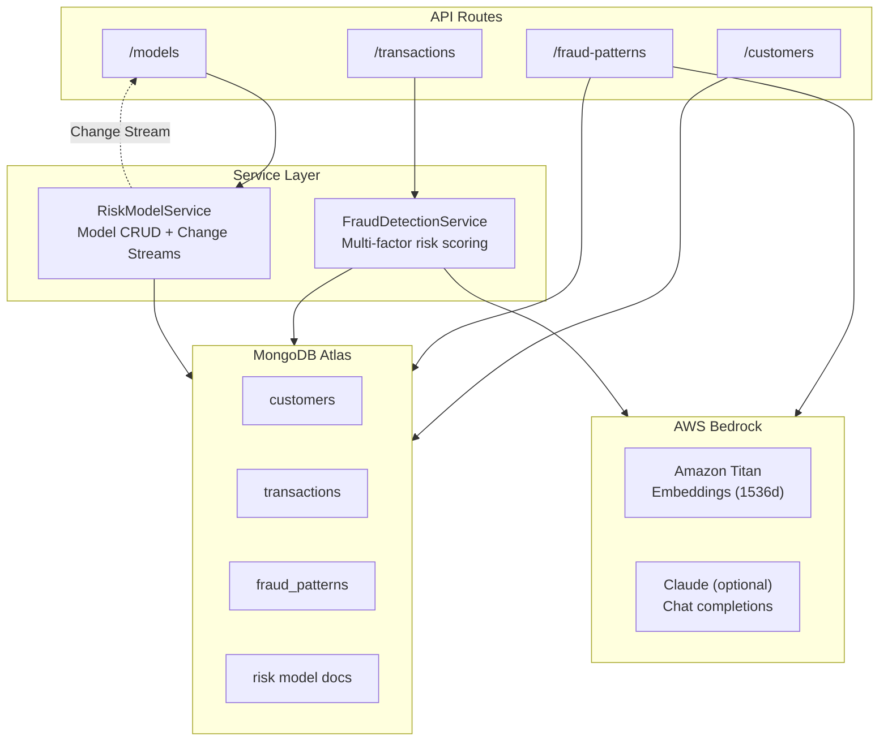

# ThreatSight 360 - Fraud Detection Backend


**Real-time Fraud Detection and Risk Model Management Service**

The fraud detection backend (port 8000) provides real-time transaction risk assessment, dynamic risk model management, and vector-based fraud pattern recognition. It is one of two backend services in the ThreatSight 360 dual-backend architecture.

---

## Table of Contents

1. [Architecture](#architecture)
2. [API Endpoints](#api-endpoints)
3. [Fraud Detection Engine](#fraud-detection-engine)
4. [Risk Model Management](#risk-model-management)
5. [Vector Search](#vector-search)
6. [Environment Variables](#environment-variables)
7. [Quick Start](#quick-start)
8. [Related Documentation](#related-documentation)

---

## Architecture



### Project Structure

```
backend/
├── main.py                  # FastAPI app, CORS, router registration
├── dependencies.py          # MongoDB connection, service singletons
├── routes/
│   ├── customer.py          # Customer CRUD endpoints
│   ├── transaction.py       # Transaction creation + fraud evaluation
│   ├── fraud_pattern.py     # Fraud pattern CRUD + vector search
│   └── model_management.py  # Risk model lifecycle + WebSocket
├── services/
│   ├── fraud_detection.py   # Multi-factor risk scoring engine
│   └── risk_model_service.py# Model CRUD + Change Stream management
├── models/
│   ├── customer.py          # Customer Pydantic models
│   ├── transaction.py       # Transaction Pydantic models
│   └── fraud_pattern.py     # Fraud pattern Pydantic models
├── bedrock/
│   ├── embeddings.py        # Amazon Titan embedding generation
│   └── chat_completions.py  # Bedrock Claude chat completions
├── db/
│   └── mongo_db.py          # MongoDB access layer
├── README-RISK-MODEL.md     # Risk model deep-dive
├── VECTOR_SEARCH_IMPLEMENTATION.md # Vector search deep-dive
└── pyproject.toml           # Poetry dependencies
```

---

## API Endpoints

### Customers (`/customers`)

| Method | Path | Description |
|--------|------|-------------|
| GET | `/customers/` | List all customers |
| GET | `/customers/{customer_id}` | Get customer by ID |
| POST | `/customers/` | Create a new customer |
| PUT | `/customers/{customer_id}` | Update a customer |
| DELETE | `/customers/{customer_id}` | Delete a customer |

### Transactions (`/transactions`)

| Method | Path | Description |
|--------|------|-------------|
| GET | `/transactions/` | List transactions |
| GET | `/transactions/{transaction_id}` | Get transaction by ID |
| POST | `/transactions/` | Create transaction (triggers fraud evaluation) |
| POST | `/transactions/evaluate` | Evaluate transaction risk without persisting |

### Fraud Patterns (`/fraud-patterns`)

| Method | Path | Description |
|--------|------|-------------|
| GET | `/fraud-patterns/` | List all fraud patterns |
| GET | `/fraud-patterns/{pattern_id}` | Get pattern by ID |
| POST | `/fraud-patterns/` | Create pattern (generates Titan embedding) |
| PUT | `/fraud-patterns/{pattern_id}` | Update a pattern |
| DELETE | `/fraud-patterns/{pattern_id}` | Delete a pattern |
| POST | `/fraud-patterns/similar-search` | Vector search for similar patterns |

### Risk Models (`/models`)

| Method | Path | Description |
|--------|------|-------------|
| GET | `/models/` | List all risk models |
| GET | `/models/{model_id}` | Get model by ID |
| POST | `/models/` | Create a new risk model |
| PUT | `/models/{model_id}` | Update a model (creates new version) |
| DELETE | `/models/{model_id}` | Archive a model |
| POST | `/models/{model_id}/activate` | Activate a model |
| POST | `/models/restore` | Restore default models |
| POST | `/models/reset` | Reset to clean baseline |
| GET | `/models/{model_id}/performance` | Get performance metrics |
| POST | `/models/{model_id}/feedback` | Record transaction outcome |
| GET | `/models/compare` | Compare model versions |
| WebSocket | `/models/change-stream` | Real-time model updates |

### Utility Endpoints

| Method | Path | Description |
|--------|------|-------------|
| GET | `/` | Service info |
| GET | `/test-cors/` | CORS test |
| GET | `/simple-test/` | Connectivity test |

---

## Fraud Detection Engine

The `FraudDetectionService` (`services/fraud_detection.py`) implements multi-factor risk scoring:

### Risk Factors

| Factor | Weight (default) | Description |
|--------|-----------------|-------------|
| Amount | 0.25 | Deviation from customer's typical transaction amounts |
| Location | 0.25 | Geographic distance from usual transaction locations |
| Device | 0.20 | Device fingerprint match against known devices |
| Velocity | 0.15 | Transaction frequency within a sliding time window |
| Pattern | 0.15 | Vector similarity to known fraud patterns |

### Scoring Flow

1. **Customer Profile Lookup**: Retrieve the customer's 360 profile from MongoDB
2. **Rule-based Assessment**: Apply configurable thresholds for amount, location, device, and velocity
3. **Embedding Generation**: Generate a text embedding via Amazon Titan (1536 dimensions)
4. **Vector Search**: `$vectorSearch` against `fraud_patterns` and `transactions` collections
5. **Weighted Scoring**: Combine all factor scores using the active risk model's weights
6. **Result**: Return a comprehensive risk assessment with per-factor breakdowns

### Risk Score Scale

All risk scores use a **0-100 scale**:
- **Low**: < 40
- **Medium**: 40-59
- **High**: 60-79
- **Critical**: >= 80

---

## Risk Model Management

Dynamic risk models stored as MongoDB documents with real-time synchronization via Change Streams.

- **Schema Flexibility**: Add custom risk factors without schema migrations
- **Versioning**: Each update creates a new version; full history preserved
- **Activation**: Only one model can be active at a time
- **Real-time Push**: WebSocket endpoint streams Change Stream events to all connected frontends

For detailed documentation, see [README-RISK-MODEL.md](README-RISK-MODEL.md).

---

## Vector Search

MongoDB Atlas Vector Search powers semantic similarity matching:

- **Fraud Patterns**: Text descriptions embedded via Amazon Titan, searched with `$vectorSearch` (cosine similarity, 1536 dimensions)
- **Historical Transactions**: Transaction embeddings enable context-aware risk evaluation against similar past transactions
- **Index**: `transaction_vector_index` on the `vector_embedding` field

For detailed documentation, see [VECTOR_SEARCH_IMPLEMENTATION.md](VECTOR_SEARCH_IMPLEMENTATION.md).

---

## Environment Variables

```bash
# MongoDB Connection
MONGODB_URI=mongodb+srv://<username>:<password>@cluster.mongodb.net/
DB_NAME=fsi-threatsight360

# AWS Bedrock
AWS_ACCESS_KEY_ID=your_key
AWS_SECRET_ACCESS_KEY=your_secret
AWS_REGION=us-east-1

# Server
HOST=0.0.0.0
PORT=8000
FRONTEND_URL=http://localhost:3000

# Risk Thresholds
AMOUNT_THRESHOLD_MULTIPLIER=2.5
MAX_LOCATION_DISTANCE_KM=100
VELOCITY_TIME_WINDOW_MINUTES=10
VELOCITY_THRESHOLD=5
SIMILARITY_THRESHOLD=0.8

# Risk Weights
WEIGHT_AMOUNT=0.25
WEIGHT_LOCATION=0.25
WEIGHT_DEVICE=0.20
WEIGHT_VELOCITY=0.15
WEIGHT_PATTERN=0.15
```

---

## Quick Start

```bash
cd backend
poetry install
poetry run uvicorn main:app --host 0.0.0.0 --port 8000 --reload
```

The API documentation is available at [http://localhost:8000/docs](http://localhost:8000/docs) (Swagger UI).

---

## Related Documentation

- [Root README](../README.md) -- Full project overview and setup
- [Risk Model Management](README-RISK-MODEL.md) -- Risk model deep-dive
- [Vector Search Implementation](VECTOR_SEARCH_IMPLEMENTATION.md) -- Vector search deep-dive
- [Solution Architecture](../docs/SOLUTION_ARCHITECTURE.md) -- System architecture diagrams
- [Data Model](../docs/DATA_MODEL.md) -- MongoDB collections and indexes
- [AML Backend](../aml-backend/README.md) -- Companion AML/KYC service
