# Agentic SAR Investigation Pipeline

## ThreatSight 360 — Multi-Agent Financial Crime Investigation System

> An autonomous, stateful investigation pipeline that transforms AML alerts into
> regulatory-compliant SAR narratives using specialized AI agents, LangGraph
> orchestration, and MongoDB as the unified data platform.

---

## Table of Contents

1. [Executive Summary](#1-executive-summary)
2. [Architecture Overview](#2-architecture-overview)
3. [Pipeline Workflow](#3-pipeline-workflow)
4. [Agent Descriptions](#4-agent-descriptions)
5. [Data Architecture](#5-data-architecture)
6. [Tool Layer](#6-tool-layer)
7. [Structured Output Models](#7-structured-output-models)
8. [LangGraph Patterns](#8-langgraph-patterns)
9. [API Reference](#9-api-reference)
10. [Frontend Dashboard](#10-frontend-dashboard)
11. [Demo Scenarios](#11-demo-scenarios)
12. [Configuration & Dependencies](#12-configuration--dependencies)
13. [Design Principles](#13-design-principles)
14. [Failure Mode Mitigations](#14-failure-mode-mitigations)
15. [File Reference](#15-file-reference)

---

## 1. Executive Summary

The Agentic Investigation Pipeline is a **LangGraph-powered multi-agent system**
integrated into the ThreatSight 360 AML backend. It automates the end-to-end
investigation lifecycle — from initial alert triage through evidence gathering,
typology classification, parallel analysis (network + temporal), trail following,
sub-investigations of connected entities, SAR narrative generation, quality
validation, and human review — producing audit-ready case documents.

### Key Capabilities

- **Automated Alert Triage** — Risk scoring and disposition routing (auto-close or full investigation)
- **Parallel Data Gathering** — Concurrent entity, transaction, network, and watchlist queries via LangGraph's `Send` API
- **Typology Classification** — Integrated into Case Analyst; RAG-powered mapping to 12 AML crime typologies with confidence scoring
- **Parallel Analysis** — Network risk analysis and temporal pattern detection run concurrently after Case Analyst
- **Trail Following** — LLM-powered lead selection from network and temporal evidence, identifying suspicious connected entities
- **Sub-Investigation Branching** — Parallel mini-investigations of connected entities via `Send` fan-out, with findings rolled up into the parent narrative
- **SAR Narrative Generation** — FinCEN-compliant who/what/when/where/why/how narratives grounded exclusively in evidence
- **Compliance QA Loop** — Automated fact-checking with up to 2 re-drafting cycles before forced escalation
- **Durable Human Review** — `interrupt_before`-based pause/resume enabling analyst decisions hours or days later
- **Interactive Chat Co-Pilot** — ReAct agent with tools for fund flow tracing, temporal analysis, entity similarity, and lead expansion
- **Immutable Audit Trail** — Append-only logging of every agent decision for regulatory examination

### Technology Stack

| Component | Technology |
|-----------|------------|
| Orchestration | LangGraph 1.0.7 (StateGraph, Command, Send, interrupt) |
| LLM | Claude Haiku 4.5 (default) / Sonnet via AWS Bedrock (`ChatBedrockConverse`) |
| Embeddings | Voyage AI `voyage-4` via Atlas Embedding API |
| State Persistence | `MongoDBSaver` (checkpoints + checkpoint_writes) |
| Long-term Memory | `MongoDBStore` (cross-investigation learning) |
| Data Platform | MongoDB Atlas (operational data, vector search, `$graphLookup`) |
| Backend | FastAPI (Python) |
| Frontend | Next.js with MongoDB LeafyGreen UI |

---

## 2. Architecture Overview

The system follows a **supervisor-pipeline hybrid** architecture: a sequential
pipeline for the core investigation flow, parallel fan-out for data gathering
and sub-investigations, parallel analysis nodes (network + temporal), an
evaluator-optimizer loop for validation, and `Command`-based dynamic routing
at decision points.

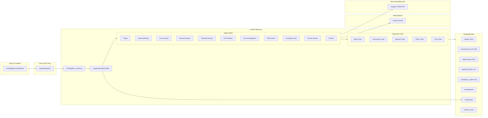

### MongoDB as Unified Agentic Data Platform

MongoDB serves **six distinct roles** in the system, eliminating the need for
separate vector databases, state stores, and graph engines:

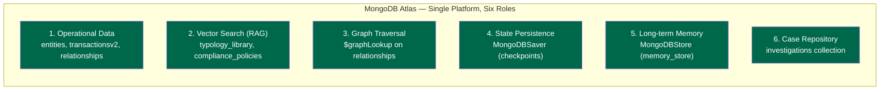

---

## 3. Pipeline Workflow

### Complete Investigation Flow

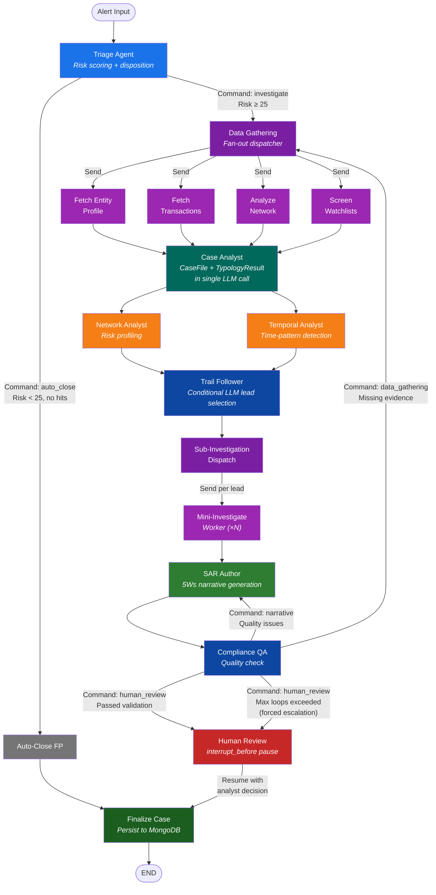

### State Evolution Through the Pipeline

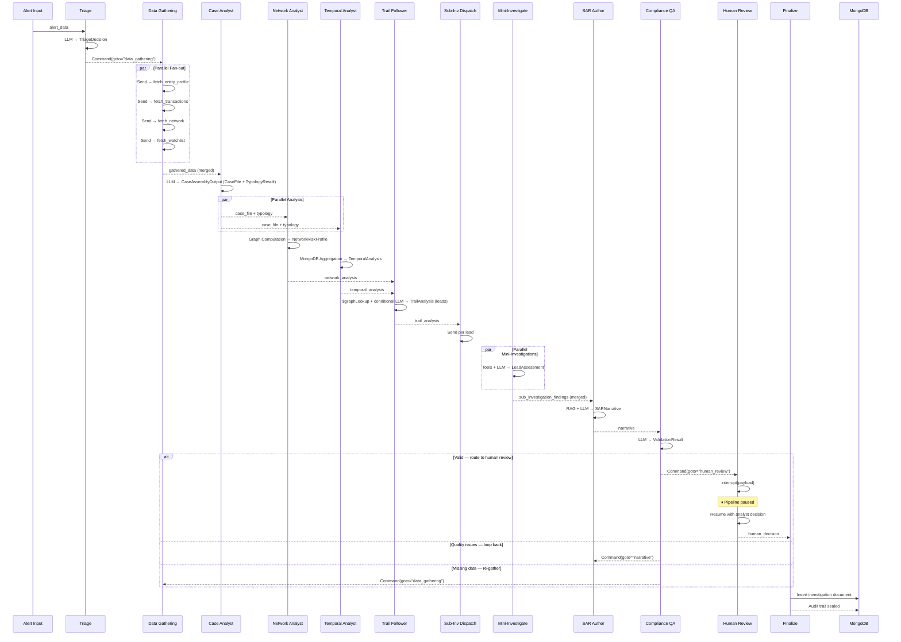

---

## 4. Agent Descriptions

### 4.1 Triage Agent

**File:** `services/agents/nodes/triage.py`
**Structured Output:** `TriageDecision`
**Routing:** `Command`-based dynamic routing

| Disposition | Condition | Route |
|------------|-----------|-------|
| `auto_close` | Risk < 25, no watchlist hits, no flagged transactions | `auto_close` → `finalize` → END |
| `investigate` | Risk ≥ 25, suspicious indicators, watchlist hits, PEP, sanctions, or flagged transactions | `data_gathering` → full pipeline |

The triage agent combines a deterministic risk score from the alert data with
the LLM's contextual reasoning for a hybrid approach. Every decision is logged
to the immutable `agent_audit_log`.

### 4.2 Data Gathering Agent

**File:** `services/agents/nodes/data_gatherer.py`
**Pattern:** `Send` API parallel fan-out + `CaseAssemblyOutput` fan-in assembly

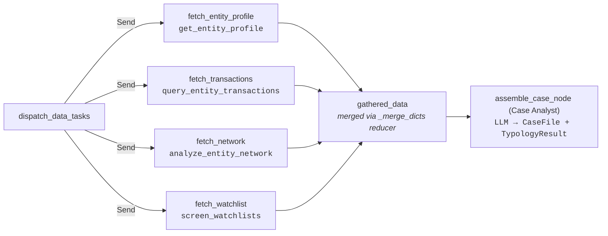

Each parallel worker invokes a LangChain `@tool` and writes its results to a
unique key in `gathered_data`. The `_merge_dicts` reducer on the state ensures
results from parallel branches accumulate without overwriting.

### 4.3 Case Analyst (assemble_case)

**File:** `services/agents/nodes/data_gatherer.py` (`assemble_case_node`)
**Structured Output:** `CaseAssemblyOutput` (contains `CaseFile` + `TypologyResult`)
**RAG Source:** `typology_library` collection (12 AML typologies, conditional)

The Case Analyst performs both evidence synthesis and typology classification in
a **single LLM call** using `model.with_structured_output(CaseAssemblyOutput)`.
This consolidation reduces latency by eliminating one sequential LLM round-trip.

**Evidence Synthesis:** Synthesizes all gathered data into a structured
360-degree `CaseFile`, applying **hierarchical summarization** — detailed data
for the most suspicious items, summaries for the rest — to prevent context
window overflow.

**Typology Classification:** Classifies suspicious activity into one or more
financial crime typologies. When the triage agent provides a `typology_hint`,
a conditional `search_typologies` RAG lookup retrieves relevant patterns from
the typology library before classification. Includes confidence scores and
supporting evidence for regulatory explainability.

**Available Typologies:**

| Typology | Category |
|----------|----------|
| Structuring / Smurfing | Money Laundering |
| Layering | Money Laundering |
| Funnel Account | Money Laundering |
| Trade-Based ML | Money Laundering |
| Shell Company Abuse | Money Laundering |
| Crypto Mixing | Money Laundering |
| Sanctions Evasion | Sanctions |
| Terrorist Financing | Terrorist Financing |
| Fraud Scheme | Fraud |
| Elder Exploitation | Fraud |
| PEP Corruption | Corruption |
| Unclassified | Unclassified |

### 4.4 Network Analyst Agent

**File:** `services/agents/nodes/network_analyst.py`
**Structured Output:** `NetworkRiskProfile`
**Execution:** Runs in **parallel** with Temporal Analyst after Case Analyst

Enriches the investigation with graph-computed network insights (no LLM — pure MongoDB aggregation):

- **Shell company structures** — passes through shell indicators from gathered data
- **Suspicious relationship patterns** — proxy, beneficial owner, financial beneficiary connections from gathered data
- **Degree centrality** — computed from actual connection counts in the network
- **Network risk score** — computed from connected entity risk scores

### 4.5 Temporal Analyst Agent

**File:** `services/agents/nodes/temporal_analyst.py`
**Structured Output:** `TemporalAnalysis`
**Execution:** Runs in **parallel** with Network Analyst after Case Analyst

Pure compute node (no LLM) that detects time-based suspicious patterns using
MongoDB aggregation pipelines on `transactionsv2`:

| Pattern | Detection Method |
|---------|-----------------|
| **Structuring Indicators** | Groups transactions by day, flags days with multiple sub-threshold amounts |
| **Velocity Anomalies** | Uses `$setWindowFields` to compute rolling averages and detect spikes |
| **Round-Trip Patterns** | Identifies bidirectional fund flows between the same entity pairs |
| **Time Anomalies** | Detects transactions occurring outside business hours |
| **Dormancy Bursts** | Identifies long dormant periods followed by sudden transaction activity |

### 4.6 Trail Follower Agent

**File:** `services/agents/nodes/trail_follower.py`
**Structured Output:** `TrailAnalysis`
**LLM:** Yes — selects and ranks investigation leads

The trail follower consumes converged results from both the network analyst
and temporal analyst. It uses MongoDB `$graphLookup` to trace ownership chains,
then asks the LLM to select up to 3 connected entities as "leads" for
sub-investigation, providing reasoning for each selection.

**Conditional Skip:** For simple cases (network size ≤ 2, no high-risk
connections, no ownership chains), the LLM call is skipped entirely and an
empty set of leads is returned, allowing the pipeline to proceed directly
to narrative generation.

**Lead selection criteria:**
- Entities in ownership chains or shell structures
- Counterparties in flagged or high-risk transactions
- Entities with temporal correlation to the subject's suspicious activity
- Entities with suspicious relationship types (proxy, beneficial owner)

### 4.7 Sub-Investigation Agents

**File:** `services/agents/nodes/sub_investigator.py`
**Pattern:** `Send` API parallel fan-out, results flow directly to SAR Author
**Scope:** One level deep only (parent → child, no recursion)

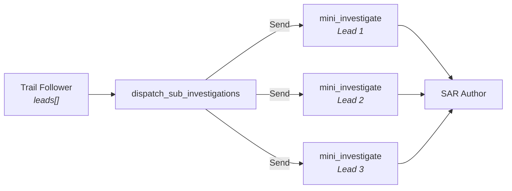

**Two components:**

| Component | Purpose | LLM |
|-----------|---------|-----|
| `dispatch_sub_investigations` | Fans out `Send` per lead from trail analysis; routes directly to `narrative` if no leads | No |
| `mini_investigate_node` | Self-contained worker: 4 tool calls (profile, watchlist, transactions, network at depth 1) + single LLM assessment → `LeadAssessment` | Yes (1 call) |

If the trail follower returns no leads, the dispatcher routes directly to the
SAR Author node, so the pipeline continues gracefully without sub-investigations.

### 4.8 SAR Author (narrative)

**File:** `services/agents/nodes/narrative.py`
**Structured Output:** `SARNarrative`
**RAG Source:** `compliance_policies` collection (6 policies)

Generates SAR-compliant narratives following FinCEN's who/what/when/where/why/how
structure. The SAR Author synthesizes **raw sub-investigation findings directly**
(no intermediate summarization step) and incorporates all evidence streams:

1. **Case file** — entity profile, transactions, sanctions, network
2. **Typology classification** — crime type, red flags, confidence
3. **Network analysis** — graph metrics, suspicious connections
4. **Temporal analysis** — structuring, velocity, round-tripping, dormancy patterns
5. **Trail analysis** — ownership chains, shell patterns
6. **Sub-investigation findings** — assessments of connected entities

Critical design constraints:

1. **Temperature 0.1** — minimizes creative generation
2. **Grounded exclusively** in the JSON evidence — never fabricates facts
3. **Bracket citations** — every factual claim cites its evidence source:
   `[entity_profile]`, `[transaction:<id>]`, `[relationship:<type>]`,
   `[watchlist:<list>]`, `[network_analysis]`, `[temporal_analysis]`,
   `[sub_investigation:<entity_id>]`
4. **Policy-aware** — retrieves SAR formatting guidance from `compliance_policies`

**Narrative Structure:**

| Section | Content |
|---------|---------|
| Introduction | Reason for filing, subject identification, activity summary |
| Body | Chronological detail with specific dates, amounts, counterparties |
| Conclusion | Actions taken, documents available, account status |

### 4.9 Compliance QA (validation)

**File:** `services/agents/nodes/validator.py`
**Structured Output:** `ValidationResult`
**Routing:** `Command`-based dynamic routing

The critical hallucination prevention and regulatory compliance layer. Checks:

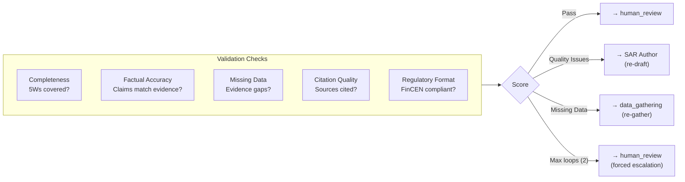

**Hard cap:** `MAX_VALIDATION_LOOPS = 2`. After 2 cycles, the validator forces
escalation to human review with `forced_escalation: true` in the result.

### 4.10 Human Review Agent

**File:** `services/agents/nodes/human_review.py`
**Pattern:** `interrupt_before` at compile time for durable pause/resume

The graph is compiled with `interrupt_before=["human_review"]`, which:

1. Pauses execution before the `human_review` node runs
2. Serializes the complete case state to `MongoDBSaver`
3. Returns control to the caller (SSE stream signals pause to frontend)

The analyst reviews the case file, narrative, typology, and network analysis,
then the resume endpoint calls `graph.update_state(config, resume_value, as_node="human_review")`
followed by `graph.astream(None, config)` to continue execution through `finalize`.

| Decision | Effect |
|----------|--------|
| `approve` | Pipeline resumes → `finalize` → SAR filed |
| `reject` | Pipeline resumes → `finalize` → case closed |
| `request_changes` | Pipeline resumes → `finalize` → case updated |

### 4.11 Finalize Agent

**File:** `services/agents/nodes/finalize.py`

Assembles the final investigation document containing:

- Case ID (generated UUID)
- Complete alert data, triage decision, case file, typology
- Network analysis, temporal analysis, trail analysis
- Sub-investigation findings
- Full SAR narrative with citations
- Validation result and human decision
- Immutable `agent_audit_log` (every agent decision throughout the pipeline)
- Pipeline metrics (LLM call counts, token usage, tool call counts, node durations)

Persists the document to the `investigations` MongoDB collection.

### 4.12 Interactive Chat Co-Pilot

**File:** `services/agents/chat_agent.py`
**Pattern:** LangGraph ReAct agent with tool access

A conversational assistant for analysts to explore entities, follow money trails,
and deepen investigations interactively. Built as a `create_react_agent` with
access to all investigation tools plus specialized chat tools:

| Tool | Purpose |
|------|---------|
| `search_investigations` | Search past investigation cases |
| `get_investigation_detail` | Retrieve full case details |
| `search_entities` | Find entities by name, type, or risk |
| `assess_entity_risk` | Comprehensive risk dossier: profile + txn stats + network + watchlists |
| `compare_entities` | Side-by-side entity comparison |
| `trace_fund_flow` | Multi-hop fund flow tracing via iterative find |
| `find_similar_entities` | Atlas Vector Search on `profileEmbedding` for semantic similarity |
| `analyze_temporal_patterns` | Interactive temporal pattern analysis (reuses temporal analyst logic) |

---

## 5. Data Architecture

### Existing Collections (Reused As-Is)

These collections are populated by the existing ThreatSight 360 seed notebooks.
The agentic pipeline reads from them via tools — no data is modified.

#### `entities` — 504 documents

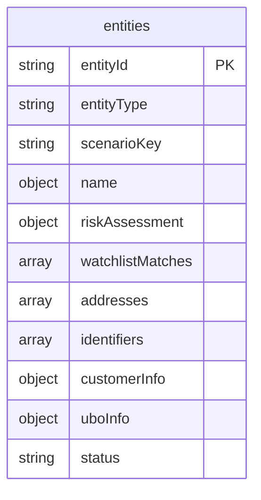

**Scenario keys accessed by agents:**

| Scenario Pattern | Risk Profile | Count |
|-----------------|--------------|-------|
| `generic_individual` | Low risk, clean history | ~200 |
| `generic_organization` | Low risk, normal activity | ~100 |
| `shell_company_candidate_var{i}` | High risk, nominee directors | Multiple |
| `sanctioned_org_varied_{i}` | OFAC-SDN confirmed, risk 85+ | Multiple |
| `pep_individual_varied_{i}` | PEP, watchlist score 0.99 | Multiple |
| `hnwi_global_investor_{i}` | Complex financial profiles | Multiple |
| `complex_org_parent_struct{i}` | Parent-subsidiary structures | Multiple |
| `evolving_risk_individual_{i}` | Changing risk profiles | Multiple |

#### `transactionsv2` — 12,766 documents

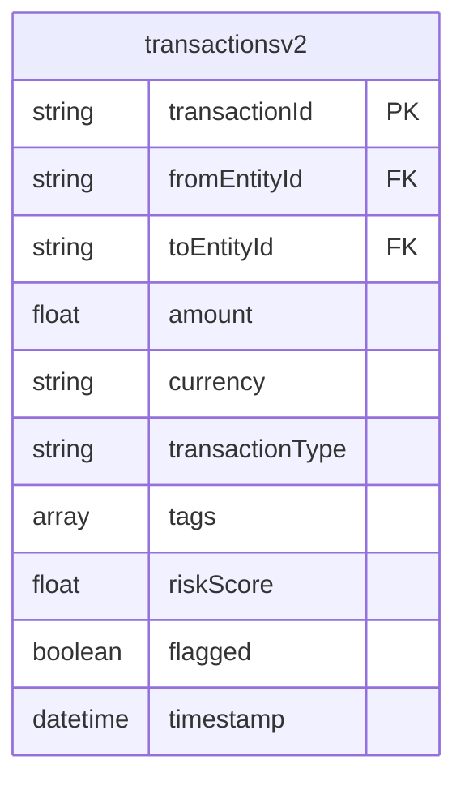

**Suspicious tags used by agents:**

| Tag | Scenario |
|-----|----------|
| `layering`, `shell_company_chain` | Shell-to-shell transfers |
| `sanctions_evasion_risk`, `sanctioned_entity` | Sanctioned org transactions |
| `pep_transaction`, `shell_to_pep`, `pep_to_offshore` | PEP-related flows |
| `potential_structuring`, `below_threshold` | Structuring patterns |

#### `relationships` — 519 documents

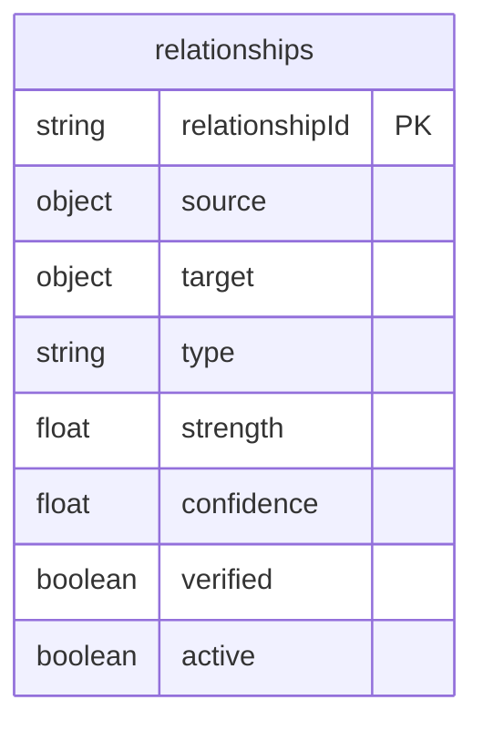

**Relationship types traversed by `$graphLookup`:**

| Category | Types |
|----------|-------|
| Corporate | `director_of`, `ubo_of`, `parent_of_subsidiary`, `subsidiary_of`, `board_member_of` |
| Suspicious | `financial_beneficiary_suspected`, `proxy_relationship_suspected`, `potential_beneficial_owner_of` |
| Business | `supplier_of`, `customer_of`, `business_partner` |
| Family | `household_member`, `family_member` |

### New Collections (Created by Seed Script)

#### `typology_library` — 12 documents

Financial crime typology reference library for RAG-powered classification.

| typology_id | Name | Category |
|------------|------|----------|
| `typ_structuring` | Structuring / Smurfing | money_laundering |
| `typ_layering` | Layering | money_laundering |
| `typ_funnel_account` | Funnel Account | money_laundering |
| `typ_trade_based_ml` | Trade-Based Money Laundering | money_laundering |
| `typ_shell_company` | Shell Company Abuse | money_laundering |
| `typ_crypto_mixing` | Cryptocurrency Mixing | money_laundering |
| `typ_sanctions_evasion` | Sanctions Evasion | sanctions |
| `typ_terrorist_financing` | Terrorist Financing | terrorist_financing |
| `typ_fraud_scheme` | Fraud Scheme | fraud |
| `typ_elder_exploitation` | Elder Financial Exploitation | fraud |
| `typ_pep_abuse` | PEP Corruption / Abuse of Office | corruption |
| `typ_unknown` | Unclassified Suspicious Activity | unclassified |

Each document includes `description`, `red_flags[]`, and `regulatory_references[]`.

#### `compliance_policies` — 6 documents

SAR filing guidance and internal policies for narrative generation RAG.

| policy_id | Title | Category |
|-----------|-------|----------|
| `pol_sar_5ws` | SAR Narrative Structure — The Five Ws | sar_filing |
| `pol_sar_format` | SAR Narrative Formatting Requirements | sar_filing |
| `pol_sar_filing_rules` | FinCEN SAR Filing Thresholds and Timing | regulatory |
| `pol_evidence_citation` | Evidence Citation and Grounding Policy | internal |
| `pol_risk_thresholds` | Investigation Risk Thresholds and Escalation | internal |
| `pol_human_review` | Human Review Requirements | regulatory |

#### `investigations` — populated by pipeline

Final case documents with full state history. Indexed on:
- `case_id` (unique)
- `investigation_status`
- `created_at`
- `entity_id`

#### Auto-created by LangGraph

| Collection | Purpose | Created By |
|------------|---------|------------|
| `checkpoints` | Investigation state snapshots | `MongoDBSaver` |
| `checkpoint_writes` | State write operations | `MongoDBSaver` |
| `memory_store` | Cross-investigation learning | `MongoDBStore` |

---

## 6. Tool Layer

LangChain `@tool` wrappers provide the agent nodes with direct access to
MongoDB collections. Each tool uses the synchronous `pymongo` client from
the existing `dependencies.py` connection pool.

### Pipeline Tools

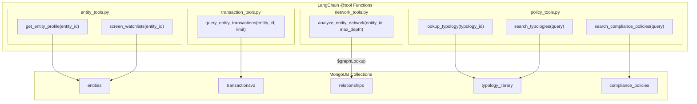

### Tool Details

| Tool | Collection | Query Pattern | Returns |
|------|-----------|---------------|---------|
| `get_entity_profile` | `entities` | `find_one({entityId})` | Full entity document (risk, watchlist, KYC) |
| `screen_watchlists` | `entities` | `find_one({entityId})` → `.watchlistMatches` | Structured screening with hit count, list IDs, match scores |
| `query_entity_transactions` | `transactionsv2` | `find({$or: [fromEntityId, toEntityId]})` sorted by risk | Aggregate stats + top 15 suspicious transactions |
| `analyze_entity_network` | `relationships` | `$graphLookup` from `source.entityId`, max 2 hops | Network size, suspicious connections, shell indicators |
| `lookup_typology` | `typology_library` | `find_one({typology_id})` | Full typology description, red flags, regulatory refs |
| `search_typologies` | `typology_library` | Text search over all documents | Top 5 matching typologies |
| `search_compliance_policies` | `compliance_policies` | Text search over all documents | Top 5 matching policies |

### Chat Co-Pilot Tools

| Tool | Collection(s) | Purpose |
|------|--------------|---------|
| `search_investigations` | `investigations` | Regex search across case_id, entity_id, typology, narrative |
| `get_investigation_detail` | `investigations` | Full case document retrieval by case_id |
| `search_entities` | `entities` | Entity search by name, type, or risk criteria |
| `assess_entity_risk` | `entities`, `transactionsv2`, `relationships` | Comprehensive risk dossier: profile + txn stats + network + watchlists |
| `compare_entities` | `entities`, `transactionsv2`, `relationships` | Side-by-side comparison of two entities |
| `trace_fund_flow` | `transactionsv2` | Multi-hop fund flow tracing via iterative find |
| `find_similar_entities` | `entities` | Atlas Vector Search on `profileEmbedding` |
| `analyze_temporal_patterns` | `transactionsv2` | MongoDB aggregations for structuring, velocity, round-trips |

---

## 7. Structured Output Models

Every agent uses `model.with_structured_output(PydanticModel)` for type-safe,
schema-validated LLM responses. This ensures consistent data flow and eliminates
unstructured text parsing.

```mermaid
classDiagram
    class TriageDecision {
        +float risk_score [0-100]
        +Literal disposition
        +str reasoning
        +str typology_hint
    }

    class CaseFile {
        +EntityProfile entity
        +TransactionSummary transactions
        +SanctionsScreening sanctions
        +List~str~ adverse_media
        +List~str~ similar_past_cases
        +str network_summary
        +List~str~ key_findings
    }

    class TypologyResult {
        +CrimeTypology primary_typology
        +float confidence [0-1]
        +List~CrimeTypology~ secondary_typologies
        +List~str~ red_flags
        +List~str~ supporting_evidence
        +str reasoning
    }

    class NetworkRiskProfile {
        +int network_size
        +int high_risk_connections
        +int max_depth_reached
        +List~str~ shell_structure_indicators
        +float degree_centrality
        +float network_risk_score
        +float base_entity_risk
        +List~dict~ key_connections
        +str summary
    }

    class TemporalAnalysis {
        +List~dict~ structuring_indicators
        +List~dict~ velocity_anomalies
        +List~dict~ round_trip_patterns
        +List~dict~ time_anomalies
        +List~dict~ dormancy_bursts
        +str timeline_summary
    }

    class TrailAnalysis {
        +List~dict~ ownership_chains
        +List~str~ shell_patterns
        +List~InvestigationLead~ leads
        +str summary
    }

    class InvestigationLead {
        +str entity_id
        +str entity_name
        +str reason
        +List~str~ risk_indicators
        +str relationship_to_subject
        +Literal priority
    }

    class LeadAssessment {
        +str entity_id
        +str entity_name
        +Literal risk_level
        +float risk_score [0-100]
        +int watchlist_hits
        +str connection_to_subject
        +List~str~ key_findings
        +List~str~ red_flags
        +Literal recommendation
        +str summary
    }

    class CaseAssemblyOutput {
        +CaseFile case_file
        +TypologyResult typology
    }

    class SARNarrative {
        +str introduction
        +str body
        +str conclusion
        +List~str~ cited_evidence
    }

    class ValidationResult {
        +bool is_valid
        +float score [0-1]
        +List~str~ issues
        +List~str~ missing_data
        +List~str~ factual_errors
        +Literal route_to
    }

    class CrimeTypology {
        <<enumeration>>
        STRUCTURING
        LAYERING
        FUNNEL_ACCOUNT
        TRADE_BASED_ML
        TERRORIST_FINANCING
        FRAUD_SCHEME
        SANCTIONS_EVASION
        SHELL_COMPANY
        CRYPTO_MIXING
        ELDER_EXPLOITATION
        PEP_ABUSE
        UNKNOWN
    }

    CaseFile *-- EntityProfile
    CaseFile *-- TransactionSummary
    CaseFile *-- SanctionsScreening
    TypologyResult --> CrimeTypology
    TrailAnalysis *-- InvestigationLead
```

---

## 8. LangGraph Patterns

### 8.1 Command-Based Dynamic Routing

The `Command` class replaces traditional conditional edges. Nodes return
routing decisions inline with state updates:

```python
# Triage node returns a Command that routes AND updates state
return Command(
    goto="data_gathering",         # dynamic routing target
    update={                        # state changes
        "triage_decision": decision.model_dump(),
        "investigation_status": "triage_investigate",
        "agent_audit_log": [audit_entry],
    },
)
```

**Used by:** Triage Agent (2 routes), Validation Agent (4 routes)

### 8.2 Send API for Parallel Fan-Out

The `Send` API dispatches work to multiple nodes concurrently. Used in two
places in the pipeline:

**Data Gathering:**
```python
def dispatch_data_tasks(state: InvestigationState) -> list[Send]:
    entity_id = state["alert_data"]["entity_id"]
    tasks = [
        "fetch_entity_profile",
        "fetch_transactions",
        "fetch_network",
        "fetch_watchlist",
    ]
    return [Send(task, {"task": task, "entity_id": entity_id}) for task in tasks]
```

**Sub-Investigation Dispatch:**
```python
def dispatch_sub_investigations(state: InvestigationState) -> list[Send]:
    leads = state.get("trail_analysis", {}).get("leads", [])
    return [
        Send("mini_investigate", {**state, "_lead": lead})
        for lead in leads
    ]
```

Results are merged via `_merge_dicts` reducers on both `gathered_data` and
`sub_investigation_findings`.

### 8.3 Parallel Analysis Edges

LangGraph supports multiple edges from a single node, enabling true parallel
execution. After the Case Analyst produces both `case_file` and `typology`:

```python
builder.add_edge("assemble_case", "network_analyst")
builder.add_edge("assemble_case", "temporal_analyst")

builder.add_edge("network_analyst", "trail_follower")
builder.add_edge("temporal_analyst", "trail_follower")
```

Both analysis nodes run concurrently, and `trail_follower` waits for both
to complete before executing (LangGraph's built-in join semantics).

### 8.4 Durable Interrupt for Human Review

The `interrupt_before` compile-time option pauses execution before the
`human_review` node and persists state to MongoDB:

```python
# In graph.py — compile with interrupt_before
_compiled_graph = builder.compile(
    checkpointer=checkpointer,
    interrupt_before=["human_review"],
)
```

The `human_review_node` itself is a placeholder that runs only after resume:

```python
def human_review_node(state: InvestigationState) -> dict:
    decision = state.get("human_decision", {})
    # Process analyst decision injected via update_state
    return {"human_decision": decision, "investigation_status": "reviewed_by_analyst"}
```

**Resume:** `graph.update_state(config, resume_value, as_node="human_review")` then `graph.astream(None, config)`

### 8.5 State Reducers

| Field | Reducer | Behavior |
|-------|---------|----------|
| `messages` | `add_messages` | LangGraph built-in message accumulator |
| `gathered_data` | `_merge_dicts` | Shallow dict merge for fan-out results |
| `sub_investigation_findings` | `_merge_dicts` | Shallow dict merge for parallel mini-investigations |
| `agent_audit_log` | `_append_only` | Immutable append (entries can never be removed) |
| `tool_trace_log` | `_append_only` | Immutable append for tool call traces |
| `_node_tool_calls` | `_append_only` | Immutable append for SSE tool event generation |

### 8.6 Validation Cycles

The graph supports cycles (LangGraph is NOT a DAG framework). The validation
agent can route back to `data_gathering` or `narrative` up to 2 times:

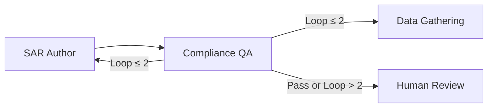

---

## 9. API Reference

All endpoints are prefixed with `/agents` and served via the AML backend
(default port 8001). The Next.js frontend proxies requests through
`/api/aml/agents/*`.

### POST `/agents/investigate`

Launch a new agentic investigation with SSE streaming.

**Request Body:**
```json
{
  "entity_id": "shell_company_candidate_var0",
  "alert_type": "suspicious_structure"
}
```

**Response:** `text/event-stream`

```
data: {"type":"agent_start","agent":"triage","timestamp":"..."}
data: {"type":"agent_end","agent":"triage","status":"triage_investigate","timestamp":"..."}
data: {"type":"agent_start","agent":"data_gathering","timestamp":"..."}
...
data: {"type":"investigation_complete","thread_id":"case-abc123","status":"filed","triage_decision":{...},"typology":{...},"narrative":{...},"needs_human_review":false}
```

**SSE Event Types:**

| Event Type | Fields | Description |
|-----------|--------|-------------|
| `alert_ingested` | `alert_id`, `entity_id`, `alert_type`, `timestamp` | Alert document inserted into alerts collection |
| `pipeline_started` | `agent`, `timestamp` | Pipeline execution beginning |
| `agent_start` | `agent`, `timestamp` | Agent node beginning execution |
| `agent_end` | `agent`, `status`, `output`, `timestamp` | Agent node completed |
| `tool_start` | `agent`, `tool`, `input`, `timestamp` | Tool invocation beginning |
| `tool_end` | `agent`, `tool`, `output`, `timestamp` | Tool invocation completed |
| `investigation_complete` | `thread_id`, `status`, `triage_decision`, `typology`, `narrative`, `validation_result`, `needs_human_review` | Pipeline finished |
| `error` | `message` | Error occurred |

### POST `/agents/investigate/resume`

Resume an investigation paused at human review.

**Request Body:**
```json
{
  "thread_id": "case-abc123def456",
  "decision": "approve",
  "analyst_notes": "Evidence confirms shell company activity."
}
```

**Decision Values:** `approve` | `reject` | `request_changes`

### GET `/agents/investigations`

List all investigations.

**Query Parameters:**

| Parameter | Type | Default | Description |
|-----------|------|---------|-------------|
| `status` | string | null | Filter by investigation_status |
| `limit` | int | 20 | Max results |
| `skip` | int | 0 | Pagination offset |

**Response:**
```json
{
  "investigations": [...],
  "total": 42,
  "skip": 0,
  "limit": 20
}
```

### GET `/agents/investigations/{case_id}`

Get a single investigation by case ID.

### GET `/agents/investigations/analytics`

Compute investigation analytics using MongoDB `$facet` aggregation — status
distribution, typology counts, risk score statistics, and recent 7-day count.

### GET `/agents/investigations/search`

Search investigations by entity_id, case_id, typology, or narrative text
using MongoDB regex matching.

### GET `/agents/entities/investigable`

Return all entities grouped by investigation category with transaction
red-flag tags from `transactionsv2`.

### GET `/agents/typologies`

Return all AML typologies from the `typology_library` collection.

### POST `/agents/seed`

Seed the `typology_library` (12 docs) and `compliance_policies` (6 docs)
collections. Safe to run multiple times (drops and re-creates).

### GET `/agents/health`

Health check for the agent pipeline.

### WebSocket `/agents/investigations/stream`

Real-time investigation updates via MongoDB Change Streams on the
`investigations` collection.

### WebSocket `/agents/alerts/stream`

Real-time alert updates via MongoDB Change Streams on the `alerts` and
`investigations` collections.

---

## 10. Frontend Dashboard

### Page Structure

The `/investigations` page uses a **sidebar + workspace** layout built with
MongoDB LeafyGreen UI components and a centralized design token system.

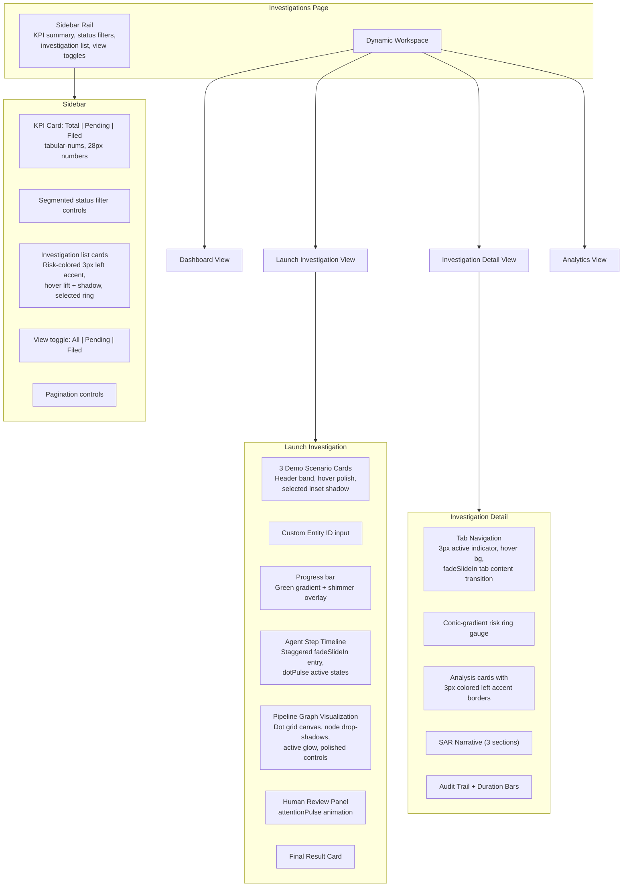

### Design Token System

All investigation components share a centralized design token module
(`investigationTokens.js`) to prevent style drift and ensure visual
consistency:

| Token | Value | Usage |
|-------|-------|-------|
| `railBg` | `#FAFBFA` | Sidebar background |
| `shadowHover` | `0 4px 12px rgba(20,23,26,0.06)` | Card hover elevation |
| `shadowSelected` | `0 8px 24px rgba(0,104,74,0.08)` | Selected card emphasis |
| `transitionFast` | `150ms cubic-bezier(0.33,1,0.68,1)` | Hover transitions |
| `transitionMedium` | `220ms cubic-bezier(0.33,1,0.68,1)` | Content transitions |

**Risk accent colors** are computed via `getRiskAccentColor(score)`:

| Score Range | Color | Meaning |
|-------------|-------|---------|
| ≥ 75 | `palette.red.base` | Critical |
| ≥ 50 | `#ed6c02` | High |
| ≥ 25 | `palette.yellow.base` | Medium |
| < 25 | `palette.green.base` | Low |

**CSS Keyframe Animations** (centralized in `GLOBAL_KEYFRAMES`):

| Animation | Purpose |
|-----------|---------|
| `fadeSlideIn` | Staggered entry for cards, list items, and tab content |
| `shimmerBar` | Progress bar shimmer overlay during running state |
| `attentionPulse` | Yellow pulse on human review panel header |
| `dotPulse` | Active step indicator in agent timeline |
| `nodePulse` | Active node glow on pipeline graph |
| `subtlePulse` | Status dot animation in change stream console |
| `shimmerText` | Loading text animation |

All animations respect `prefers-reduced-motion` via a global media query
that collapses animation durations to `0.01ms`.

### Component Breakdown

| Component | File | Purpose |
|-----------|------|---------|
| `InvestigationsPage` | `InvestigationsPage.jsx` | Root page with sidebar + workspace layout, KPI summary, status filters, investigation list with risk accents, view toggles |

| `InvestigationLauncher` | `InvestigationLauncher.jsx` | Demo scenarios with header bands, progress bar with shimmer, agent step timeline with staggered animations, pipeline graph, human review panel |
| `InvestigationDetail` | `InvestigationDetail.jsx` | Full case view with refined tab navigation (3px indicator, hover states), conic-gradient risk ring gauge, analysis accent borders, audit trail |
| `AgenticPipelineGraph` | `AgenticPipelineGraph.jsx` | ReactFlow pipeline visualization with dot grid canvas, node drop-shadows, active glow, polished controls and minimap |
| `ChangeStreamConsole` | `ChangeStreamConsole.jsx` | Collapsible MongoDB Change Stream monitor with chevron toggle and compact collapsed preview |
| `InvestigationAnalytics` | `InvestigationAnalytics.jsx` | Analytics dashboard with status distribution, typology counts, risk stats |
| `investigationTokens` | `investigationTokens.js` | Shared design tokens (`uiTokens`), `getRiskAccentColor()` utility, and centralized `GLOBAL_KEYFRAMES` |

### Pipeline Graph Visualization

The `AgenticPipelineGraph` component renders the full pipeline as an interactive
ReactFlow graph. During live investigations, nodes highlight in real-time as
SSE events arrive. The graph includes:

- **Agent nodes** — triage, data gathering, case analyst, network analyst, temporal analyst, trail follower, SAR author, compliance QA, human review, finalize
- **Worker nodes** — fetch_entity_profile, fetch_transactions, fetch_network, fetch_watchlist, mini_investigate
- **Collection badges** — MongoDB collection names shown on relevant nodes
- **Edge labels** — routing labels (auto_close, investigate, parallel, Send)
- **Dot grid canvas** — subtle radial-gradient background pattern for visual depth
- **Node drop-shadows** — `filter: drop-shadow(...)` for elevation on all node types
- **Active glow** — `0 0 0 4px palette.blue.light2` ring on actively processing nodes with `nodePulse` animation
- **Polished controls** — ReactFlow controls and minimap styled with `borderRadius: 8px`, white background, and `shadowElevated`
- **Legend** — increased padding, rounded corners, and `backdropFilter: blur(8px)`

### SSE Streaming Pattern

The frontend uses `fetch()` with `response.body.getReader()` to consume
server-sent events in real-time, matching the existing pattern from the
streaming classification feature:

```
Frontend → /api/aml/agents/investigate (POST)
         → Next.js proxy passes through SSE
         → FastAPI StreamingResponse
         → graph.astream_events() generates events
         → Each event rendered as a progress row + graph highlight
```

---

## 11. Demo Scenarios

Three pre-built alert payloads exercise different pipeline paths against
the existing seed data:

### Scenario 1: Auto-Close False Positive

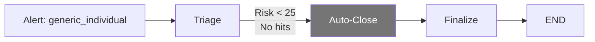

| Field | Value |
|-------|-------|
| Entity | `generic_individual` |
| Alert Type | `routine_monitoring` |
| Expected Path | Triage → Auto-Close → Finalize → END |
| Demonstrates | 70-80% false positive reduction |

### Scenario 2: Shell Company Investigation

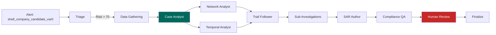

| Field | Value |
|-------|-------|
| Entity | `shell_company_candidate_var0` |
| Alert Type | `suspicious_structure` |
| Expected Path | Full pipeline with parallel analysis, trail following, and sub-investigations |
| Key Evidence | Nominee directors, layering-tagged transactions, shell_company_chain flows |
| Expected Typology | `shell_company` + `layering` |
| Demonstrates | Full investigation, network + temporal analysis, sub-investigations, SAR generation |

### Scenario 3: PEP Investigation

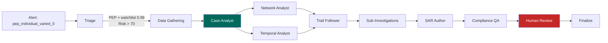

| Field | Value |
|-------|-------|
| Entity | `pep_individual_varied_0` |
| Alert Type | `pep_alert` |
| Expected Path | Full pipeline — PEP entities now go through complete investigation |
| Key Evidence | NATIONAL-PEP watchlist match (0.99), pep_to_offshore transactions |
| Expected Typology | `pep_abuse` |
| Demonstrates | High-risk PEP investigation with full analysis pipeline |

---

## 12. Configuration & Dependencies

### Python Dependencies

| Package | Version | Purpose |
|---------|---------|---------|
| `langgraph` | >=1.0.7 | Core graph framework (GA, stable API) |
| `langchain-core` | >=1.2.14 | LLM abstractions, tool calling, structured output |
| `langchain-aws` | >=0.2.9 | `ChatBedrockConverse` for Claude via Bedrock |
| `langchain-mongodb` | >=0.10.0 | MongoDB vector search, hybrid retriever |
| `langgraph-checkpoint-mongodb` | >=0.3.1 | `MongoDBSaver` for investigation checkpointing |
| `voyageai` | >=0.3.2 | Voyage AI embeddings |
| `pymongo` | ^4.10.1 | MongoDB driver (existing) |
| `motor` | ^3.7.0 | Async MongoDB driver (existing) |
| `boto3` / `botocore` | ^1.35.0 | AWS SDK for Bedrock (existing) |

### Environment Variables

| Variable | Default | Description |
|----------|---------|-------------|
| `MONGODB_URI` | `mongodb://localhost:27017` | MongoDB connection string |
| `DB_NAME` | `fsi-threatsight360` | Database name |
| `AWS_REGION` | `us-east-1` | AWS region for Bedrock |
| `VOYAGE_API_KEY` | — | Voyage AI API key |
| `ENTITY_VECTOR_INDEX` | `entity_vector_search_index` | Atlas Vector Search index name (used by chat co-pilot) |

### LLM Configuration

| Setting | Value |
|---------|-------|
| Model | Claude Haiku 4.5 (default: `global.anthropic.claude-haiku-4-5-20251001-v1:0`), configurable via `LLM_MODEL_ARN` env var |
| Temperature | 0.1 |
| Client | `ChatBedrockConverse` (langchain-aws) |
| Pattern | Singleton via `get_llm()` |

### Embedding Configuration

| Setting | Value |
|---------|-------|
| Model | `voyage-4` |
| Provider | Atlas Embedding API (`ai.mongodb.com`) |
| Client | Custom `AtlasVoyageEmbeddings` wrapper implementing LangChain `Embeddings` |
| Pattern | Singleton via `get_voyage_embeddings()` |

---

## 13. Design Principles

Five principles from 2025-2026 production deployments govern this
implementation:

### 1. Start Simple, Add Autonomy in Layers

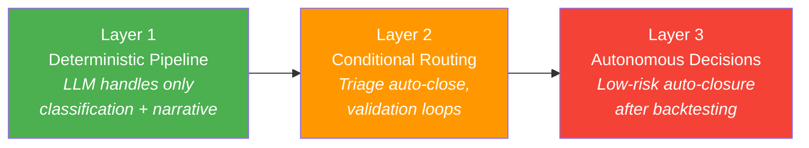

### 2. Compliance-by-Design

Every agent decision logs to the immutable `agent_audit_log`:
- Input data and reasoning trace
- Tools invoked and their results
- Confidence score and decision made
- Alternatives considered

The append-only annotation ensures no entry can be removed. Satisfies
SR 11-7, EU AI Act, and OCC guidance on explainability.

### 3. Layered Guardrails (Defense-in-Depth)

| Layer | Mechanism | Example |
|-------|-----------|---------|
| Policy | Business rules as deterministic checks | Risk thresholds, filing deadlines |
| Behavioral | Pydantic structured output validation | Every LLM response schema-validated |
| Operational | Hard caps on agent behavior | `MAX_VALIDATION_LOOPS = 2` |

### 4. Risk-Adaptive Human Oversight

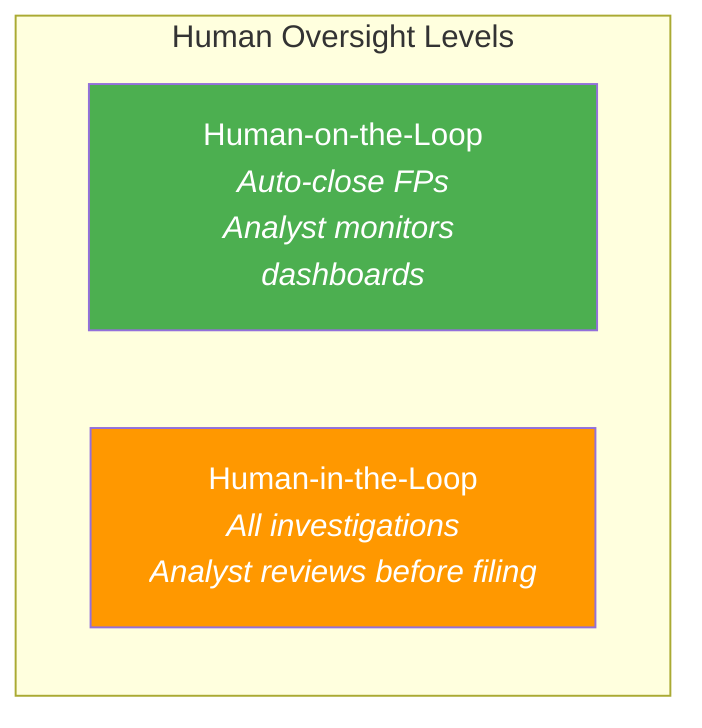

### 5. Ground All Generation in Evidence

The SAR Author generates exclusively from the structured evidence
JSON — never from parametric knowledge. Every factual claim cites its
evidence source in brackets. The modular approach (separate data gathering →
case analyst → parallel analysis → sub-investigations → SAR narrative
generation) dramatically reduces hallucination compared to monolithic prompting.

### 6. LLM Only Where Reasoning Is Required

LLMs are used sparingly and deliberately — only at nodes that require
synthesis, classification, or judgment:

| LLM Nodes | Purpose |
|-----------|---------|
| Triage | Risk assessment + disposition routing |
| Case Analyst | Evidence synthesis into CaseFile + typology classification (single call) |
| Trail Follower | Lead selection from network + temporal evidence (conditional — skipped for simple cases) |
| Mini-Investigate (per lead) | Rapid lead risk assessment |
| SAR Author | SAR narrative generation with direct sub-finding synthesis |
| Compliance QA | Quality assurance + regulatory compliance routing |

**Maximum LLM calls:** 8 (full pipeline with 3 sub-investigation leads).
**Minimum LLM calls:** 4 (simple case: triage → case analyst → SAR author → compliance QA, trail follower skipped).

Pure compute nodes (Network Analyst, Temporal Analyst, Data Gathering workers)
use MongoDB aggregations directly — no LLM overhead.

---

## 14. Failure Mode Mitigations

| Failure Mode | Risk | Mitigation |
|-------------|------|------------|
| Hallucinated SAR facts | Critical | Ground in structured JSON case_file; require source citations; temperature 0.1; validation agent fact-checks against evidence |
| Infinite validation loops | High | Hard cap `MAX_VALIDATION_LOOPS = 2`; forced escalation to human review |
| Context window overflow | Medium | Hierarchical summarization in data gathering: summaries for bulk data, detail only for most suspicious items; payload truncation with `[:14000]` |
| Tool call failures | Medium | Each tool catches exceptions and returns structured error dicts; agents reason about missing data gracefully |
| State loss during interrupt | Medium | `MongoDBSaver` persists state durably; pipeline resumes from exact checkpoint |
| No leads found by trail follower | Low | Dispatcher routes directly to SAR Author; pipeline continues without sub-investigations |
| Sub-investigation worker failure | Low | Individual worker errors are captured in findings; SAR Author synthesizes available results |
| Cognitive drift over time | Low | Monitor via `agent_audit_log`: are triage scores calibrating? Are investigation steps consistent? |
| Concurrent investigation conflicts | Low | Each investigation gets a unique `thread_id`; state is isolated per thread |

---

## 15. File Reference

### Backend — `aml-backend/`

```
services/agents/
├── __init__.py
├── state.py                    # InvestigationState TypedDict + reducers (_merge_dicts, _append_only)
├── graph.py                    # LangGraph StateGraph wiring + compilation
├── llm.py                      # ChatBedrockConverse singleton
├── embeddings.py               # AtlasVoyageEmbeddings wrapper (voyage-4 via Atlas API)
├── memory.py                   # MongoDBStore for cross-investigation learning
├── chat_agent.py               # ReAct chat co-pilot (15 tools, system prompt)
├── prompts.py                  # Centralized system prompts (6 prompts)
├── seed.py                     # Seed script (12 typologies + 6 policies)
├── nodes/
│   ├── __init__.py
│   ├── triage.py               # Triage + auto_close
│   ├── data_gatherer.py        # Fan-out dispatch + 4 workers + Case Analyst (assembly + typology)
│   ├── network_analyst.py      # $graphLookup network risk profiling
│   ├── temporal_analyst.py     # MongoDB aggregation temporal pattern detection
│   ├── trail_follower.py       # $graphLookup + conditional LLM lead selection
│   ├── sub_investigator.py     # Send fan-out dispatch + mini_investigate workers
│   ├── narrative.py            # SAR Author — 5Ws narrative generation
│   ├── validator.py            # Compliance QA — quality loop with max 2 iterations
│   ├── human_review.py         # interrupt_before durable pause/resume
│   └── finalize.py             # Case document assembly + MongoDB persistence
└── tools/
    ├── __init__.py
    ├── entity_tools.py         # get_entity_profile, screen_watchlists
    ├── transaction_tools.py    # query_entity_transactions
    ├── network_tools.py        # analyze_entity_network ($graphLookup)
    ├── policy_tools.py         # lookup_typology, search_typologies, search_compliance_policies
    └── chat_tools.py           # 9 chat co-pilot tools (search, trace, similarity, temporal, lead expansion)

routes/agents/
├── __init__.py
└── investigation_routes.py     # 10 endpoints (SSE streaming, CRUD, analytics, search, WebSocket streams, seed, health)

models/agents/
├── __init__.py
└── investigation.py            # 15 Pydantic models + CaseAssemblyOutput + CrimeTypology enum
```

### Frontend — `frontend/`

```
app/investigations/
└── page.js                     # Route entry point

components/investigations/
├── investigationTokens.js      # Shared design tokens (uiTokens, getRiskAccentColor, GLOBAL_KEYFRAMES)
├── InvestigationsPage.jsx      # Root page (sidebar + workspace layout, KPI summary, filters, list)

├── InvestigationLauncher.jsx   # Demo scenarios + SSE progress + pipeline graph + human review
├── InvestigationDetail.jsx     # Full case view (sub-tabs: Summary | Evidence | Narrative | Audit)
├── AgenticPipelineGraph.jsx    # ReactFlow pipeline visualization with live node highlighting
├── ChangeStreamConsole.jsx     # Collapsible MongoDB Change Stream monitor
└── InvestigationAnalytics.jsx  # Analytics dashboard with MongoDB aggregation stats

lib/
└── agent-api.js                # API functions (SSE streaming, CRUD, seed, analytics)
```

---

*Generated for ThreatSight 360 — Agentic SAR Investigation Pipeline*
*Built with LangGraph 1.0, MongoDB Atlas, Claude Sonnet, and Voyage AI*
