# Agentic SAR Investigation Pipeline

## ThreatSight 360 — Multi-Agent Financial Crime Investigation System

> An autonomous, stateful investigation pipeline that transforms AML alerts into
> regulatory-compliant SAR narratives using specialized AI agents, LangGraph
> orchestration, and MongoDB as the unified data platform.

---

## Table of Contents

1. [Executive Summary](#1-executive-summary)
2. [Architecture Overview](#2-architecture-overview)
3. [Pipeline Workflow](#3-pipeline-workflow)
4. [Agent Descriptions](#4-agent-descriptions)
5. [Data Architecture](#5-data-architecture)
6. [Tool Layer](#6-tool-layer)
7. [Structured Output Models](#7-structured-output-models)
8. [LangGraph Patterns](#8-langgraph-patterns)
9. [API Reference](#9-api-reference)
10. [Frontend Dashboard](#10-frontend-dashboard)
11. [Demo Scenarios](#11-demo-scenarios)
12. [Configuration & Dependencies](#12-configuration--dependencies)
13. [Design Principles](#13-design-principles)
14. [Failure Mode Mitigations](#14-failure-mode-mitigations)
15. [File Reference](#15-file-reference)

---

## 1. Executive Summary

The Agentic Investigation Pipeline is a **LangGraph-powered multi-agent system**
integrated into the ThreatSight 360 AML backend. It automates the end-to-end
investigation lifecycle — from initial alert triage through evidence gathering,
typology classification, network analysis, SAR narrative generation, quality
validation, and human review — producing audit-ready case documents.

### Key Capabilities

- **Automated Alert Triage** — Risk scoring and disposition routing (auto-close, investigate, urgent escalation)
- **Parallel Data Gathering** — Concurrent entity, transaction, network, and watchlist queries via LangGraph's `Send` API
- **Typology Classification** — RAG-powered mapping to 12 AML crime typologies with confidence scoring
- **Network Risk Analysis** — `$graphLookup`-based traversal identifying shell structures and suspicious connections
- **SAR Narrative Generation** — FinCEN-compliant who/what/when/where/why/how narratives grounded exclusively in evidence
- **Quality Validation Loop** — Automated fact-checking with up to 3 re-drafting cycles before forced escalation
- **Durable Human Review** — `interrupt()`-based pause/resume enabling analyst decisions hours or days later
- **Immutable Audit Trail** — Append-only logging of every agent decision for regulatory examination

### Technology Stack

| Component | Technology |
|-----------|------------|
| Orchestration | LangGraph 1.0.7 (StateGraph, Command, Send, interrupt) |
| LLM | Claude Sonnet via AWS Bedrock (`ChatBedrockConverse`) |
| Embeddings | Voyage AI `voyage-finance-2` |
| State Persistence | `MongoDBSaver` (checkpoints + checkpoint_writes) |
| Long-term Memory | `MongoDBStore` (cross-investigation learning) |
| Data Platform | MongoDB Atlas (operational data, vector search, `$graphLookup`) |
| Backend | FastAPI (Python) |
| Frontend | Next.js with MongoDB LeafyGreen UI |

---

## 2. Architecture Overview

The system follows a **supervisor-pipeline hybrid** architecture: a sequential
pipeline for the core investigation flow, parallel fan-out for data gathering,
an evaluator-optimizer loop for validation, and `Command`-based dynamic routing
at decision points.

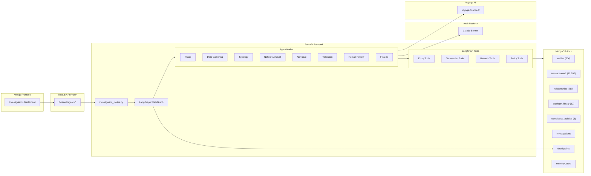

### MongoDB as Unified Agentic Data Platform

MongoDB serves **six distinct roles** in the system, eliminating the need for
separate vector databases, state stores, and graph engines:

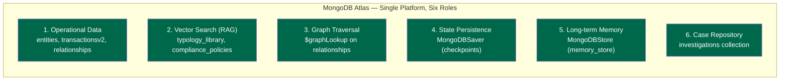

---

## 3. Pipeline Workflow

### Complete Investigation Flow

```mermaid
flowchart TD
    Start(["Alert Input"]) --> Triage["Triage Agent<br/><i>Risk scoring + disposition</i>"]

    Triage -->|"Command: auto_close<br/>Risk < 25, no hits"| AutoClose["Auto-Close FP"]
    Triage -->|"Command: escalate_urgent<br/>Risk > 70, sanctions hit"| Urgent["Urgent Escalation"]
    Triage -->|"Command: investigate<br/>Risk 25-70"| FanOut["Data Gathering<br/><i>Fan-out dispatcher</i>"]

    AutoClose --> EndNode(["END"])
    Urgent --> HumanReview

    FanOut -->|"Send"| FetchEntity["Fetch Entity<br/>Profile"]
    FanOut -->|"Send"| FetchTxn["Fetch<br/>Transactions"]
    FanOut -->|"Send"| FetchNet["Analyze<br/>Network"]
    FanOut -->|"Send"| FetchWL["Screen<br/>Watchlists"]

    FetchEntity --> Assemble["Assemble Case File<br/><i>LLM-powered synthesis</i>"]
    FetchTxn --> Assemble
    FetchNet --> Assemble
    FetchWL --> Assemble

    Assemble --> Typology["Typology Agent<br/><i>Crime classification</i>"]
    Typology --> NetAnalyst["Network Analyst<br/><i>Risk profiling</i>"]
    NetAnalyst --> Narrative["Narrative Agent<br/><i>SAR 5Ws generation</i>"]
    Narrative --> Validation["Validation Agent<br/><i>Quality check</i>"]

    Validation -->|"Command: data_gathering<br/>Missing evidence"| FanOut
    Validation -->|"Command: narrative<br/>Quality issues"| Narrative
    Validation -->|"Command: human_review<br/>Passed validation"| HumanReview["Human Review<br/><i>interrupt() pause</i>"]
    Validation -->|"Command: finalize<br/>Max loops exceeded"| Finalize

    HumanReview -->|"Resume with<br/>analyst decision"| Finalize["Finalize Case<br/><i>Persist to MongoDB</i>"]
    Finalize --> EndNode

    style Triage fill:#1a73e8,color:#fff
    style FanOut fill:#7b1fa2,color:#fff
    style FetchEntity fill:#9c27b0,color:#fff
    style FetchTxn fill:#9c27b0,color:#fff
    style FetchNet fill:#9c27b0,color:#fff
    style FetchWL fill:#9c27b0,color:#fff
    style Assemble fill:#00695c,color:#fff
    style Typology fill:#f57f17,color:#fff
    style NetAnalyst fill:#f57f17,color:#fff
    style Narrative fill:#2e7d32,color:#fff
    style Validation fill:#0d47a1,color:#fff
    style HumanReview fill:#c62828,color:#fff
    style Finalize fill:#1b5e20,color:#fff
    style AutoClose fill:#757575,color:#fff
    style Urgent fill:#b71c1c,color:#fff
```

### State Evolution Through the Pipeline

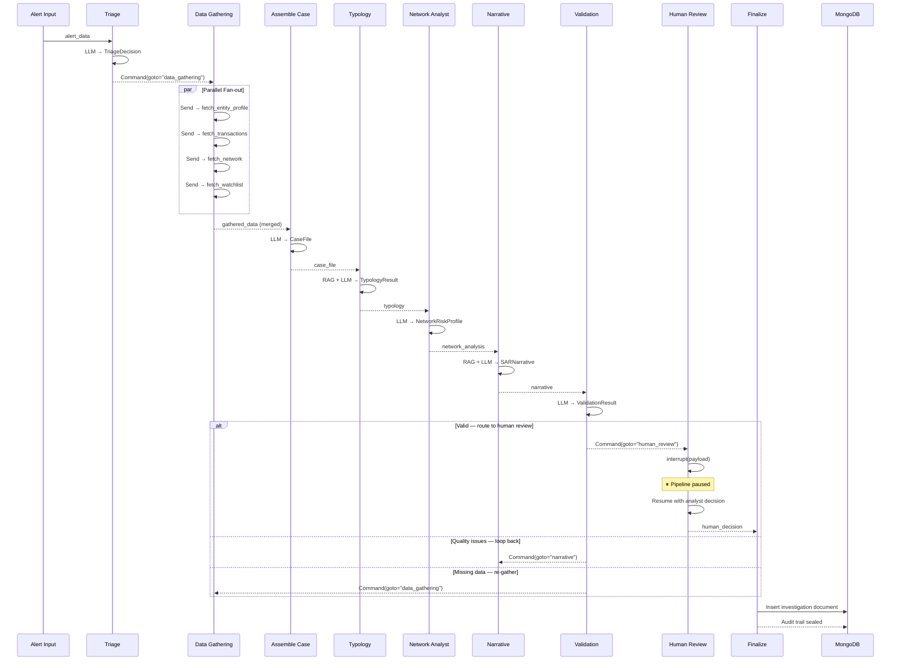

---

## 4. Agent Descriptions

### 4.1 Triage Agent

**File:** `services/agents/nodes/triage.py`
**Structured Output:** `TriageDecision`
**Routing:** `Command`-based dynamic routing

| Disposition | Condition | Route |
|------------|-----------|-------|
| `auto_close` | Risk < 25, no watchlist hits, no flagged transactions | `auto_close` → END |
| `investigate` | Risk 25-70, suspicious indicators present | `data_gathering` |
| `escalate_urgent` | Risk > 70, confirmed sanctions hits, PEP with suspicious patterns | `urgent_escalation` → `human_review` |

The triage agent combines a deterministic risk score from the alert data with
the LLM's contextual reasoning for a hybrid approach. Every decision is logged
to the immutable `agent_audit_log`.

### 4.2 Data Gathering Agent

**File:** `services/agents/nodes/data_gatherer.py`
**Pattern:** `Send` API parallel fan-out + `CaseFile` fan-in assembly

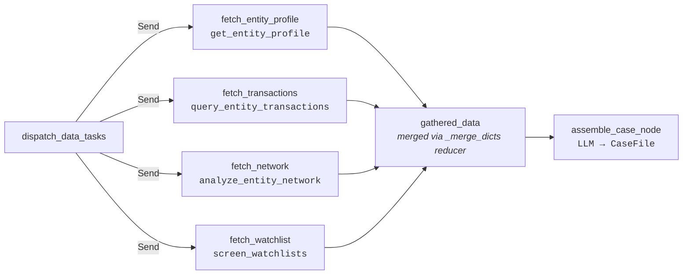

Each parallel worker invokes a LangChain `@tool` and writes its results to a
unique key in `gathered_data`. The `_merge_dicts` reducer on the state ensures
results from parallel branches accumulate without overwriting.

The assembly node uses `model.with_structured_output(CaseFile)` to synthesize
all gathered evidence into a structured 360-degree profile, applying
**hierarchical summarization** — detailed data for the most suspicious items,
summaries for the rest — to prevent context window overflow.

### 4.3 Typology Agent

**File:** `services/agents/nodes/typology.py`
**Structured Output:** `TypologyResult`
**RAG Source:** `typology_library` collection (12 AML typologies)

Classifies suspicious activity into one or more financial crime typologies.
When the triage agent provides a `typology_hint`, the agent performs RAG lookup
against the typology library for relevant patterns before classification.
Includes confidence scores and supporting evidence for regulatory explainability.

**Available Typologies:**

| Typology | Category |
|----------|----------|
| Structuring / Smurfing | Money Laundering |
| Layering | Money Laundering |
| Funnel Account | Money Laundering |
| Trade-Based ML | Money Laundering |
| Shell Company Abuse | Money Laundering |
| Crypto Mixing | Money Laundering |
| Sanctions Evasion | Sanctions |
| Terrorist Financing | Terrorist Financing |
| Fraud Scheme | Fraud |
| Elder Exploitation | Fraud |
| PEP Corruption | Corruption |
| Unclassified | Unclassified |

### 4.4 Network Analyst Agent

**File:** `services/agents/nodes/network_analyst.py`
**Structured Output:** `NetworkRiskProfile`

Enriches the investigation with graph-based insights:

- **Shell company structures** — nominee directors, layered subsidiaries
- **Suspicious relationship patterns** — proxy, beneficial owner, financial beneficiary
- **Centrality analysis** — is the entity a hub connecting high-risk nodes?
- **Risk propagation** — do connected entities raise overall risk?

Uses the `analyze_entity_network` tool which runs `$graphLookup` on the
`relationships` collection, traversing up to 2 hops from the target entity.

### 4.5 Narrative Agent

**File:** `services/agents/nodes/narrative.py`
**Structured Output:** `SARNarrative`
**RAG Source:** `compliance_policies` collection (6 policies)

Generates SAR-compliant narratives following FinCEN's who/what/when/where/why/how
structure. Critical design constraints:

1. **Temperature 0.1** — minimizes creative generation
2. **Grounded exclusively** in the JSON `case_file` — never fabricates facts
3. **Bracket citations** — every factual claim cites its evidence source:
   `[entity_profile]`, `[transaction:<id>]`, `[relationship:<type>]`,
   `[watchlist:<list>]`, `[network_analysis]`
4. **Policy-aware** — retrieves SAR formatting guidance from `compliance_policies`

**Narrative Structure:**

| Section | Content |
|---------|---------|
| Introduction | Reason for filing, subject identification, activity summary |
| Body | Chronological detail with specific dates, amounts, counterparties |
| Conclusion | Actions taken, documents available, account status |

### 4.6 Validation Agent

**File:** `services/agents/nodes/validator.py`
**Structured Output:** `ValidationResult`
**Routing:** `Command`-based dynamic routing

The critical hallucination prevention layer. Checks:

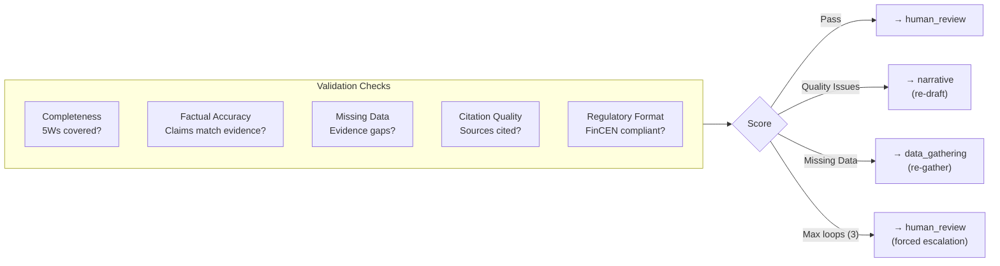

**Hard cap:** `MAX_VALIDATION_LOOPS = 3`. After 3 cycles, the validator forces
escalation to human review with `forced_escalation: true` in the result.

### 4.7 Human Review Agent

**File:** `services/agents/nodes/human_review.py`
**Pattern:** `interrupt()` for durable pause/resume

Calls `interrupt(review_payload)` which:

1. Serializes the complete case state to `MongoDBSaver`
2. Returns the review payload to the frontend via SSE
3. Pauses the pipeline indefinitely (minutes, hours, or days)

The analyst reviews the case file, narrative, typology, and network analysis,
then responds with:

| Decision | Effect |
|----------|--------|
| `approve` | Pipeline resumes → `finalize` → SAR filed |
| `reject` | Pipeline resumes → `finalize` → case closed |
| `request_changes` | Pipeline resumes → `finalize` → case updated |

Resume via: `graph.invoke(Command(resume={"decision": "approve", "analyst_notes": "..."}), config)`

### 4.8 Finalize Agent

**File:** `services/agents/nodes/finalize.py`

Assembles the final investigation document containing:

- Case ID (generated UUID)
- Complete alert data, triage decision, case file, typology, network analysis
- Full SAR narrative with citations
- Validation result and human decision
- Immutable `agent_audit_log` (every agent decision throughout the pipeline)

Persists the document to the `investigations` MongoDB collection.

---

## 5. Data Architecture

### Existing Collections (Reused As-Is)

These collections are populated by the existing ThreatSight 360 seed notebooks.
The agentic pipeline reads from them via tools — no data is modified.

#### `entities` — 504 documents

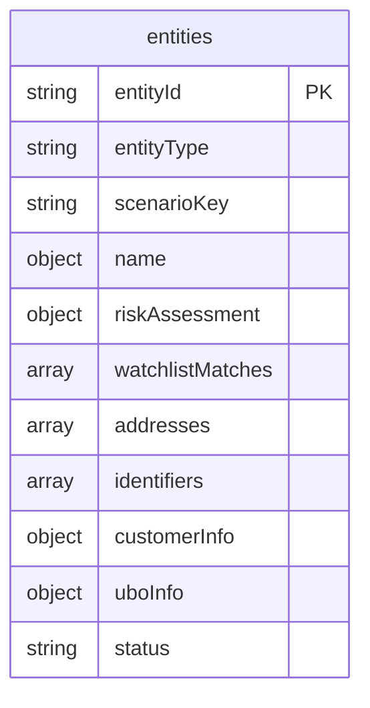

**Scenario keys accessed by agents:**

| Scenario Pattern | Risk Profile | Count |
|-----------------|--------------|-------|
| `generic_individual` | Low risk, clean history | ~200 |
| `generic_organization` | Low risk, normal activity | ~100 |
| `shell_company_candidate_var{i}` | High risk, nominee directors | Multiple |
| `sanctioned_org_varied_{i}` | OFAC-SDN confirmed, risk 85+ | Multiple |
| `pep_individual_varied_{i}` | PEP, watchlist score 0.99 | Multiple |
| `hnwi_global_investor_{i}` | Complex financial profiles | Multiple |
| `complex_org_parent_struct{i}` | Parent-subsidiary structures | Multiple |
| `evolving_risk_individual_{i}` | Changing risk profiles | Multiple |

#### `transactionsv2` — 12,766 documents

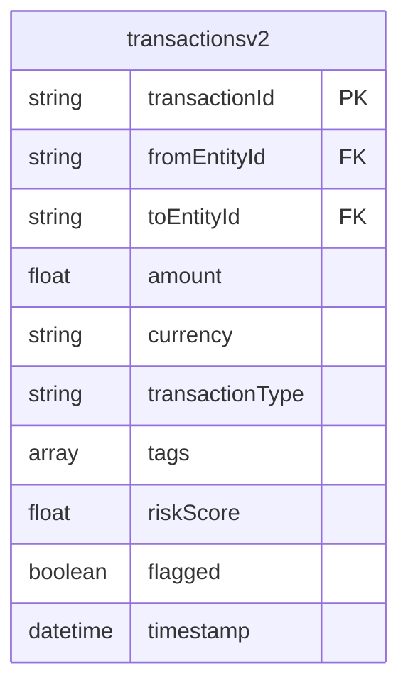

**Suspicious tags used by agents:**

| Tag | Scenario |
|-----|----------|
| `layering`, `shell_company_chain` | Shell-to-shell transfers |
| `sanctions_evasion_risk`, `sanctioned_entity` | Sanctioned org transactions |
| `pep_transaction`, `shell_to_pep`, `pep_to_offshore` | PEP-related flows |
| `potential_structuring`, `below_threshold` | Structuring patterns |

#### `relationships` — 519 documents

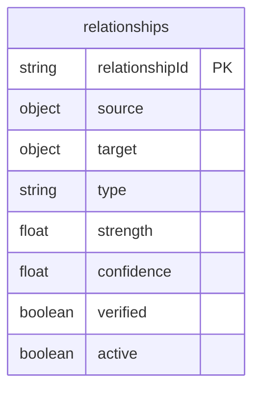

**Relationship types traversed by `$graphLookup`:**

| Category | Types |
|----------|-------|
| Corporate | `director_of`, `ubo_of`, `parent_of_subsidiary`, `subsidiary_of`, `board_member_of` |
| Suspicious | `financial_beneficiary_suspected`, `proxy_relationship_suspected`, `potential_beneficial_owner_of` |
| Business | `supplier_of`, `customer_of`, `business_partner` |
| Family | `household_member`, `family_member` |

### New Collections (Created by Seed Script)

#### `typology_library` — 12 documents

Financial crime typology reference library for RAG-powered classification.

| typology_id | Name | Category |
|------------|------|----------|
| `typ_structuring` | Structuring / Smurfing | money_laundering |
| `typ_layering` | Layering | money_laundering |
| `typ_funnel_account` | Funnel Account | money_laundering |
| `typ_trade_based_ml` | Trade-Based Money Laundering | money_laundering |
| `typ_shell_company` | Shell Company Abuse | money_laundering |
| `typ_crypto_mixing` | Cryptocurrency Mixing | money_laundering |
| `typ_sanctions_evasion` | Sanctions Evasion | sanctions |
| `typ_terrorist_financing` | Terrorist Financing | terrorist_financing |
| `typ_fraud_scheme` | Fraud Scheme | fraud |
| `typ_elder_exploitation` | Elder Financial Exploitation | fraud |
| `typ_pep_abuse` | PEP Corruption / Abuse of Office | corruption |
| `typ_unknown` | Unclassified Suspicious Activity | unclassified |

Each document includes `description`, `red_flags[]`, and `regulatory_references[]`.

#### `compliance_policies` — 6 documents

SAR filing guidance and internal policies for narrative generation RAG.

| policy_id | Title | Category |
|-----------|-------|----------|
| `pol_sar_5ws` | SAR Narrative Structure — The Five Ws | sar_filing |
| `pol_sar_format` | SAR Narrative Formatting Requirements | sar_filing |
| `pol_sar_filing_rules` | FinCEN SAR Filing Thresholds and Timing | regulatory |
| `pol_evidence_citation` | Evidence Citation and Grounding Policy | internal |
| `pol_risk_thresholds` | Investigation Risk Thresholds and Escalation | internal |
| `pol_human_review` | Human Review Requirements | regulatory |

#### `investigations` — populated by pipeline

Final case documents with full state history. Indexed on:
- `case_id` (unique)
- `investigation_status`
- `created_at`
- `entity_id`

#### Auto-created by LangGraph

| Collection | Purpose | Created By |
|------------|---------|------------|
| `checkpoints` | Investigation state snapshots | `MongoDBSaver` |
| `checkpoint_writes` | State write operations | `MongoDBSaver` |
| `memory_store` | Cross-investigation learning | `MongoDBStore` |

---

## 6. Tool Layer

LangChain `@tool` wrappers provide the agent nodes with direct access to
MongoDB collections. Each tool uses the synchronous `pymongo` client from
the existing `dependencies.py` connection pool.

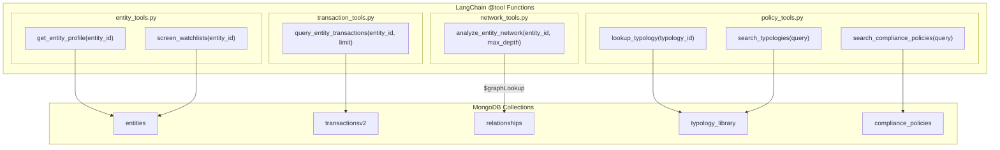

### Tool Details

| Tool | Collection | Query Pattern | Returns |
|------|-----------|---------------|---------|
| `get_entity_profile` | `entities` | `find_one({entityId})` | Full entity document (risk, watchlist, KYC) |
| `screen_watchlists` | `entities` | `find_one({entityId})` → `.watchlistMatches` | Structured screening with hit count, list IDs, match scores |
| `query_entity_transactions` | `transactionsv2` | `find({$or: [fromEntityId, toEntityId]})` sorted by risk | Aggregate stats + top 15 suspicious transactions |
| `analyze_entity_network` | `relationships` | `$graphLookup` from `source.entityId`, max 2 hops | Network size, suspicious connections, shell indicators |
| `lookup_typology` | `typology_library` | `find_one({typology_id})` | Full typology description, red flags, regulatory refs |
| `search_typologies` | `typology_library` | Text search over all documents | Top 5 matching typologies |
| `search_compliance_policies` | `compliance_policies` | Text search over all documents | Top 5 matching policies |

---

## 7. Structured Output Models

Every agent uses `model.with_structured_output(PydanticModel)` for type-safe,
schema-validated LLM responses. This ensures consistent data flow and eliminates
unstructured text parsing.

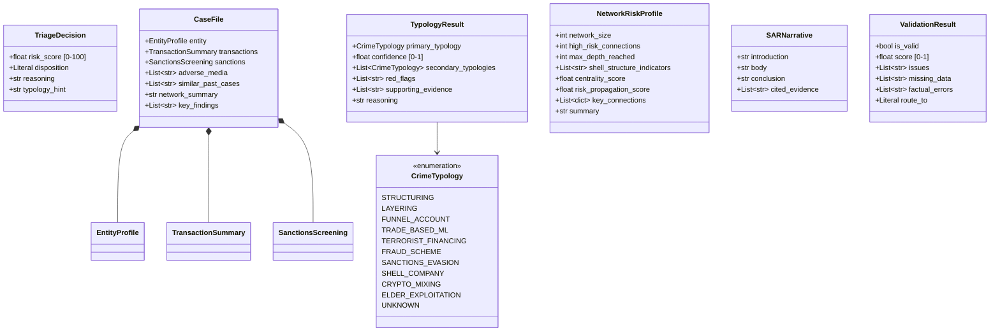

---

## 8. LangGraph Patterns

### 8.1 Command-Based Dynamic Routing

The `Command` class replaces traditional conditional edges. Nodes return
routing decisions inline with state updates:

```python
# Triage node returns a Command that routes AND updates state
return Command(
    goto="data_gathering",         # dynamic routing target
    update={                        # state changes
        "triage_decision": decision.model_dump(),
        "investigation_status": "triage_investigate",
        "agent_audit_log": [audit_entry],
    },
)
```

**Used by:** Triage Agent (3 routes), Validation Agent (4 routes)

### 8.2 Send API for Parallel Fan-Out

The `Send` API dispatches work to multiple nodes concurrently:

```python
def dispatch_data_tasks(state: InvestigationState) -> list[Send]:
    entity_id = state["alert_data"]["entity_id"]
    tasks = [
        "fetch_entity_profile",
        "fetch_transactions",
        "fetch_network",
        "fetch_watchlist",
    ]
    return [Send(task, {"task": task, "entity_id": entity_id}) for task in tasks]
```

Results are merged into `gathered_data` via the `_merge_dicts` reducer, which
shallow-merges dicts so each parallel branch's output accumulates without
overwriting.

### 8.3 Durable Interrupt for Human Review

The `interrupt()` function pauses execution and persists state to MongoDB:

```python
def human_review_node(state: InvestigationState) -> dict:
    review_payload = {
        "case_file": state.get("case_file", {}),
        "narrative": state.get("narrative", {}),
        # ... full review context
    }
    decision = interrupt(review_payload)  # ⏸ Pauses here
    # Resumes when analyst responds
    return {"human_decision": decision}
```

**Resume:** `graph.invoke(Command(resume=analyst_decision), config={"configurable": {"thread_id": thread_id}})`

### 8.4 State Reducers

| Field | Reducer | Behavior |
|-------|---------|----------|
| `messages` | `add_messages` | LangGraph built-in message accumulator |
| `gathered_data` | `_merge_dicts` | Shallow dict merge for fan-out results |
| `agent_audit_log` | `_append_only` | Immutable append (entries can never be removed) |

### 8.5 Validation Cycles

The graph supports cycles (LangGraph is NOT a DAG framework). The validation
agent can route back to `data_gathering` or `narrative` up to 3 times:

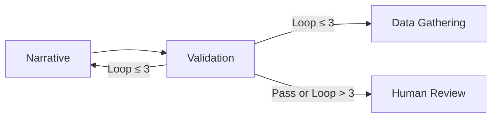

---

## 9. API Reference

All endpoints are prefixed with `/agents` and served via the AML backend
(default port 8001). The Next.js frontend proxies requests through
`/api/aml/agents/*`.

### POST `/agents/investigate`

Launch a new agentic investigation with SSE streaming.

**Request Body:**
```json
{
  "entity_id": "shell_company_candidate_var0",
  "alert_type": "suspicious_structure"
}
```

**Response:** `text/event-stream`

```
data: {"type":"agent_start","agent":"triage","timestamp":"..."}
data: {"type":"agent_end","agent":"triage","status":"triage_investigate","timestamp":"..."}
data: {"type":"agent_start","agent":"data_gathering","timestamp":"..."}
...
data: {"type":"investigation_complete","thread_id":"case-abc123","status":"filed","triage_decision":{...},"typology":{...},"narrative":{...},"needs_human_review":false}
```

**SSE Event Types:**

| Event Type | Fields | Description |
|-----------|--------|-------------|
| `agent_start` | `agent`, `timestamp` | Agent node beginning execution |
| `agent_end` | `agent`, `status`, `timestamp` | Agent node completed |
| `investigation_complete` | `thread_id`, `status`, `triage_decision`, `typology`, `narrative`, `validation_result`, `needs_human_review` | Pipeline finished |
| `error` | `message` | Error occurred |

### POST `/agents/investigate/resume`

Resume an investigation paused at human review.

**Request Body:**
```json
{
  "thread_id": "case-abc123def456",
  "decision": "approve",
  "analyst_notes": "Evidence confirms shell company activity."
}
```

**Decision Values:** `approve` | `reject` | `request_changes`

### GET `/agents/investigations`

List all investigations.

**Query Parameters:**

| Parameter | Type | Default | Description |
|-----------|------|---------|-------------|
| `status` | string | null | Filter by investigation_status |
| `limit` | int | 20 | Max results |
| `skip` | int | 0 | Pagination offset |

**Response:**
```json
{
  "investigations": [...],
  "total": 42,
  "skip": 0,
  "limit": 20
}
```

### GET `/agents/investigations/{case_id}`

Get a single investigation by case ID.

### POST `/agents/seed`

Seed the `typology_library` (12 docs) and `compliance_policies` (6 docs)
collections. Safe to run multiple times (drops and re-creates).

### GET `/agents/health`

Health check for the agent pipeline.

---

## 10. Frontend Dashboard

### Page Structure

The `/investigations` page uses a tabbed interface built with MongoDB
LeafyGreen UI components:

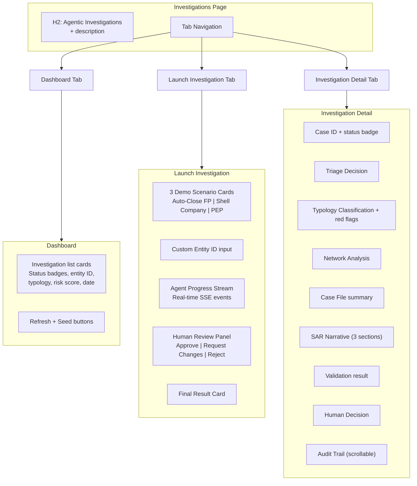

### Component Breakdown

| Component | File | Purpose |
|-----------|------|---------|
| `InvestigationsPage` | `InvestigationsPage.jsx` | Root page with tab navigation and state management |
| `InvestigationDashboard` | `InvestigationDashboard.jsx` | Lists investigations with status badges, supports refresh and seed |
| `InvestigationLauncher` | `InvestigationLauncher.jsx` | Demo scenarios, custom launch, SSE progress stream, human review panel |
| `InvestigationDetail` | `InvestigationDetail.jsx` | Full case view with all sections expanded |

### SSE Streaming Pattern

The frontend uses `fetch()` with `response.body.getReader()` to consume
server-sent events in real-time, matching the existing pattern from the
streaming classification feature:

```
Frontend → /api/aml/agents/investigate (POST)
         → Next.js proxy passes through SSE
         → FastAPI StreamingResponse
         → graph.astream_events() generates events
         → Each event rendered as a progress row
```

---

## 11. Demo Scenarios

Three pre-built alert payloads exercise different pipeline paths against
the existing seed data:

### Scenario 1: Auto-Close False Positive


| Field | Value |
|-------|-------|
| Entity | `generic_individual` |
| Alert Type | `routine_monitoring` |
| Expected Path | Triage → Auto-Close → END |
| Demonstrates | 70-80% false positive reduction |

### Scenario 2: Shell Company Investigation

```mermaid
flowchart LR
    A["Alert: shell_company_candidate_var0"] --> T["Triage"]
    T -->|"Risk > 70"| DG["Data Gathering"]
    DG --> AC["Assemble Case"]
    AC --> TY["Typology:<br/>shell_company + layering"]
    TY --> NA["Network Analyst"]
    NA --> NR["Narrative"]
    NR --> V["Validation"]
    V --> HR["Human Review"]
    HR --> F["Finalize"]

    style TY fill:#f57f17,color:#fff
    style HR fill:#c62828,color:#fff
```

| Field | Value |
|-------|-------|
| Entity | `shell_company_candidate_var0` |
| Alert Type | `suspicious_structure` |
| Expected Path | Full pipeline with validation loop |
| Key Evidence | Nominee directors, layering-tagged transactions, shell_company_chain flows |
| Expected Typology | `shell_company` + `layering` |
| Demonstrates | Full investigation, network analysis, SAR generation |

### Scenario 3: PEP Investigation

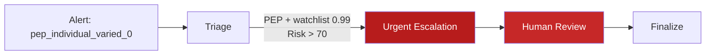

| Field | Value |
|-------|-------|
| Entity | `pep_individual_varied_0` |
| Alert Type | `pep_alert` |
| Expected Path | Triage → Urgent Escalation → Human Review → Finalize |
| Key Evidence | NATIONAL-PEP watchlist match (0.99), pep_to_offshore transactions |
| Expected Typology | `pep_abuse` |
| Demonstrates | Urgent escalation path, PEP-specific handling |

---

## 12. Configuration & Dependencies

### Python Dependencies

| Package | Version | Purpose |
|---------|---------|---------|
| `langgraph` | >=1.0.7 | Core graph framework (GA, stable API) |
| `langchain-core` | >=1.2.14 | LLM abstractions, tool calling, structured output |
| `langchain-aws` | >=0.2.9 | `ChatBedrockConverse` for Claude via Bedrock |
| `langchain-mongodb` | >=0.10.0 | MongoDB vector search, hybrid retriever |
| `langgraph-checkpoint-mongodb` | >=0.3.1 | `MongoDBSaver` for investigation checkpointing |
| `voyageai` | >=0.3.2 | Voyage AI embeddings |
| `pymongo` | ^4.10.1 | MongoDB driver (existing) |
| `motor` | ^3.7.0 | Async MongoDB driver (existing) |
| `boto3` / `botocore` | ^1.35.0 | AWS SDK for Bedrock (existing) |

### Environment Variables

| Variable | Default | Description |
|----------|---------|-------------|
| `MONGODB_URI` | `mongodb://localhost:27017` | MongoDB connection string |
| `DB_NAME` | `fsi-threatsight360` | Database name |
| `AWS_REGION` | `us-east-1` | AWS region for Bedrock |
| `VOYAGE_API_KEY` | — | Voyage AI API key |

### LLM Configuration

| Setting | Value |
|---------|-------|
| Model | Claude Sonnet (`arn:aws:bedrock:us-east-1:275662791714:application-inference-profile/n5kazy9gif2u`) |
| Temperature | 0.1 |
| Client | `ChatBedrockConverse` (langchain-aws) |
| Pattern | Singleton via `get_llm()` |

### Embedding Configuration

| Setting | Value |
|---------|-------|
| Model | `voyage-finance-2` (financial-domain-optimized) |
| Provider | Voyage AI |
| Client | Custom `VoyageFinanceEmbeddings` wrapper implementing LangChain `Embeddings` |
| Pattern | Singleton via `get_voyage_embeddings()` |

---

## 13. Design Principles

Five principles from 2025-2026 production deployments govern this
implementation:

### 1. Start Simple, Add Autonomy in Layers

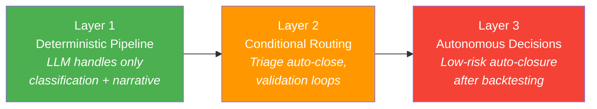

### 2. Compliance-by-Design

Every agent decision logs to the immutable `agent_audit_log`:
- Input data and reasoning trace
- Tools invoked and their results
- Confidence score and decision made
- Alternatives considered

The append-only annotation ensures no entry can be removed. Satisfies
SR 11-7, EU AI Act, and OCC guidance on explainability.

### 3. Layered Guardrails (Defense-in-Depth)

| Layer | Mechanism | Example |
|-------|-----------|---------|
| Policy | Business rules as deterministic checks | Risk thresholds, filing deadlines |
| Behavioral | Pydantic structured output validation | Every LLM response schema-validated |
| Operational | Hard caps on agent behavior | `MAX_VALIDATION_LOOPS = 3` |

### 4. Risk-Adaptive Human Oversight

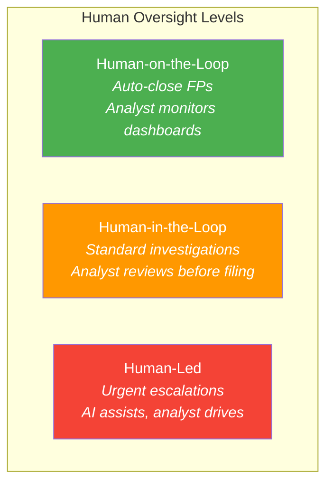

### 5. Ground All Generation in Evidence

The Narrative Agent generates exclusively from the structured `case_file`
JSON — never from parametric knowledge. Every factual claim cites its
evidence source in brackets. The modular approach (separate data gathering →
structured case file → narrative generation) dramatically reduces hallucination
compared to monolithic prompting.

---

## 14. Failure Mode Mitigations

| Failure Mode | Risk | Mitigation |
|-------------|------|------------|
| Hallucinated SAR facts | Critical | Ground in structured JSON case_file; require source citations; temperature 0.1; validation agent fact-checks against evidence |
| Infinite validation loops | High | Hard cap `MAX_VALIDATION_LOOPS = 3`; forced escalation to human review |
| Context window overflow | Medium | Hierarchical summarization in data gathering: summaries for bulk data, detail only for most suspicious items; payload truncation with `[:12000]` |
| Tool call failures | Medium | Each tool catches exceptions and returns structured error dicts; agents reason about missing data gracefully |
| State loss during interrupt | Medium | `MongoDBSaver` persists state durably; pipeline resumes from exact checkpoint |
| Cognitive drift over time | Low | Monitor via `agent_audit_log`: are triage scores calibrating? Are investigation steps consistent? |
| Concurrent investigation conflicts | Low | Each investigation gets a unique `thread_id`; state is isolated per thread |

---

## 15. File Reference

### Backend — `aml-backend/`

```
services/agents/
├── __init__.py
├── state.py                    # InvestigationState TypedDict + reducers
├── graph.py                    # LangGraph StateGraph wiring + compilation
├── llm.py                      # ChatBedrockConverse singleton
├── embeddings.py               # VoyageFinanceEmbeddings wrapper
├── memory.py                   # MongoDBStore for cross-investigation learning
├── prompts.py                  # Centralized system prompts (5 prompts)
├── seed.py                     # Seed script (12 typologies + 6 policies)
├── nodes/
│   ├── __init__.py
│   ├── triage.py               # Triage + auto_close + urgent_escalation
│   ├── data_gatherer.py        # Fan-out dispatch + 4 workers + fan-in assembly
│   ├── typology.py             # RAG-powered crime classification
│   ├── network_analyst.py      # $graphLookup network risk profiling
│   ├── narrative.py            # SAR 5Ws narrative generation
│   ├── validator.py            # Quality loop with max 3 iterations
│   ├── human_review.py         # interrupt() durable pause/resume
│   └── finalize.py             # Case document assembly + MongoDB persistence
└── tools/
    ├── __init__.py
    ├── entity_tools.py         # get_entity_profile, screen_watchlists
    ├── transaction_tools.py    # query_entity_transactions
    ├── network_tools.py        # analyze_entity_network ($graphLookup)
    └── policy_tools.py         # lookup_typology, search_typologies, search_compliance_policies

routes/agents/
├── __init__.py
└── investigation_routes.py     # 6 endpoints (SSE streaming, CRUD, seed, health)

models/agents/
├── __init__.py
└── investigation.py            # 10 Pydantic models + CrimeTypology enum
```

### Frontend — `frontend/`

```
app/investigations/
└── page.js                     # Route entry point

components/investigations/
├── InvestigationsPage.jsx      # Root page (tabs: Dashboard | Launch | Detail)
├── InvestigationDashboard.jsx  # Investigation list with status badges
├── InvestigationLauncher.jsx   # Demo scenarios + SSE progress + human review
└── InvestigationDetail.jsx     # Full case view (9 sections)

lib/
└── agent-api.js                # 5 API functions (SSE streaming, CRUD, seed)
```

---

*Generated for ThreatSight 360 — Agentic SAR Investigation Pipeline*
*Built with LangGraph 1.0, MongoDB Atlas, Claude Sonnet, and Voyage AI*
