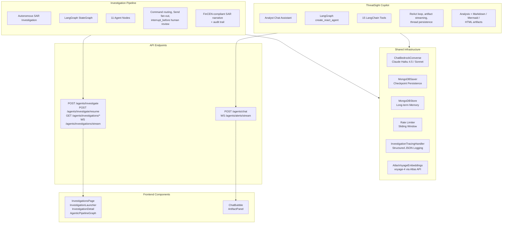
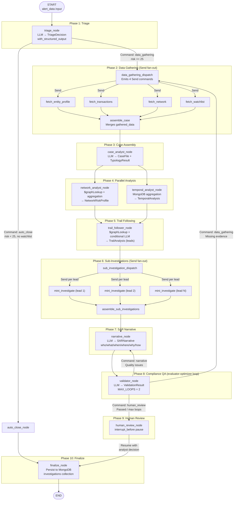
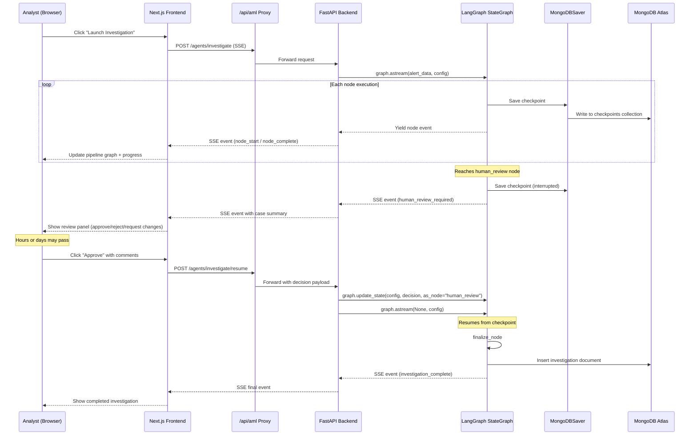
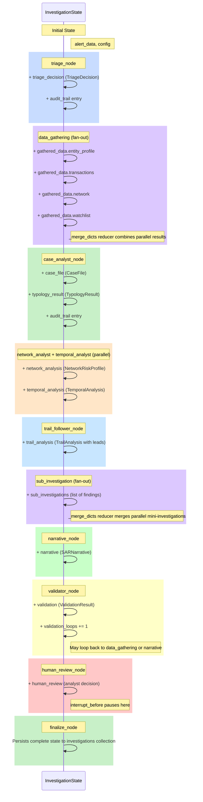

# ThreatSight 360 - Agentic System Overview

This document provides a consolidated view of all AI agent capabilities in ThreatSight 360. For the deep-dive on the investigation pipeline, see [AGENTIC_INVESTIGATION_PIPELINE.md](AGENTIC_INVESTIGATION_PIPELINE.md). For the Copilot architecture, see [COPILOT_ARCHITECTURE.md](COPILOT_ARCHITECTURE.md).

---

## Table of Contents

1. [Agentic System Landscape](#1-agentic-system-landscape)
2. [Investigation Pipeline Node Graph](#2-investigation-pipeline-node-graph)
3. [Human-in-the-Loop Workflow](#3-human-in-the-loop-workflow)
4. [Investigation State Evolution](#4-investigation-state-evolution)
5. [Shared Infrastructure](#5-shared-infrastructure)

---

## 1. Agentic System Landscape

ThreatSight 360 contains two agentic subsystems that share common infrastructure but serve different user workflows.



### Side-by-Side Comparison

| Aspect | Investigation Pipeline | ThreatSight Copilot |
|--------|----------------------|---------------------|
| **Architecture** | `StateGraph` (11 nodes) | `create_react_agent` (ReAct loop) |
| **Trigger** | `POST /agents/investigate` | `POST /agents/chat` |
| **LLM** | Claude Haiku 4.5 (default) | Claude Haiku 4.5 (default) |
| **State** | `InvestigationState` TypedDict | ReAct agent state |
| **Persistence** | `MongoDBSaver` checkpoints | `MongoDBSaver` checkpoints |
| **Memory** | `MongoDBStore` (cross-investigation) | Thread-scoped |
| **Parallelism** | `Send` API fan-out (data gathering, sub-investigations) | Sequential tool calls |
| **Human-in-loop** | `interrupt_before` at `human_review` node | N/A (conversational) |
| **Output** | SAR narrative + case document | Markdown, Mermaid, HTML artifacts |
| **Streaming** | SSE events per node | SSE tokens + artifact events |
| **Rate Limit** | `RATE_LIMIT_INVESTIGATE` (10/60s) | `RATE_LIMIT_CHAT` (30/60s) |
| **Tools** | Node-internal MongoDB queries | 15 `@tool`-decorated functions |

---

## 2. Investigation Pipeline Node Graph

Detailed view of the LangGraph `StateGraph` with LangGraph primitives annotated.



### LangGraph Primitives Used

| Primitive | Where Used | Purpose |
|-----------|-----------|---------|
| `Command(goto=...)` | Triage, Validator | Dynamic routing based on LLM decisions |
| `Send(node, state)` | Data Gathering Dispatch, Sub-Investigation Dispatch | Parallel fan-out to worker nodes |
| `interrupt_before` | `human_review` node (compile-time) | Durable pause for analyst review |
| `MongoDBSaver` | Graph compilation | Checkpoint persistence across all nodes |
| `MongoDBStore` | Graph compilation | Cross-investigation memory (optional) |
| `with_structured_output` | All LLM-calling nodes | Pydantic-typed LLM responses |

---

## 3. Human-in-the-Loop Workflow

Sequence diagram showing the full lifecycle of a human review interaction.



### Key Properties

- **Durability**: The `interrupt_before` mechanism uses `MongoDBSaver` checkpoints, so the investigation state survives backend restarts
- **Asynchronous**: The analyst can review and resume hours or days later
- **State Injection**: Resume uses `graph.update_state()` to inject the analyst's decision into the graph state as if `human_review` node produced it
- **Audit Trail**: The decision is appended to the `audit_trail` state key via the `_append_only` reducer

---

## 4. Investigation State Evolution

How the `InvestigationState` TypedDict evolves as it passes through each pipeline node.



### State Keys Reference

| Key | Type | Set By | Reducer |
|-----|------|--------|---------|
| `alert_data` | dict | Input | Default (overwrite) |
| `triage_decision` | TriageDecision | triage_node | Default |
| `gathered_data` | dict | data_gathering workers | `_merge_dicts` |
| `case_file` | CaseFile | case_analyst_node | Default |
| `typology_result` | TypologyResult | case_analyst_node | Default |
| `network_analysis` | NetworkRiskProfile | network_analyst_node | Default |
| `temporal_analysis` | TemporalAnalysis | temporal_analyst_node | Default |
| `trail_analysis` | TrailAnalysis | trail_follower_node | Default |
| `sub_investigations` | list[dict] | sub_investigation workers | `_merge_dicts` |
| `narrative` | SARNarrative | narrative_node | Default |
| `validation` | ValidationResult | validator_node | Default |
| `validation_loops` | int | validator_node | Default |
| `human_review` | dict | human_review_node | Default |
| `audit_trail` | list[dict] | All LLM nodes | `_append_only` |

---

## 5. Shared Infrastructure

### LLM Configuration

```
services/agents/llm.py
├── get_llm()          → ChatBedrockConverse singleton
├── get_model_id()     → Model ARN string for audit logging
└── invoke_with_retry()→ tenacity retry (3 attempts, exponential backoff)
```

- **Default model**: Claude Haiku 4.5 via AWS Bedrock inference profile
- **Override**: Set `LLM_MODEL_ARN` environment variable to use a different model
- **Retry**: 3 attempts with exponential backoff on transient failures

### Checkpoint Persistence

Both agents use `MongoDBSaver` from `langgraph-checkpoint-mongodb`:
- Stores checkpoint data in the application database (same `MONGODB_URI` / `DB_NAME`)
- Creates `checkpoints` and `checkpoint_writes` collections automatically
- Thread isolation via `thread_id` in the LangGraph config

### Rate Limiting

```
services/agents/rate_limit.py
├── Sliding-window in-memory rate limiter
├── RATE_LIMIT_INVESTIGATE = 10 requests / 60s
└── RATE_LIMIT_CHAT = 30 requests / 60s
```

Applied via FastAPI `Depends()` on the `/agents/investigate` and `/agents/chat` endpoints.

### Tracing

```
services/agents/tracing.py
└── InvestigationTracingHandler (BaseCallbackHandler)
    ├── on_llm_start / on_llm_end
    ├── on_tool_start / on_tool_end
    └── Structured JSON logging of all LLM/tool interactions
```

Wired via `config["callbacks"]` at graph invocation time.
