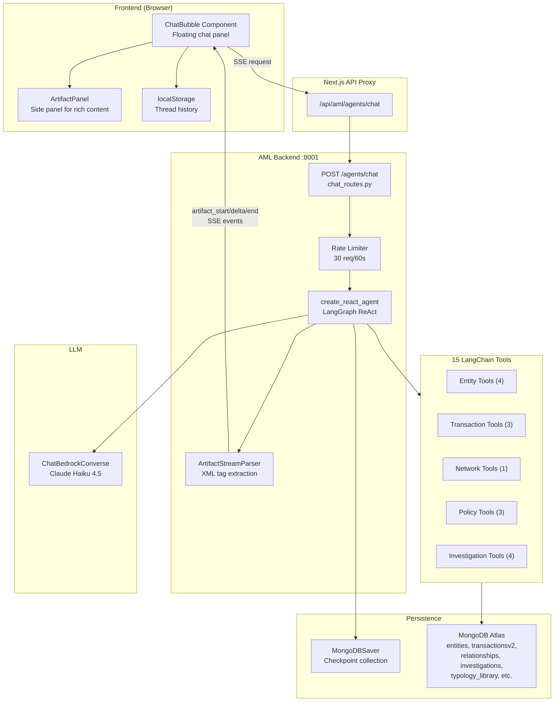
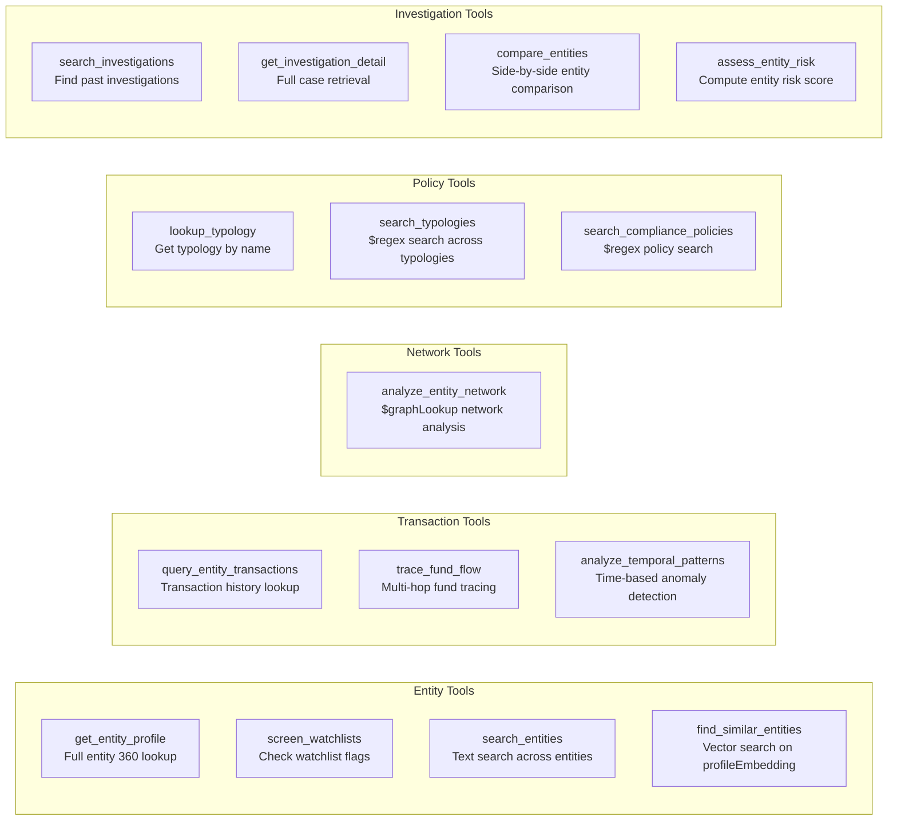
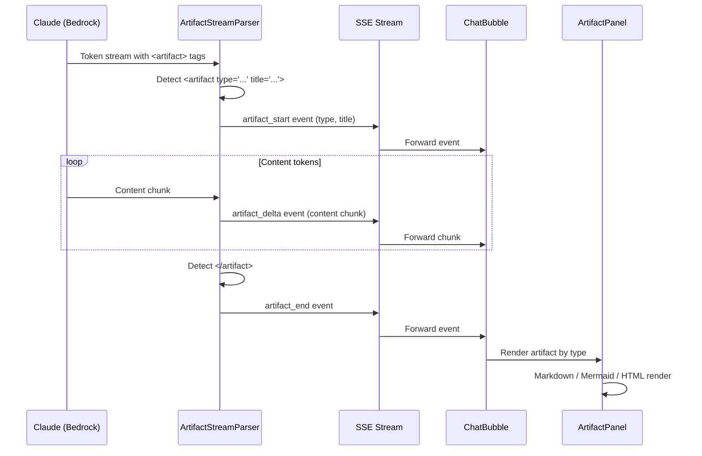
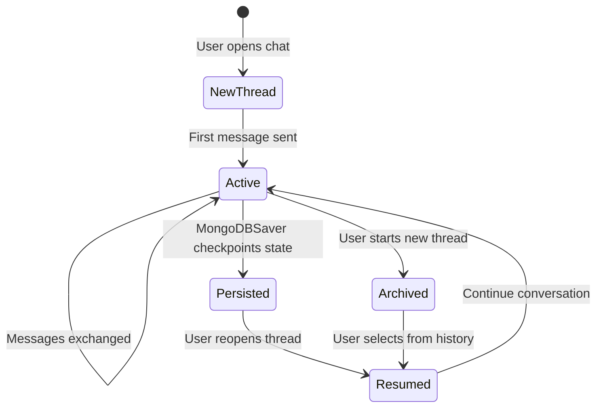

# ThreatSight Copilot - Architecture

The ThreatSight Copilot is a conversational AI assistant available globally across the ThreatSight 360 application. It provides analysts with tool-assisted exploration of entities, transactions, networks, and investigations through natural language.

---

## Table of Contents

1. [Architecture Overview](#1-architecture-overview)
2. [Tool Inventory](#2-tool-inventory)
3. [Artifact System](#3-artifact-system)
4. [Thread Management](#4-thread-management)
5. [API Reference](#5-api-reference)
6. [Configuration](#6-configuration)
7. [File Reference](#7-file-reference)

---

## 1. Architecture Overview



### How It Works

1. The analyst types a message in the `ChatBubble` floating panel
2. The frontend sends a `POST /agents/chat` request with the message and `thread_id`
3. The backend creates/resumes a `create_react_agent` with `MongoDBSaver` for state persistence
4. The ReAct agent enters a reasoning loop: it calls tools as needed, then generates a response
5. The `ArtifactStreamParser` watches the LLM output stream for `<artifact>` XML tags
6. SSE events stream back: regular text tokens (`delta`), plus `artifact_start`, `artifact_delta`, `artifact_end` for rich content
7. The frontend renders text in the chat and routes artifacts to the `ArtifactPanel`

---

## 2. Tool Inventory

The Copilot has access to 15 tools organized into five categories.



### Tool Details

| Tool | Source File | MongoDB Operations | Returns |
|------|-----------|-------------------|---------|
| `get_entity_profile` | `entity_tools.py` | `find_one` on `entities` | Full entity document |
| `screen_watchlists` | `entity_tools.py` | `find_one` + watchlist field check | Watchlist match results |
| `search_entities` | `chat_tools.py` | `$search` on `entities` | Matching entity list |
| `find_similar_entities` | `chat_tools.py` | `$vectorSearch` on `profileEmbedding` | Similar entities by embedding |
| `query_entity_transactions` | `transaction_tools.py` | `find` on `transactionsv2` | Transaction list |
| `trace_fund_flow` | `chat_tools.py` | Multi-hop aggregation on `transactionsv2` | Fund flow graph |
| `analyze_temporal_patterns` | `chat_tools.py` | Time-bucketed aggregation | Temporal anomaly report |
| `analyze_entity_network` | `network_tools.py` | `$graphLookup` on `relationships` | Network graph + metrics |
| `lookup_typology` | `policy_tools.py` | `find_one` on `typology_library` | Typology definition |
| `search_typologies` | `policy_tools.py` | `$regex` + `$or` on `typology_library` | Matching typologies |
| `search_compliance_policies` | `policy_tools.py` | `$regex` + `$or` on `compliance_policies` | Matching policies |
| `search_investigations` | `chat_tools.py` | `find` on `investigations` | Investigation summaries |
| `get_investigation_detail` | `chat_tools.py` | `find_one` on `investigations` | Full investigation document |
| `compare_entities` | `chat_tools.py` | Two `find_one` calls on `entities` | Comparison report |
| `assess_entity_risk` | `chat_tools.py` | Aggregation on entity + relationships + transactions | Risk assessment |

All tools use **sync PyMongo** (not Motor) because LangGraph tool execution runs in a synchronous context. The route handler uses `asyncio.to_thread()` to bridge async FastAPI with sync LangGraph/PyMongo calls.

---

## 3. Artifact System

The Copilot supports rich artifact rendering beyond plain text. Artifacts are embedded in the LLM output stream using XML tags and extracted by a streaming parser.

### Artifact Flow



### Supported Artifact Types

| Type | Constant | Rendering | Frontend Component |
|------|----------|-----------|-------------------|
| Markdown | `ARTIFACT_TYPES.MARKDOWN` | `react-markdown` + `remark-gfm` | `ArtifactPanel` |
| Mermaid | `ARTIFACT_TYPES.MERMAID` | Dynamic `mermaid` import + SVG render | `ArtifactPanel` |
| HTML | `ARTIFACT_TYPES.HTML` | Sandboxed `<iframe>` with CSP | `ArtifactPanel` via `artifact-sandbox.html` |

### Artifact Utilities (`lib/artifact-utils.js`)

- `ARTIFACT_TYPES`: Type constants with labels, icons, colors, and file extensions
- `downloadArtifact(content, type, title)`: Download artifact as file
- `copyToClipboard(content)`: Copy artifact content

### HTML Sandboxing

HTML artifacts are rendered in an isolated iframe using `public/artifact-sandbox.html`:
- Content Security Policy (CSP) restricts script execution
- Tailwind CSS is available for styling
- The iframe communicates with the parent via `postMessage`

---

## 4. Thread Management

### Thread Lifecycle



### Storage

| Layer | Storage | Data |
|-------|---------|------|
| Frontend | `localStorage` (`aml-chat-threads`) | Thread list, metadata, display messages |
| Backend | MongoDB (`checkpoints` collection) | Full LangGraph state, tool call history, message context |

### Thread ID

Each thread gets a unique `thread_id` generated on the frontend. This ID is passed in every `/agents/chat` request and used by `MongoDBSaver` to scope checkpoint storage. Conversations survive page refreshes because the backend resumes from the last checkpoint.

---

## 5. API Reference

### POST /agents/chat

Sends a message to the Copilot and receives a streaming response.

**Request:**
```json
{
  "message": "Trace the fund flow for entity ENT-001",
  "thread_id": "uuid-v4-string"
}
```

**Response:** SSE stream with events:
- `delta` -- Text token from the LLM
- `tool_start` -- Tool invocation begins (includes tool name and args)
- `tool_end` -- Tool invocation completes (includes result summary)
- `artifact_start` -- Rich artifact begins (includes type and title)
- `artifact_delta` -- Artifact content chunk
- `artifact_end` -- Rich artifact complete
- `end` -- Stream complete

### Rate Limiting

- Default: 30 requests per 60-second sliding window
- Configurable via `RATE_LIMIT_CHAT` environment variable
- Returns HTTP 429 when exceeded

---

## 6. Configuration

| Variable | Default | Description |
|----------|---------|-------------|
| `LLM_MODEL_ARN` | Haiku 4.5 inference profile | Override the default LLM model |
| `RATE_LIMIT_CHAT` | `30` | Max chat requests per 60s |
| `MONGODB_URI` | (required) | MongoDB connection string |
| `DB_NAME` | `fsi-threatsight360` | Database name for checkpoints and tools |

---

## 7. File Reference

### Backend (`aml-backend/`)

| File | Purpose |
|------|---------|
| `services/agents/chat_agent.py` | `create_react_agent` setup, tool registration, LLM wiring |
| `services/agents/tools/entity_tools.py` | `get_entity_profile`, `screen_watchlists` |
| `services/agents/tools/transaction_tools.py` | `query_entity_transactions` |
| `services/agents/tools/network_tools.py` | `analyze_entity_network` |
| `services/agents/tools/policy_tools.py` | `lookup_typology`, `search_typologies`, `search_compliance_policies` |
| `services/agents/tools/chat_tools.py` | 8 additional tools (search, compare, trace, temporal, etc.) |
| `services/agents/artifact_parser.py` | `ArtifactStreamParser` for XML tag extraction |
| `routes/agents/chat_routes.py` | Chat SSE endpoint, rate limiting, artifact event forwarding |
| `services/agents/llm.py` | Shared LLM singleton |
| `services/agents/rate_limit.py` | Sliding-window rate limiter |

### Frontend (`frontend/`)

| File | Purpose |
|------|---------|
| `components/chat/ChatBubble.jsx` | Floating chat panel, thread management, SSE consumption |
| `components/chat/ArtifactPanel.jsx` | Side panel for Markdown, Mermaid, and HTML artifacts |
| `lib/agent-api.js` | `sendChatMessage()` with SSE streaming and AbortSignal |
| `lib/artifact-utils.js` | Artifact type constants, download/copy utilities |
| `public/artifact-sandbox.html` | Isolated HTML artifact preview with CSP |
