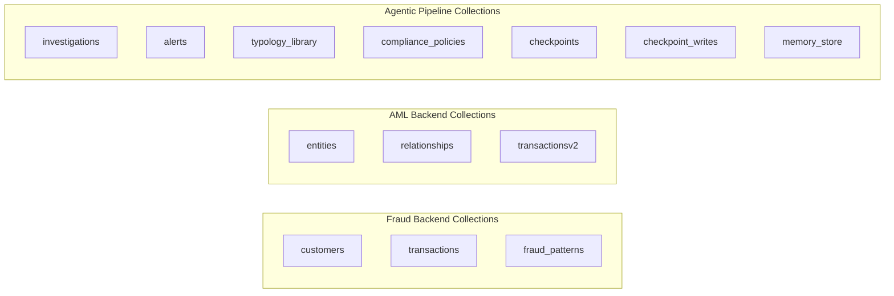
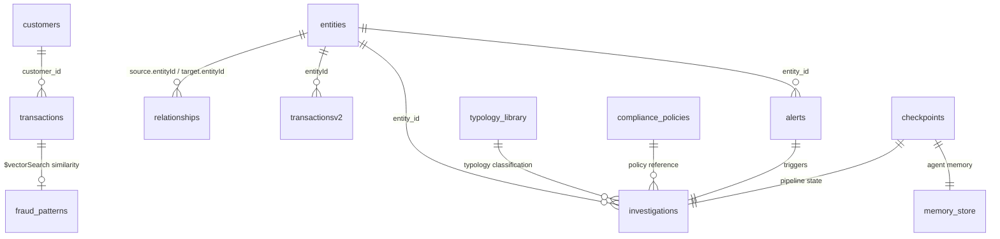

# ThreatSight 360 - MongoDB Data Model

This document provides a consolidated reference for all MongoDB collections, schemas, indexes, and conventions used across both backends.

**Database**: `fsi-threatsight360` (configurable via `DB_NAME` environment variable)

---

## Table of Contents

1. [Collection Overview](#1-collection-overview)
2. [Fraud Backend Collections](#2-fraud-backend-collections)
3. [AML Backend Collections](#3-aml-backend-collections)
4. [Agentic Pipeline Collections](#4-agentic-pipeline-collections)
5. [Index Reference](#5-index-reference)
6. [Collection Relationships](#6-collection-relationships)
7. [Field Naming Conventions](#7-field-naming-conventions)
8. [Risk Score Conventions](#8-risk-score-conventions)

---

## 1. Collection Overview



| Collection | Backend | Documents | Purpose |
|------------|---------|-----------|---------|
| `customers` | Fraud | ~50 | Customer 360 profiles with behavioral patterns |
| `transactions` | Fraud | ~26,000 | Transaction records with fraud assessments |
| `fraud_patterns` | Fraud | ~5 | Known fraud pattern definitions with embeddings |
| `entities` | AML | ~504 | KYC/AML entity profiles (individuals + organizations) |
| `relationships` | AML | ~519 | Entity relationship graph edges |
| `transactionsv2` | AML | ~12,766 | Entity transaction records |
| `investigations` | AML (agents) | Variable | Completed investigation case documents |
| `alerts` | AML (agents) | Variable | Investigation trigger records |
| `typology_library` | AML (agents) | 12 | AML crime typology definitions with embeddings |
| `compliance_policies` | AML (agents) | 6 | Regulatory compliance policy documents with embeddings |
| `checkpoints` | AML (agents) | Variable | LangGraph state checkpoints (MongoDBSaver) |
| `checkpoint_writes` | AML (agents) | Variable | LangGraph checkpoint write log (MongoDBSaver) |
| `memory_store` | AML (agents) | Variable | Cross-investigation memory (MongoDBStore) |

---

## 2. Fraud Backend Collections

### `customers`

Customer 360 profiles with rich behavioral patterns.

```javascript
{
  "_id": ObjectId,
  "customer_id": "CUST-001",
  "personal_info": {
    "name": "John Smith",
    "email": "john@example.com",
    "phone": "+1-555-0100"
  },
  "account_info": {
    "account_type": "checking",
    "opened_date": ISODate,
    "status": "active"
  },
  "device_fingerprints": [
    { "device_id": "...", "type": "mobile", "os": "iOS" }
  ],
  "usual_locations": {
    "type": "MultiPoint",
    "coordinates": [[-73.9857, 40.7484]]
  },
  "transaction_behavior": {
    "avg_amount": 250.00,
    "typical_categories": ["grocery", "gas", "dining"],
    "usual_times": { "start": 8, "end": 22 }
  },
  "risk_profile": {
    "score": 15,
    "level": "low",
    "flags": []
  }
}
```

### `transactions`

Transaction records with fraud risk assessments and vector embeddings.

```javascript
{
  "_id": ObjectId,
  "transaction_id": "TXN-001",
  "customer_id": "CUST-001",
  "type": "purchase",
  "amount": 1500.00,
  "merchant": {
    "name": "Electronics Store",
    "category": "electronics",
    "location": { "type": "Point", "coordinates": [-73.9857, 40.7484] }
  },
  "device": { "device_id": "...", "type": "mobile" },
  "timestamp": ISODate,
  "risk_assessment": {
    "score": 72,
    "level": "high",
    "flags": ["unusual_amount", "new_merchant"],
    "factor_scores": {
      "amount": 85,
      "location": 20,
      "device": 60,
      "velocity": 45,
      "pattern": 78
    }
  },
  "vector_embedding": [0.023, -0.015, ...] // 1536 dimensions (Titan)
}
```

### `fraud_patterns`

Known fraud pattern definitions with vector embeddings for similarity search.

```javascript
{
  "_id": ObjectId,
  "name": "Account Takeover",
  "description": "Unauthorized access pattern involving device changes...",
  "indicators": ["new_device", "password_change", "high_amount"],
  "risk_level": "critical",
  "vector_embedding": [0.012, -0.034, ...] // 1536 dimensions (Titan)
}
```

---

## 3. AML Backend Collections

### `entities`

KYC/AML entity profiles for individuals and organizations.

```javascript
{
  "_id": ObjectId,
  "entityId": "ENT-001",
  "entityType": "individual",
  "name": {
    "full": "Maria Santos",
    "first": "Maria",
    "last": "Santos",
    "aliases": ["M. Santos", "Maria S."]
  },
  "addresses": [
    {
      "full": "123 Main St, New York, NY 10001",
      "city": "New York",
      "country": "US",
      "type": "residential"
    }
  ],
  "identifiers": [
    { "type": "passport", "value": "AB1234567", "country": "US" }
  ],
  "nationality": "US",
  "residency": "US",
  "riskAssessment": {
    "overall": {
      "score": 45,
      "level": "medium"
    },
    "factors": { ... }
  },
  "customerInfo": {
    "businessType": "retail",
    "accountOpenDate": ISODate
  },
  "watchlistFlags": {
    "isOnWatchlist": false,
    "matches": []
  },
  "profileEmbedding": [0.045, -0.012, ...], // Voyage AI embedding
  "createdAt": ISODate,
  "updatedAt": ISODate
}
```

### `relationships`

Entity relationship graph edges for network analysis.

```javascript
{
  "_id": ObjectId,
  "relationshipId": "REL-001",
  "source": {
    "entityId": "ENT-001",
    "entityType": "individual"
  },
  "target": {
    "entityId": "ENT-002",
    "entityType": "organization"
  },
  "type": "director_of",
  "direction": "directed",
  "strength": 0.9,
  "confidence": 0.95,
  "active": true,
  "verified": true,
  "evidence": ["corporate_registry"],
  "datasource": "public_records",
  "createdAt": ISODate,
  "updatedAt": ISODate
}
```

**Relationship Types**: `director_of`, `owner_of`, `subsidiary_of`, `family_member`, `same_address`, `frequent_transactor`, `beneficiary`, `suspicious_link`

### `transactionsv2`

Entity-centric transaction records used by the AML backend and agentic tools.

```javascript
{
  "_id": ObjectId,
  "transactionId": "TXNV2-001",
  "entityId": "ENT-001",
  "counterpartyEntityId": "ENT-002",
  "amount": 50000.00,
  "currency": "USD",
  "type": "wire_transfer",
  "direction": "outgoing",
  "timestamp": ISODate,
  "description": "International wire transfer",
  "flagged": false
}
```

---

## 4. Agentic Pipeline Collections

### `investigations`

Completed investigation case documents persisted by `finalize_node`.

```javascript
{
  "_id": ObjectId,
  "case_id": "INV-2024-001",
  "entity_id": "ENT-001",
  "status": "filed",
  "created_at": ISODate,
  "completed_at": ISODate,
  "triage_decision": {
    "disposition": "investigate",
    "risk_score": 78,
    "reasoning": "..."
  },
  "case_file": { ... },
  "typology_result": {
    "primary_typology": "trade_based_laundering",
    "confidence": 0.85,
    "secondary_typologies": [...]
  },
  "network_analysis": { ... },
  "temporal_analysis": { ... },
  "trail_analysis": { "leads": [...] },
  "sub_investigations": [...],
  "narrative": {
    "who": "...", "what": "...", "when": "...",
    "where": "...", "why": "...", "how": "..."
  },
  "validation": {
    "passed": true,
    "issues": [],
    "loops_completed": 1
  },
  "human_review": {
    "decision": "approve",
    "analyst_comments": "...",
    "reviewed_at": ISODate
  },
  "audit_trail": [
    { "node": "triage", "timestamp": ISODate, "action": "...", "model_id": "..." }
  ]
}
```

### `alerts`

Investigation trigger records created when launching a new investigation.

```javascript
{
  "_id": ObjectId,
  "alert_id": "ALT-001",
  "entity_id": "ENT-001",
  "typology_hint": "shell_company_layering",
  "initial_risk_score": 72,
  "created_at": ISODate,
  "status": "processing"
}
```

### `typology_library`

AML crime typology definitions seeded via `POST /agents/seed`. Used for RAG-powered typology classification.

```javascript
{
  "_id": ObjectId,
  "name": "Trade-Based Money Laundering",
  "category": "laundering",
  "description": "Manipulation of trade transactions to move value...",
  "indicators": ["over_invoicing", "phantom_shipments", ...],
  "risk_level": "high",
  "regulatory_references": ["FATF Guidance 2020"],
  "embedding": [0.023, -0.045, ...] // Voyage AI
}
```

### `compliance_policies`

Regulatory compliance policies seeded via `POST /agents/seed`. Used for RAG-powered policy lookup.

```javascript
{
  "_id": ObjectId,
  "title": "SAR Filing Requirements",
  "category": "reporting",
  "content": "Financial institutions must file a SAR...",
  "jurisdiction": "US",
  "effective_date": ISODate,
  "embedding": [0.034, -0.021, ...] // Voyage AI
}
```

### `checkpoints` and `checkpoint_writes`

Managed automatically by `langgraph-checkpoint-mongodb` (`MongoDBSaver`). Stores LangGraph graph state for both the investigation pipeline and the Copilot chat agent.

### `memory_store`

Managed by `MongoDBStore` for cross-investigation learning. Stores namespace-scoped key-value pairs that persist across investigation runs.

---

## 5. Index Reference

### Atlas Search Indexes

| Index Name | Collection | Type | Fields |
|------------|-----------|------|--------|
| `entity_resolution_search` | `entities` | Atlas Search | `name.full` (autocomplete + string), `name.aliases` (string), `entityType` (stringFacet), `nationality` (stringFacet), `residency` (stringFacet), `jurisdictionOfIncorporation` (stringFacet), `riskAssessment.overall.level` (stringFacet), `riskAssessment.overall.score` (numberFacet), `customerInfo.businessType` (stringFacet) |
| `entity_text_search_index` | `entities` | Atlas Search | `name.full` (string), `name.aliases` (string), `addresses.full` (string), `entityType` (string), `identifiers.value` (string) |

### Vector Search Indexes

| Index Name | Collection | Field | Dimensions | Similarity |
|------------|-----------|-------|------------|------------|
| `transaction_vector_index` | `transactions` | `vector_embedding` | 1536 | cosine |
| `transaction_vector_index` | `fraud_patterns` | `vector_embedding` | 1536 | cosine |
| `entity_vector_search_index` | `entities` | `embedding` | 1536 | cosine |

### Standard Indexes

| Collection | Index | Fields | Purpose |
|------------|-------|--------|---------|
| `customers` | Geospatial | `usual_locations` (2dsphere) | Location-based fraud detection |
| `customers` | Standard | `customer_id` | Customer lookup |
| `transactions` | Standard | `customer_id`, `timestamp` | Transaction queries |
| `relationships` | Standard | `source.entityId`, `target.entityId` | `$graphLookup` traversal |
| `transactionsv2` | Standard | `entityId`, `timestamp` | Entity transaction queries |
| `investigations` | Standard | `entity_id`, `status`, `created_at` | Investigation listing and filtering |

---

## 6. Collection Relationships



### Cross-Backend Relationships

The `customers` / `transactions` / `fraud_patterns` collections are used exclusively by the Fraud Backend (:8000). The `entities` / `relationships` / `transactionsv2` and all agentic collections are used by the AML Backend (:8001). Both backends share the same database (`fsi-threatsight360`) but operate on separate collections.

The `TransactionSimulator` in the frontend uses entity data from the AML backend for customer selection but submits transactions to the Fraud backend for evaluation.

---

## 7. Field Naming Conventions

### MongoDB Documents: camelCase

All MongoDB document fields use **camelCase**:

```javascript
{
  "entityId": "ENT-001",
  "entityType": "individual",
  "riskAssessment": { "overall": { "score": 75, "level": "high" } },
  "createdAt": ISODate,
  "updatedAt": ISODate
}
```

### Python Code: snake_case

Python variables and function parameters use **snake_case**. Repository implementations handle the mapping between Python naming and MongoDB field names.

### Common Pitfalls

- Do not use `entity_id` in MongoDB queries -- the field is `entityId`
- Do not use `risk_assessment` -- the field is `riskAssessment`
- The `relationships` collection uses nested `source.entityId` and `target.entityId`, not flat fields

---

## 8. Risk Score Conventions

All risk scores across the entire system use a **0-100 integer scale**.

| Level | Score Range | Color (Frontend) |
|-------|------------|-----------------|
| Low | 0-39 | Green (`palette.green.base`) |
| Medium | 40-59 | Yellow (`palette.yellow.base`) |
| High | 60-79 | Orange (`#ed6c02`) |
| Critical | 80-100 | Red (`palette.red.base`) |

Never multiply a score by 100 if it is already on the 0-100 scale. The fraud backend and AML backend both use this convention consistently.
