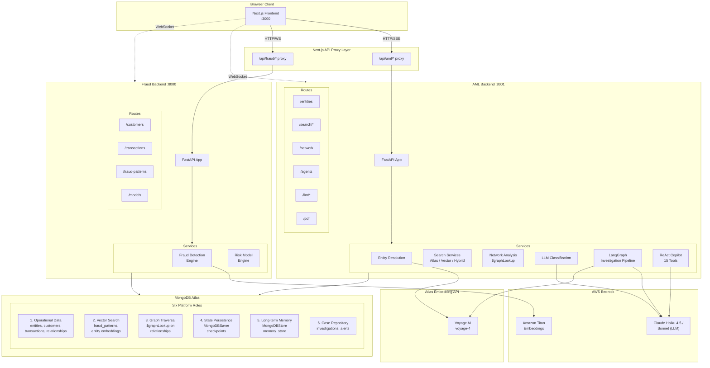
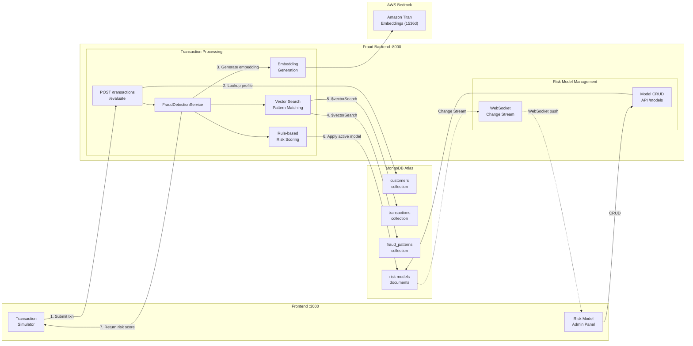
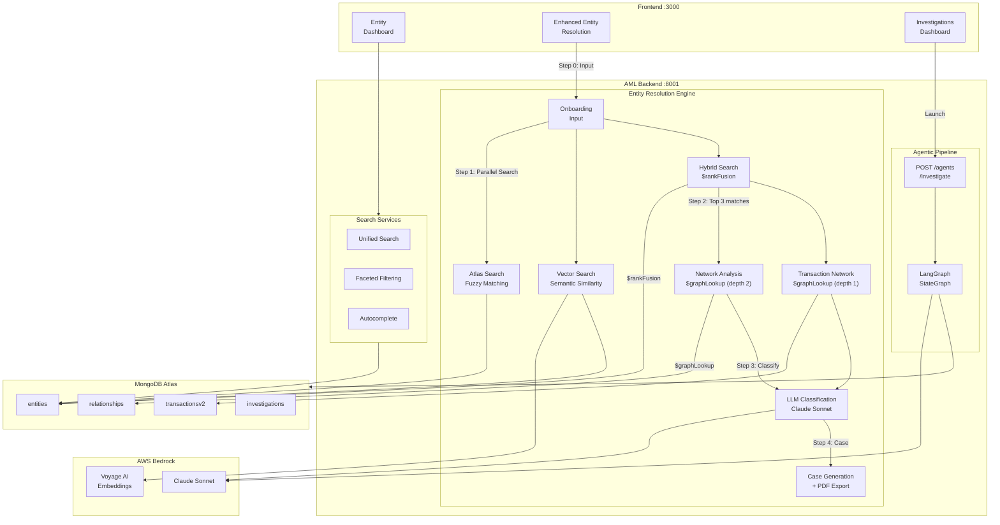
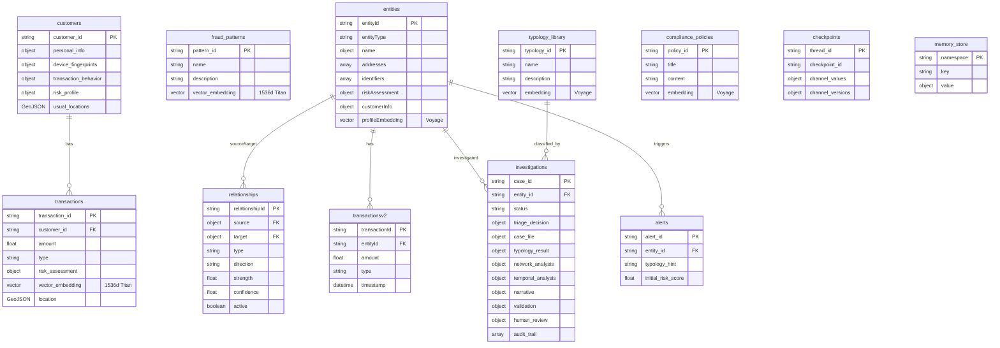
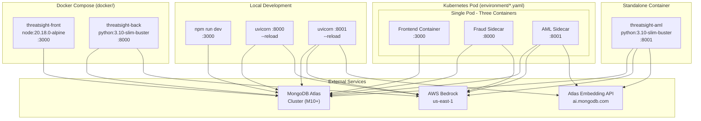
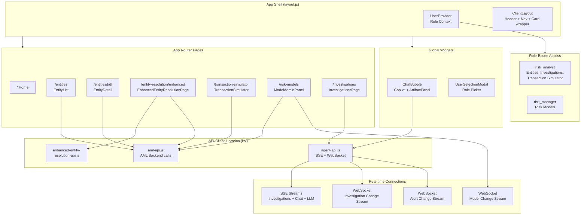

# ThreatSight 360 - Solution Architecture

This document provides comprehensive architecture diagrams for the ThreatSight 360 platform in mermaid format. These diagrams complement the static PNG architecture images in the root README (`Sol Arch 1.png`, `Sol Arch 2.png`) with expanded coverage of the agentic pipeline, Copilot, deployment topology, and frontend architecture.

---

## Table of Contents

1. [High-Level Solution Architecture](#1-high-level-solution-architecture)
2. [Fraud Detection Data Flow](#2-fraud-detection-data-flow)
3. [AML/Entity Resolution Data Flow](#3-amlentity-resolution-data-flow)
4. [MongoDB Data Architecture](#4-mongodb-data-architecture)
5. [Deployment Architecture](#5-deployment-architecture)
6. [Frontend Architecture](#6-frontend-architecture)

---

## 1. High-Level Solution Architecture

Complete system overview showing all three services, external dependencies, and MongoDB's six distinct roles.

---

## 2. Fraud Detection Data Flow

Expanded view of the fraud detection flow, complementing `Sol Arch 1.png`. Includes Change Stream integration for real-time risk model updates.

### Key Data Flow Steps

1. **Transaction Submission**: User submits a transaction from the simulator
2. **Customer Lookup**: FraudDetectionService retrieves the customer's 360 profile
3. **Embedding Generation**: Transaction text is embedded via Amazon Titan (1536 dimensions)
4. **Pattern Matching**: `$vectorSearch` finds similar fraud patterns and historical transactions
5. **Historical Context**: Similar past transactions provide contextual risk signals
6. **Risk Scoring**: Active risk model weights are applied to compute the final score
7. **Result**: Comprehensive risk assessment returned to the frontend

---

## 3. AML/Entity Resolution Data Flow

Expanded view of the AML flow, complementing `Sol Arch 2.png`. Includes the enhanced resolution workflow with $rankFusion and the agentic investigation pipeline entry point.

### Enhanced Resolution Workflow Steps

| Step | Action | MongoDB Features Used |
|------|--------|---------------------|
| 0 | Entity input (name, address, type) | -- |
| 1 | Parallel search (Atlas + Vector + Hybrid) | Atlas Search, Vector Search, `$rankFusion` |
| 2 | Network analysis for top 3 matches | `$graphLookup` on `relationships` and `transactionsv2` |
| 3 | LLM classification | Bedrock Claude Sonnet |
| 4 | Case generation + PDF export | Document insert, ReportLab PDF |

---

## 4. MongoDB Data Architecture

All collections across both backends, their relationships, and index types.

### Index Summary

| Collection | Index Name | Type | Purpose |
|------------|-----------|------|---------|
| `transactions` | `transaction_vector_index` | Vector Search | Fraud pattern similarity (1536d, cosine) |
| `fraud_patterns` | `transaction_vector_index` | Vector Search | Pattern embedding search |
| `entities` | `entity_resolution_search` | Atlas Search | Faceted search with autocomplete |
| `entities` | `entity_text_search_index` | Atlas Search | Text matching (name, address, identifiers) |
| `entities` | `entity_vector_search_index` | Vector Search | Semantic entity matching (1536d, cosine) |
| `typology_library` | (vector index) | Vector Search | RAG typology retrieval |
| `compliance_policies` | (vector index) | Vector Search | RAG policy retrieval |
| `relationships` | Standard indexes | B-tree | `source.entityId`, `target.entityId` for `$graphLookup` |
| `customers` | Geospatial + standard | 2dsphere, B-tree | Location-based fraud detection |

---

## 5. Deployment Architecture

Three-service topology with ports, container images, and external dependencies.

### Deployment Options

| Method | Config File | Services | Notes |
|--------|------------|----------|-------|
| Local Dev | Manual (3 terminals) | All 3 | `--reload` for hot reloading |
| Docker Compose | `docker/docker-compose.yml` | Frontend + Fraud Backend | AML backend requires separate container |
| Standalone Docker | `Dockerfile.aml-backend` | AML Backend only | Requires AWS credentials mount |
| Kubernetes | `environment/*-combined.yaml` | All 3 (unified pod) | Sidecar pattern, all containers share localhost |

---

## 6. Frontend Architecture

Component hierarchy, routing, API clients, and real-time connection patterns.

### Route-to-API Mapping

| Route | API Client | Backend | Real-time |
|-------|-----------|---------|-----------|
| `/entities` | `aml-api.js` | AML :8001 | -- |
| `/entities/[id]` | `aml-api.js` | AML :8001 | -- |
| `/entity-resolution/enhanced` | `enhanced-entity-resolution-api.js` + `aml-api.js` | AML :8001 | SSE (LLM classification) |
| `/transaction-simulator` | `axios` (direct) | Fraud :8000 + AML :8001 | -- |
| `/risk-models` | `fetch` (direct) | Fraud :8000 | WebSocket (Change Stream) |
| `/investigations` | `agent-api.js` | AML :8001 | SSE + WebSocket |
| ChatBubble (global) | `agent-api.js` | AML :8001 | SSE |

### Key Frontend Technologies

| Technology | Purpose |
|-----------|---------|
| Next.js 15 (App Router) | Framework and routing |
| React 18 | UI rendering |
| MongoDB LeafyGreen UI | Design system components |
| Cytoscape.js | Entity relationship network graphs |
| React Flow (@xyflow/react) | Agentic pipeline visualization |
| Mermaid | Diagram rendering in Copilot artifacts |
| SSE (EventSource) | Streaming agent and chat responses |
| WebSocket | Change Stream monitoring |
