# ThreatSight 360 - Production Solution Architecture
## Entity Management & Intelligent Entity Resolution Platform

```mermaid
graph TB
    %% External Data Sources & Partners
    subgraph "External Data Sources & Partners"
        WL1[OFAC Sanctions Lists]
        WL2[UN Security Council Lists]
        WL3[EU Consolidated Lists]
        WL4[PEP Databases]
        WL5[Adverse Media Sources]
        
        KYC1[Jumio Identity Verification]
        KYC2[Onfido Document Verification]
        KYC3[LexisNexis Risk Solutions]
        
        ENR1[Refinitiv World-Check]
        ENR2[Dow Jones Risk Center]
        ENR3[Thomson Reuters CLEAR]
        ENR4[Experian CrossCore]
        
        GOV1[Corporate Registries]
        GOV2[Credit Bureaus]
        GOV3[Financial Intelligence Units]
        
        NEWS1[Reuters News API]
        NEWS2[Bloomberg Terminal]
        NEWS3[Google News API]
    end

    %% Client Applications
    subgraph "Client Layer"
        WEB[Next.js 15 Web App<br/>Port 3000]
        MOBILE[Mobile App<br/>React Native]
        API_CLIENT[Partner API Clients]
    end

    %% Load Balancer & API Gateway
    subgraph "Edge & Gateway Layer"
        LB[AWS Application Load Balancer]
        APIGW[AWS API Gateway<br/>Rate Limiting & Throttling]
        WAF[AWS WAF<br/>Security & DDoS Protection]
        CACHE[CloudFlare CDN<br/>Global Edge Caching]
    end

    %% Core Application Services
    subgraph "Application Services Layer"
        subgraph "Main Backend Microservice"
            MAIN[FastAPI Main Service<br/>Port 8000<br/>• Transaction Processing<br/>• Real-time Fraud Detection<br/>• Risk Assessment<br/>• Customer Onboarding]
        end
        
        subgraph "AML Backend Microservice"
            AML[FastAPI AML Service<br/>Port 8001<br/>• Entity Resolution Engine<br/>• Network Analysis<br/>• Watchlist Screening<br/>• Case Management<br/>• Compliance Reporting]
        end
        
        subgraph "Supporting Services"
            SEARCH[Search Service<br/>• MongoDB Atlas Search<br/>• Vector Similarity<br/>• Hybrid Ranking with rankFusion]
            
            ML[ML/AI Service<br/>• AWS Bedrock Integration<br/>• Entity Classification<br/>• Risk Scoring<br/>• Pattern Recognition]
            
            NOTIF[Notification Service<br/>• Real-time Alerts<br/>• Case Assignments<br/>• Compliance Notifications]
            
            REPORT[Reporting Service<br/>• SAR Generation<br/>• Regulatory Reports<br/>• Executive Dashboards]
        end
    end

    %% Message & Event Layer
    subgraph "Event & Message Layer"
        KAFKA[Apache Kafka<br/>Event Streaming Platform]
        REDIS[Redis Cluster<br/>• Caching Layer<br/>• Session Management<br/>• Real-time Data]
        SQS[AWS SQS<br/>Asynchronous Processing]
    end

    %% Data Processing Layer
    subgraph "Data Processing & Intelligence Layer"
        subgraph "Real-time Processing"
            STREAM1[Kafka Streams<br/>Entity Resolution Pipeline]
            STREAM2[Kafka Streams<br/>Transaction Monitoring]
            STREAM3[Kafka Streams<br/>Risk Score Updates]
        end
        
        subgraph "Batch Processing"
            BATCH1[AWS EMR<br/>Large-scale Entity Matching]
            BATCH2[Apache Airflow<br/>Data Pipeline Orchestration]
            BATCH3[AWS Glue<br/>Data Integration & ETL]
        end
        
        subgraph "AI/ML Pipeline"
            BEDROCK[AWS Bedrock<br/>• Claude-3 Sonnet<br/>• Entity Classification<br/>• Risk Assessment<br/>• Case Investigation]
            
            SAGEMAKER[AWS SageMaker<br/>• Custom ML Models<br/>• Fraud Detection<br/>• Network Analysis]
            
            VECTOR[Vector Database<br/>• Entity Embeddings<br/>• Semantic Search<br/>• Similarity Matching]
        end
    end

    %% Core Database Layer - MongoDB Atlas
    subgraph "MongoDB Atlas - Unified Data Backbone"
        subgraph "Primary Cluster (Multi-Region)"
            MONGO_PRIMARY[MongoDB Atlas M60<br/>Primary Replica Set<br/>• Entities Collection<br/>• Relationships Collection<br/>• Transactions Collection<br/>• Cases Collection<br/>• Watchlist Matches]
        end
        
        subgraph "Analytics Cluster"
            MONGO_ANALYTICS[MongoDB Atlas M40<br/>Analytics Replica Set<br/>• Historical Data<br/>• Reporting Aggregations<br/>• Compliance Archives]
        end
        
        subgraph "Search Infrastructure"
            ATLAS_SEARCH[Atlas Search Indexes<br/>• Text Search - entity_text_search<br/>• Vector Search - entity_vector<br/>• Autocomplete & Fuzzy Matching]
        end
    end

    %% External Storage & Archives
    subgraph "Storage & Archive Layer"
        S3_HOT[AWS S3 Standard<br/>• Document Storage<br/>• Case Files<br/>• Audit Trails]
        
        S3_COLD[AWS Glacier<br/>• Long-term Archive<br/>• Compliance Records<br/>• Historical Backups]
        
        BACKUP[MongoDB Atlas<br/>Continuous Backup<br/>Point-in-time Recovery]
    end

    %% Monitoring & Observability
    subgraph "Monitoring & Observability"
        DATADOG[Datadog<br/>• Application Performance<br/>• Infrastructure Monitoring<br/>• Custom Dashboards]
        
        OTEL[OpenTelemetry<br/>• Distributed Tracing<br/>• Service Mesh Observability]
        
        SENTRY[Sentry<br/>Error Tracking & Alerting]
        
        AUDIT[Audit Service<br/>• Compliance Logging<br/>• User Activity Tracking<br/>• Data Access Logs]
    end

    %% Security & Compliance Layer
    subgraph "Security & Compliance Layer"
        IAM[AWS IAM<br/>Identity & Access Management]
        VAULT[HashiCorp Vault<br/>Secrets Management]
        ENCRYPTION[Data Encryption<br/>• TLS in Transit<br/>• AES-256 at Rest<br/>• Field-level Encryption]
        COMPLIANCE[Compliance Engine<br/>• SOC 2 Type II<br/>• PCI DSS<br/>• GDPR & CCPA]
    end

    %% Data Flow Connections
    
    %% Client to Services
    WEB --> CACHE
    MOBILE --> CACHE
    API_CLIENT --> CACHE
    CACHE --> LB
    LB --> WAF
    WAF --> APIGW
    APIGW --> MAIN
    APIGW --> AML

    %% External Data Ingestion
    WL1 --> BATCH3
    WL2 --> BATCH3
    WL3 --> BATCH3
    WL4 --> BATCH3
    WL5 --> BATCH3
    
    KYC1 --> MAIN
    KYC2 --> MAIN
    KYC3 --> AML
    
    ENR1 --> AML
    ENR2 --> AML
    ENR3 --> AML
    ENR4 --> AML
    
    GOV1 --> BATCH3
    GOV2 --> BATCH3
    GOV3 --> BATCH3
    
    NEWS1 --> STREAM1
    NEWS2 --> STREAM1
    NEWS3 --> STREAM1

    %% Service Interactions
    MAIN --> REDIS
    AML --> REDIS
    MAIN --> KAFKA
    AML --> KAFKA
    
    SEARCH --> MONGO_PRIMARY
    SEARCH --> ATLAS_SEARCH
    ML --> BEDROCK
    ML --> SAGEMAKER
    ML --> VECTOR
    
    %% Event Processing
    KAFKA --> STREAM1
    KAFKA --> STREAM2
    KAFKA --> STREAM3
    STREAM1 --> MONGO_PRIMARY
    STREAM2 --> MONGO_PRIMARY
    STREAM3 --> MONGO_PRIMARY
    
    %% Batch Processing
    BATCH3 --> MONGO_PRIMARY
    BATCH1 --> MONGO_PRIMARY
    BATCH2 --> MONGO_PRIMARY
    
    %% Core Data Layer
    MAIN --> MONGO_PRIMARY
    AML --> MONGO_PRIMARY
    SEARCH --> MONGO_PRIMARY
    REPORT --> MONGO_ANALYTICS
    
    %% Storage & Backup
    MONGO_PRIMARY --> BACKUP
    MONGO_PRIMARY --> S3_HOT
    S3_HOT --> S3_COLD
    
    %% Monitoring
    MAIN --> DATADOG
    AML --> DATADOG
    MONGO_PRIMARY --> DATADOG
    MAIN --> OTEL
    AML --> OTEL
    
    %% Security
    MAIN --> VAULT
    AML --> VAULT
    MONGO_PRIMARY --> ENCRYPTION
    
    classDef external fill:#ff9999
    classDef client fill:#99ccff
    classDef service fill:#99ff99
    classDef data fill:#ffcc99
    classDef security fill:#ff99ff
    classDef monitoring fill:#cccccc
    
    class WL1,WL2,WL3,WL4,WL5,KYC1,KYC2,KYC3,ENR1,ENR2,ENR3,ENR4,GOV1,GOV2,GOV3,NEWS1,NEWS2,NEWS3 external
    class WEB,MOBILE,API_CLIENT client
    class MAIN,AML,SEARCH,ML,NOTIF,REPORT service
    class MONGO_PRIMARY,MONGO_ANALYTICS,ATLAS_SEARCH,S3_HOT,S3_COLD,BACKUP data
    class IAM,VAULT,ENCRYPTION,COMPLIANCE security
    class DATADOG,OTEL,SENTRY,AUDIT monitoring
```



## Key Architecture Components & Patterns

### 🏗️ **Core Architecture Principles**

#### **1. MongoDB as Unified Data Backbone**
```javascript
// Unified Entity Document Structure
{
  "entityId": "ENT_2024_001234",
  "entityType": "individual",
  "name": {
    "full": "John Smith",
    "structured": { "first": "John", "last": "Smith" },
    "aliases": ["Johnny Smith", "J. Smith"]
  },
  "riskAssessment": {
    "overall": { "score": 75, "level": "high" },
    "components": {
      "identity": { "score": 60, "weight": 0.3 },
      "network": { "score": 85, "weight": 0.4 },
      "activity": { "score": 80, "weight": 0.3 }
    }
  },
  "relationships": [...], // Embedded for performance
  "watchlistMatches": [...], // Real-time screening results
  "resolution": {
    "status": "resolved",
    "masterEntityId": "ENT_2024_000123",
    "confidence": 0.95,
    "linkedEntities": [...]
  },
  "auditTrail": [...] // Compliance & investigation history
}
```

#### **2. Hybrid Search Architecture**
```javascript
// MongoDB $rankFusion for Intelligent Entity Resolution
db.entities.aggregate([
  {
    $search: {
      "compound": {
        "should": [
          // Atlas Text Search Pipeline
          {
            "$search": {
              "index": "entity_text_search_index",
              "compound": {
                "should": [
                  { "text": { "query": "John Smith", "path": "name.full", "fuzzy": {"maxEdits": 2} }},
                  { "text": { "query": "123 Main St", "path": "addresses.full", "fuzzy": {"maxEdits": 1} }}
                ]
              }
            }
          },
          // Vector Similarity Search Pipeline  
          {
            "$vectorSearch": {
              "index": "entity_vector_search_index", 
              "path": "embedding",
              "queryVector": [0.1, 0.2, ...], // AWS Bedrock embeddings
              "numCandidates": 100,
              "limit": 50
            }
          }
        ]
      },
      // MongoDB $rankFusion combines scores automatically
      "$rankFusion": {"weights": [1.0, 1.0]} 
    }
  }
])
```

### 🚀 **Production-Level Integrations**

#### **Watchlist & Sanctions Screening**
- **OFAC SDN List**: Real-time API updates every 30 minutes
- **UN Security Council**: Daily batch synchronization  
- **EU Consolidated List**: Weekly full refresh with delta updates
- **PEP Databases**: Quarterly full refresh with monthly updates
- **Adverse Media**: Real-time streaming from news APIs with NLP processing

#### **KYC & Identity Verification**
- **Jumio**: Document verification with liveness detection
- **Onfido**: Biometric matching and fraud detection
- **LexisNexis**: Identity verification and risk assessment
- **Bureau verification**: Credit history and address validation

#### **Data Enrichment Partners**
- **Refinitiv World-Check**: Enhanced due diligence data
- **Dow Jones Risk Center**: Risk intelligence and monitoring
- **Thomson Reuters CLEAR**: Public records and background checks
- **Corporate registries**: Beneficial ownership and corporate structures

### 🔄 **Event-Driven Entity Resolution Workflow**

#### **Step 1: Entity Ingestion**
```yaml
Event: entity.ingested
Payload:
  entityId: "ENT_2024_001234"
  source: "customer_onboarding"
  data: { name, address, identifiers }
Processing:
  - Trigger real-time watchlist screening
  - Generate entity embeddings via AWS Bedrock
  - Initiate fuzzy matching against existing entities
  - Queue for network analysis
```

#### **Step 2: Intelligent Resolution**
```yaml
Event: entity.resolution.requested
Processing:
  - Execute hybrid search ($rankFusion)
  - Calculate confidence scores
  - Identify potential matches (>70% confidence)
  - Generate resolution recommendations
  - Update master entity if match confirmed
```

#### **Step 3: Risk Assessment**
```yaml
Event: entity.risk.assessment
Processing:
  - Analyze network relationships
  - Calculate centrality metrics
  - Apply ML risk models
  - Generate overall risk score
  - Trigger alerts if high-risk threshold exceeded
```

### 📊 **Performance & Scalability Targets**

#### **Entity Resolution Performance**
- **Real-time matching**: <200ms for simple queries
- **Complex network analysis**: <2 seconds for 3-degree traversal
- **Batch processing**: 100K+ entities per hour
- **Concurrent users**: 1000+ simultaneous sessions

#### **Data Volume Capacity**
- **Entities**: 100M+ with sub-second search
- **Relationships**: 1B+ edges with efficient traversal
- **Transactions**: 10M+ daily processing
- **Storage**: Petabyte-scale with compression

### 🛡️ **Security & Compliance Architecture**

#### **Data Protection**
- **Encryption**: AES-256 at rest, TLS 1.3 in transit
- **Field-level encryption**: PII data encrypted in MongoDB
- **Key rotation**: Automated 90-day rotation cycle
- **Access controls**: Role-based with principle of least privilege

#### **Compliance Framework**
- **SOC 2 Type II**: Continuous monitoring and annual audits
- **PCI DSS**: Level 1 compliance for payment data
- **GDPR/CCPA**: Data privacy and right to erasure
- **Bank Secrecy Act**: AML reporting and record retention

#### **Audit & Monitoring**
- **Real-time alerts**: Suspicious activity and threshold breaches
- **Compliance reporting**: Automated SAR generation
- **Data lineage**: Complete audit trail for all entity changes
- **Performance monitoring**: 99.9% uptime SLA with proactive alerting

### 🌐 **Global Deployment Strategy**

#### **Multi-Region Setup**
- **Primary**: US East (N. Virginia) - Main processing center
- **Secondary**: EU West (Ireland) - European compliance requirements  
- **Tertiary**: Asia Pacific (Singapore) - Regional data residency
- **Data sync**: Real-time replication with conflict resolution

This architecture provides a production-ready, scalable, and compliant platform for intelligent entity resolution and AML compliance, leveraging MongoDB's unified data model as the backbone for all entity management operations.