# ThreatSight 360 - Demo Application Architecture
## MongoDB-Powered Fraud Detection & AML Platform

```mermaid
graph TB
    %% User Interface
    subgraph "Frontend Application"
        WEB[Next.js 15 Web App<br/>Port 3000<br/>• Transaction Simulator<br/>• Entity Management<br/>• Risk Model Dashboard<br/>• Network Visualization]
    end

    %% Dual Backend Architecture
    subgraph "Backend Services"
        FRAUD[Fraud Detection Backend<br/>FastAPI - Port 8000<br/>• Real-time Transaction Screening<br/>• Risk Model Management<br/>• Vector Pattern Matching<br/>• Dynamic Risk Assessment]
        
        AML[AML/KYC Backend<br/>FastAPI - Port 8001<br/>• Entity Resolution<br/>• Network Analysis<br/>• Compliance Workflows<br/>• Investigation Reports]
    end

    %% MongoDB as Central Data Hub
    subgraph "MongoDB Atlas - Core Data Platform"
        subgraph "Collections & Data"
            ENTITIES[Entities Collection<br/>• Individual & Organization profiles<br/>• Risk assessments<br/>• Watchlist matches<br/>• Audit trails]
            
            RELATIONSHIPS[Relationships Collection<br/>• Entity connections<br/>• Network metadata<br/>• Bidirectional relationships<br/>• Confidence scores]
            
            TRANSACTIONS[Transactions Collection<br/>• Transaction records<br/>• Fraud patterns<br/>• Risk scores<br/>• Vector embeddings]
            
            MODELS[Risk Models Collection<br/>• Dynamic model configs<br/>• Real-time updates via Change Streams<br/>• Performance metrics]
        end
        
        subgraph "MongoDB Advanced Features"
            ATLAS_SEARCH[Atlas Search<br/>• entity_text_search_index<br/>• Fuzzy name matching<br/>• Address normalization<br/>• Autocomplete]
            
            VECTOR_SEARCH[Vector Search<br/>• entity_vector_search_index<br/>• transaction_vector_index<br/>• Semantic similarity<br/>• AI-powered matching]
            
            CHANGE_STREAMS[Change Streams<br/>• Real-time model updates<br/>• Live risk synchronization<br/>• Event-driven workflows]
            
            GRAPH_LOOKUP[Graph Operations<br/>• Network traversal with $graphLookup<br/>• Relationship analysis<br/>• Connected components<br/>• Risk propagation]
            
            RANK_FUSION[Hybrid Search<br/>• $rankFusion combining<br/>• Atlas + Vector results<br/>• Contribution analysis<br/>• Score transparency]
        end
    end

    %% AI Integration
    subgraph "AWS Bedrock AI Services"
        BEDROCK[AWS Bedrock<br/>• Claude-3 Sonnet for classification<br/>• Titan for embeddings<br/>• Entity risk assessment<br/>• Investigation reports]
    end

    %% Key Data Flows
    WEB --> FRAUD
    WEB --> AML
    
    FRAUD --> ENTITIES
    FRAUD --> TRANSACTIONS
    FRAUD --> MODELS
    FRAUD --> VECTOR_SEARCH
    FRAUD --> CHANGE_STREAMS
    
    AML --> ENTITIES
    AML --> RELATIONSHIPS
    AML --> ATLAS_SEARCH
    AML --> VECTOR_SEARCH
    AML --> GRAPH_LOOKUP
    AML --> RANK_FUSION
    
    FRAUD --> BEDROCK
    AML --> BEDROCK
    
    %% MongoDB Advanced Feature Usage
    ENTITIES -.-> ATLAS_SEARCH
    ENTITIES -.-> VECTOR_SEARCH
    RELATIONSHIPS -.-> GRAPH_LOOKUP
    MODELS -.-> CHANGE_STREAMS
    ATLAS_SEARCH -.-> RANK_FUSION
    VECTOR_SEARCH -.-> RANK_FUSION

    %% Styling
    classDef frontend fill:#e1f5fe
    classDef backend fill:#f3e5f5
    classDef mongodb fill:#4caf50,stroke:#2e7d32,stroke-width:3px,color:#fff
    classDef ai fill:#ff9800,stroke:#f57c00,stroke-width:2px
    classDef features fill:#81c784,stroke:#4caf50,stroke-width:2px
    classDef collections fill:#a5d6a7,stroke:#66bb6a,stroke-width:2px
    
    class WEB frontend
    class FRAUD,AML backend
    class ENTITIES,RELATIONSHIPS,TRANSACTIONS,MODELS collections
    class ATLAS_SEARCH,VECTOR_SEARCH,CHANGE_STREAMS,GRAPH_LOOKUP,RANK_FUSION features
    class BEDROCK ai
```

## Key Architecture Highlights

### 🏗️ **Simple & Effective Demo Architecture**

This diagram represents the actual demo application architecture, focusing on:

- **Three Core Components**: Next.js frontend + dual FastAPI backends
- **MongoDB Atlas as the Hub**: All data operations centered on MongoDB
- **Real MongoDB Features**: Actual Atlas Search, Vector Search, Change Streams, and $graphLookup usage

### 🚀 **MongoDB-Powered Capabilities**

#### **Atlas Search Integration**
- **Text Search**: Fuzzy matching on entity names and addresses
- **Autocomplete**: Real-time search suggestions
- **Index**: `entity_text_search_index` for optimized text matching

#### **Vector Search for AI Matching** 
- **Semantic Similarity**: AI-powered entity and transaction matching
- **Embeddings**: AWS Bedrock Titan integration
- **Indexes**: `entity_vector_search_index` and `transaction_vector_index`

#### **Hybrid Search with $rankFusion**
- **Combined Results**: Automatically merges Atlas Search + Vector Search
- **Score Transparency**: Shows contribution percentages from each method
- **Native MongoDB**: Single aggregation query, no manual scoring

#### **Real-time Updates with Change Streams**
- **Dynamic Risk Models**: Live updates without service restart
- **Event-driven**: Automatic synchronization across all components
- **Real-time UI**: Frontend updates instantly when models change

#### **Graph Analytics with $graphLookup**
- **Network Traversal**: Multi-degree relationship analysis
- **Risk Propagation**: Relationship-based risk scoring
- **Connected Components**: Entity network analysis

### 📊 **Demo Application Flow**

1. **Transaction Simulator**: Users test fraud scenarios → Fraud Backend → MongoDB transactions
2. **Entity Resolution**: Users input entity data → AML Backend → Hybrid search → MongoDB entities  
3. **Network Analysis**: View relationships → $graphLookup → Interactive visualization
4. **Risk Models**: Admins modify models → Change Streams → Real-time updates

### 🎯 **MongoDB as the Foundation**

The entire demo revolves around MongoDB's advanced features:
- **Document Model**: Flexible entity and relationship structures  
- **Atlas Search**: Production-ready full-text search
- **Vector Search**: AI-powered semantic matching
- **Change Streams**: Real-time reactive updates
- **Aggregation Framework**: Complex analytics and graph operations
- **Native Hybrid Search**: Built-in $rankFusion for optimal results

This architecture demonstrates MongoDB's power for modern financial applications with fraud detection, entity resolution, and compliance workflows.