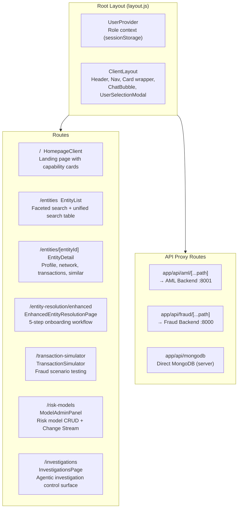

# ThreatSight 360 - Frontend


**Next.js 15 Application with MongoDB LeafyGreen UI Design System**

The ThreatSight 360 frontend provides a comprehensive interface for fraud detection, AML/KYC compliance, agentic investigations, and an AI-powered Copilot assistant. It communicates with two backend services through API proxies and supports real-time streaming via SSE and WebSocket.

---

## Table of Contents

1. [Technology Stack](#technology-stack)
2. [App Router Structure](#app-router-structure)
3. [Component Hierarchy](#component-hierarchy)
4. [API Client Libraries](#api-client-libraries)
5. [Real-time Patterns](#real-time-patterns)
6. [Design System](#design-system)
7. [Role-Based Access](#role-based-access)
8. [Environment Variables](#environment-variables)
9. [Quick Start](#quick-start)
10. [Related Documentation](#related-documentation)

---

## Technology Stack

| Technology | Version | Purpose |
|-----------|---------|---------|
| Next.js | 15.x | Framework (App Router) |
| React | 18.3 | UI rendering |
| MongoDB LeafyGreen UI | Various `@leafygreen-ui/*` | Design system components |
| Cytoscape.js | + extensions | Entity relationship network graphs |
| React Flow | `@xyflow/react` | Agentic pipeline visualization |
| Mermaid | Dynamic import | Diagram rendering in Copilot artifacts |
| Axios | Latest | HTTP client (Transaction Simulator) |
| react-markdown | + remark-gfm | Markdown rendering in chat |
| @mongodb-js/charts-embed-dom | Listed | MongoDB Charts embedding (available) |

---

## App Router Structure



### Route Details

| Route | Component | Required Role | Backend |
|-------|-----------|--------------|---------|
| `/` | `HomepageClient` | Any | -- |
| `/entities` | `EntityListWrapper` -> `EntityList` | `risk_analyst` | AML :8001 |
| `/entities/[entityId]` | `EntityDetailWrapper` -> `EntityDetail` | `risk_analyst` | AML :8001 |
| `/entity-resolution/enhanced` | `EnhancedEntityResolutionPage` | `risk_analyst` | AML :8001 |
| `/transaction-simulator` | `TransactionSimulatorWrapper` -> `TransactionSimulator` | `risk_analyst` | Both |
| `/risk-models` | `ModelAdminPanel` | `risk_manager` | Fraud :8000 |
| `/investigations` | `InvestigationsPage` | `risk_analyst` | AML :8001 |

---

## Component Hierarchy

```
RootLayout (app/layout.js)
└── UserProvider (contexts/UserContext.jsx)
    └── ClientLayout (components/ClientLayout.jsx)
        ├── Header / Navigation (inline)
        ├── UserProfile (components/ui/avatar)
        ├── main > Card > {page content}
        ├── ChatBubble (components/chat/ChatBubble.jsx)
        │   └── ArtifactPanel (components/chat/ArtifactPanel.jsx)
        └── UserSelectionModal

/investigations → InvestigationsPage
├── InvestigationLauncher
│   ├── AgenticPipelineGraph (React Flow)
│   └── InvestigationInsightsPanel
├── InvestigationDetail
├── InvestigationAnalytics
└── ChangeStreamConsole

/entities → EntityList
├── EnhancedSearchBar (autocomplete)
├── AdvancedFacetedFilters
├── MongoDBInsightsPanel
└── EntityLink (table rows)

/entities/[id] → EntityDetail
├── RiskScoreDisplay / RiskComponentsDisplay
├── Tabs: Overview | Network | Activity
├── CytoscapeNetworkComponent
├── NetworkStatisticsPanel
├── AdvancedInvestigationPanel
├── TransactionActivityTable
├── TransactionNetworkGraph
└── SimilarProfilesSection

/entity-resolution/enhanced → EnhancedEntityResolutionPage
├── ModernOnboardingForm (Step 0)
├── ParallelSearchInterface (Step 1)
├── Top3ComparisonPanel (Step 2)
├── StreamingClassificationInterface (Step 3)
├── CaseInvestigationDisplay (Step 4)
└── ProcessingStepsIndicator

/transaction-simulator → TransactionSimulator
└── VectorSearchCalculationBreakdown

/risk-models → ModelAdminPanel (single component)
```

---

## API Client Libraries

### `lib/aml-api.js`

Central `fetch`-based client for the AML backend. Provides methods for:
- Entity CRUD and search
- Vector search (similar entities)
- Network analysis (`$graphLookup`)
- Atlas and unified search
- Transaction history
- LLM classification (SSE)
- Investigation case creation

### `lib/agent-api.js`

Agent-specific client with SSE and WebSocket support:
- `launchInvestigation()` -- SSE stream with `AbortSignal` support
- `resumeInvestigation()` -- Resume after human review (SSE)
- `sendChatMessage()` -- Copilot chat (SSE)
- `getInvestigations()` / `getInvestigationAnalytics()` -- CRUD
- `seedCollections()` -- Seed typology/policy data
- `getInvestigableEntities()` -- Demo entity list
- WebSocket connections for investigation and alert change streams
- Shared `readSSEStream()` helper for DRY SSE parsing

### `lib/enhanced-entity-resolution-api.js`

Enhanced resolution workflow client:
- `performComprehensiveSearch()` -- Parallel Atlas + Vector + Hybrid search
- `getEntityNetwork()` / `getEntityTransactionNetwork()` -- Network analysis
- `classifyEntity()` -- Streaming LLM classification
- `getDemoScenarios()` -- Pre-built demo scenarios

### Direct API Calls

Some components use `fetch` or `axios` directly:
- `TransactionSimulator`: `axios` calls to both backends
- `ModelAdminPanel`: `fetch` to Fraud backend `/models` endpoints
- `EntityList`: `fetch` to AML `/entities/search/unified`
- `EnhancedSearchBar`: `fetch` to AML `/entities/search/autocomplete`
- `AdvancedFacetedFilters`: `fetch` to AML `/entities/search/facets`

---

## Real-time Patterns

### SSE (Server-Sent Events)

Used for streaming responses from long-running backend operations:

| Feature | Endpoint | Consumer Component |
|---------|----------|-------------------|
| Investigation progress | `POST /agents/investigate` | `InvestigationLauncher` |
| Investigation resume | `POST /agents/investigate/resume` | `InvestigationLauncher` |
| Copilot chat | `POST /agents/chat` | `ChatBubble` |
| LLM classification | `POST /llm/classification/classify-entity` | `StreamingClassificationInterface` |

All SSE consumers use the shared `readSSEStream()` helper from `agent-api.js` and support `AbortSignal` for cancellation.

### WebSocket

Used for real-time MongoDB Change Stream monitoring:

| Feature | Endpoint | Consumer Component |
|---------|----------|-------------------|
| Investigation changes | `WS /agents/investigations/stream` | `ChangeStreamConsole` |
| Alert stream | `WS /agents/alerts/stream` | `ChangeStreamConsole` |
| Risk model changes | `WS /models/change-stream` | `ModelAdminPanel` |

---

## Design System

### LeafyGreen UI

The application uses MongoDB's [LeafyGreen UI](https://www.mongodb.design/) component library extensively:
- `@leafygreen-ui/palette` and `@leafygreen-ui/tokens` for color and spacing primitives
- Components: Card, Badge, Button, Modal, Tabs, TextInput, Select, Code, Banner, etc.

### Investigation Design Tokens (`investigationTokens.js`)

Centralized design tokens for the investigation UI:

| Token | Purpose |
|-------|---------|
| `uiTokens.railBg`, `surface1` | Surface colors for sidebar and cards |
| `uiTokens.borderDefault`, `borderStrong` | Border hierarchy |
| `uiTokens.shadowHover`, `shadowCard`, `shadowElevated` | Elevation levels |
| `uiTokens.transitionFast` (150ms), `transitionMedium` (220ms) | CSS transitions |
| `getRiskAccentColor(score)` | Risk-based color mapping (green/yellow/orange/red) |
| `GLOBAL_KEYFRAMES` | CSS animations (fadeSlideIn, shimmerBar, attentionPulse, etc.) |

### Risk Color Conventions

| Score Range | Color | Level |
|-------------|-------|-------|
| >= 75 | `palette.red.base` | Critical / High |
| >= 50 | `#ed6c02` (orange) | Medium-High |
| >= 25 | `palette.yellow.base` | Medium |
| < 25 | `palette.green.base` | Low |

### Accessibility

All animations respect `@media (prefers-reduced-motion: reduce)` via the `GLOBAL_KEYFRAMES` module.

---

## Role-Based Access

Two demo roles are available, managed via `UserContext` and persisted in `sessionStorage`:

| Role | Allowed Routes |
|------|---------------|
| `risk_analyst` | `/entities`, `/entities/[id]`, `/entity-resolution/enhanced`, `/transaction-simulator`, `/investigations` |
| `risk_manager` | `/risk-models` |

The `ClientLayout` component enforces role-based routing via `ROUTE_ROLES` mapping. Unauthorized navigation redirects to `/`.

---

## Environment Variables

Create a `.env.local` file:

```bash
# API URLs for dual-backend architecture
NEXT_PUBLIC_FRAUD_API_URL=http://localhost:8000
NEXT_PUBLIC_AML_API_URL=http://localhost:8001

# Legacy compatibility (points to fraud backend)
NEXT_PUBLIC_API_URL=http://localhost:8000

# Server-side only (for API proxy routes)
AML_BACKEND_URL=http://localhost:8001
FRAUD_BACKEND_URL=http://localhost:8000
```

---

## Quick Start

```bash
cd frontend
npm install
npm run dev
```

The application will be available at [http://localhost:3000](http://localhost:3000).

### Build for Production

```bash
npm run build
npm start          # Runs custom server.js with WebSocket proxy
# or
npm run start:next-only  # Standard Next.js production server
```

---

## Related Documentation

- [Root README](../README.md) -- Full project overview and setup
- [Solution Architecture](../docs/SOLUTION_ARCHITECTURE.md) -- System architecture diagrams
- [Agentic System Overview](../docs/AGENTIC_SYSTEM_OVERVIEW.md) -- AI agent capabilities
- [Copilot Architecture](../docs/COPILOT_ARCHITECTURE.md) -- Chat assistant deep-dive
- [Fraud Backend](../backend/README.md) -- Fraud detection API
- [AML Backend](../aml-backend/README.md) -- AML/KYC compliance API
- [Data Model](../docs/DATA_MODEL.md) -- MongoDB collections and indexes
